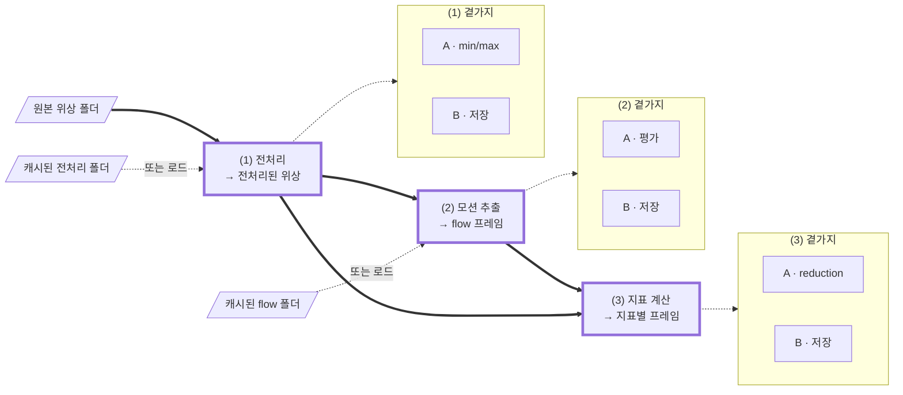

# TODO

문제 정의, 확정된 결정, 그리고 아직 코드나 테스트에 없는 것을 한곳에 모은다.
항목이 구현되면 CHANGELOG 항목으로 승격한다.

> **⚠️ 코드가 우선이다.** 불일치 시 우선순위는
> 실제 코드 > `pyproject.toml`/`uv.lock`/git 이력 > 이 문서.
> 여기 적힌 심볼·수치·경계는 **채택 전 코드로 재검증**할 것.

---

# 문제 정의

원본 위상 영상 시퀀스에서 **박동 프로파일** — 지표별 `(T′,)` 시그널 — 을 얻는다.

## 세 단계

각 단계는 **한 스텝 관점의 스트림**이다. 괄호 안 입력은 캐시로 대체할 수 있다.

| | 입력 | 출력 |
| --- | --- | --- |
| **(1) 전처리** | (위상 프레임) | 전처리된 위상 프레임 |
| **(2) 모션 추출** | (위상 프레임) | optical flow 프레임 |
| **(3) 지표 계산** | (위상 프레임, flow 프레임) | `{지표: (인덱스, 프레임)}` |



**굵은 실선이 메인 스트림**이고 테두리가 굵은 셋이 단계다. 점선은 근원 대체와 곁가지이고,
곁가지는 상자로 묶어 스트림과 갈랐다 — 무엇을 하는지는 아래 표에 있다.
(1)B가 쓰는 폴더가 다음 실행의 "캐시된 전처리 폴더"이고, (2)B와 flow 폴더도 같은 관계다.

**근원 선택은 단계마다 독립**이다. 전처리된 위상과 flow 각각 계산이거나 캐시라 네 조합이
모두 유효하고, 온라인 합성은 전이적이라 원본만 주고 지표까지 갈 수 있다. 섞었을 때
설정이 어긋나면 — 캐시된 flow가 다른 필터 설정의 산물이라면 — **사용자 책임**이며
검사하지 않는다.

## 곁가지 — A와 B, 서로 독립으로 켜고 끈다

| | **A · 누적** | **B · 저장** |
| --- | --- | --- |
| (1) | 프레임 min/max → 시퀀스 → **데이터셋** | 원본과 같은 레이아웃, 다른 루트 |
| (2) | 프레임 평가 → 시퀀스 → **데이터셋** | 〃 (최종 폴더·파일 이름은 다름) |
| (3) | 지표 프레임 → reduction → **시그널** | 〃 |

(1)A와 (2)A는 데이터셋까지 누적하지만 **(3)A는 시퀀스에서 멈춘다.**

## 지표


**요청한 지표 수와 만들어지는 계산기 수는 다르다.** Force 하나를 요청해도 그 안에
DryMass와 Acceleration이, Acceleration 안에 Speed가, Speed 안에 Displacement가 있다 —
계산기 5개, 시그널 1개. 무엇을 뽑을지는 설정으로 받는다.

| 지표 | reduction | arity |
| --- | --- | --- |
| displacement · speed | norm의 평균 | `T−1` |
| acceleration · force | norm의 평균 | `T−2` |
| OPD variance | 평균 | `T−1` |
| dry mass | 합 | `T` |

**OPD variance**: `OPDvar(i) = var[OPD(i+1) − OPD(i)]`. 계산기는 픽셀별 **편차 제곱**을
반환하고, reduction의 평균이 그것을 분산으로 만든다.

### 인덱스는 지표마다 어긋난다

위상 프레임 `5`가 들어온 순간에 나오는 것:

```
dry_mass       5     프레임 하나면 됨
opd_variance   4     4, 5로 계산
force          4     3, 4, 5 → acceleration 4
```

**구간량**은 시작 프레임으로(`flow(i)`, `OPDvar(i)`는 `[i, i+1]`),
**순간량**은 중심으로(`acceleration`은 speed `i`·`i+1`의 차이라 `i+1`) 라벨링된다.
아직 만들 수 없는 지표는 **빈 값**이다.

## 한 스텝의 값은 한 번만 계산된다

계산된 값은 그것을 쓰는 **모든 소비자에게 전달**되고, 필요한 만큼만 보관되다 버려진다.

- **소비자가 여럿** — 필터된 프레임 `i`가 추정기와 dry mass와 OPD variance로. flow를
  온라인으로 계산할 때 이 셋이 **같은 프레임**을 받아야 하며, 두 번 필터링하면 안 된다
  (필터된 읽기를 두 번 하면 **+94%**, median `(2,2,2)` 기준).
- **소비자가 나중에** — Speed `i`가 Acceleration `i+1`이 만들어질 때까지. 계산기 포함
  구조와 내부 캐시가 이것이다.

## 실행

시퀀스 하나의 (1)→(2)→(3)이 통째로 독립이므로, 기본은 **순차**이고 프로세스나 GPU가
여럿이면 **시퀀스 단위 병렬**이다.

## 산출물

시그널은 지표마다 `.npy` 하나, `(T′,)` `float32`, 한 폴더에 모은다. **인덱스는 파일 밖의
규약**이므로 위 arity 표가 곧 계약이다. 중간 필드도 저장할 수 있다((1)B·(2)B·(3)B).

## 미룬 것

**ROI 마스크.** 지금은 항상 프레임 전체. 붙으면 지표 `N`개 × 마스크 `M`개의 시그널이 된다.

마스크가 들어올 때 **OPD variance의 형태를 다시 봐야 한다.** 계산기가
`(X − E[X])²`를 만들려면 `E[X]`를 먼저 알아야 하는데, 그 평균이 전체 프레임의 것이면
마스크 안 평균과 어긋나 `Var_R(X) + (μ_R − μ_full)²`가 된다 — 분산이 아니고, 값은
그럴듯하다. `E(X²) − E(X)²` 형태로 두 장을 내보내고 reduction이 접으면 계산기가 ROI를
몰라도 정확하다.

---

# 공통

## 결정

- **멀티 GPU는 시퀀스 샤딩이다.** GPU마다 독립 파이프라인 인스턴스, 통신 0. 시퀀스가
  온전히 한 워커에 가므로 샤드 경계도 overlap도 stitch 시 dedupe도 없다. 구현은
  `mpire`(GPU당 1 프로세스, spawn). 스케일은 선형이 아니었다 — **7-GPU가 3.59배**로,
  디스크가 상한이었다. 모델 병렬은 비권장(교차 GPU 전송·복잡도; 한 프레임이 한 GPU에 안
  들어갈 때만). `cv2.cuda`는 전역 `setDevice`, torch는 per-op이라 **프로세스당 GPU 하나**
  고정 모델과 잘 맞는다.

- **장치는 실행 단위로 고른다.** 단계마다 따로 고르지 않는다. `FilteredSequence`가
  `Tensor`를 내놓고 `tensor_to_gpumat`이 그것을 OpenCV CUDA 추정기에 **복사 없이** 넘기므로
  (`tests/common/test_cuda_utils.py:28`이 포인터 동일성을 확인), 필터와 flow가 같은 장치면
  프레임이 장치를 떠나지 않는다. 나누면 프레임당 3.24 MB와 — 더 나쁘게 — 그 전송이 강제하는
  동기화를 문다. 워커 수의 최적값도 장치마다 다르므로(GPU당 하나 대 코어당 하나) **하나의
  풀이 둘을 만족할 수 없다**.

  단계가 그 장치를 못 쓰면(DeepFlow는 CPU 전용) **캐시 경계에서 실행을 나누고**, 조용히
  폴백하지 말고 **거부**할 것. 조용한 폴백은 몇 달 뒤 "왜 느리지"가 된다.

- **CUDA 할당자는 크기가 뒤섞일 때만 문제가 된다.** 900×900 343 오프셋에서 `MedianKernel`이
  한 번에 잡던 것이 **4.75 GB**였다 — `gathered` 1.11 GB, `sort`의 값 1.11 GB, `sort`의
  **인덱스** 2.22 GB(`int64`라 값의 두 배, `.values`가 곧바로 버린다), `isnan` 마스크
  0.28 GB. 지금은 프레임을 띠로 나눠 계산해 **0.17 GB**로 묶여 있고, 결과는 bit-identical에
  오히려 빠르다(§(1) 구현됨).

  그래도 위험이 사라진 것은 아니다. 크기가 제각각인 블록이 세그먼트에 흩어져 다음 큰 요청에
  연속 공간이 없으면 `release_cached_blocks`가 `cudaFree`로 장치를 세우고 재시도한다 —
  프레임마다. 커널 설정 11개를 한 프로세스에서 연달아 돌린 벤치마크에서 같은 코드가
  `cuboid (3,3,3)`에서 **8.46초 대 139 ms**로 읽혔다. **한 실행에서는 필터 설정이 하나라
  크기가 매 프레임 같으므로** 이 조건은 생산 경로에서 생기지 않는다.

  **진짜 위험은 온라인 모드다.** (1)(2)(3)이 한 프로세스에서 이어 돌면 필터 버퍼, 추정기
  작업공간, flow 텐서, 지표 중간값이 **서로 다른 모양으로** 같은 풀에 섞인다. 그리고
  `cv2.cuda`는 **torch의 캐시를 모르므로** torch가 쥔 메모리를 추정기가 못 얻을 수 있다 —
  `tensor_to_gpumat`이 프레임 복사는 없애도 추정기 내부 작업공간은 OpenCV 쪽 할당이다.

  진단은 `torch.cuda.memory_stats()["num_alloc_retries"]`(0이 아니면 일어난 것), 대책은
  `PYTORCH_CUDA_ALLOC_CONF=expandable_segments:True`(torch 2.12). `empty_cache()`는
  **시퀀스 경계**에 — 프레임 경계에 두면 그 비싼 해제를 손으로 매 프레임 하는 셈이다.

- **단계는 번호로 묻는 소스다.** `Stage`를 인덱스로 물으면 미스일 때만 계산하고 창 안에
  붙잡으므로, 한 프레임이 여러 소비자에게 **한 번의 계산으로** 간다 — 추정기와 dry mass가
  같은 위상 프레임을 볼 때 두 번 필터링하면 +94%다. 창 깊이는 소비자를 아는 빌더가 넣는다.
  곁가지는 훅이고 **인덱스마다 한 번** 불리며, `run()`이 그래프 전체의 훅을 한꺼번에 열고
  닫는다 — 공유 단계는 두 경로로 닿아도 한 번만 열리고, 중간에 죽으면 반쪽짜리 폴더가
  남지 않는다. `SequenceStage`가 `DataSequence`를 감싸므로 온라인 계산과 캐시 로드가
  같은 것이 된다.

  스테이지 팩토리가 훅을 붙여 넘기므로 **상위 단계는 하위의 곁가지를 보지 않는다.** 설정에서
  훅 팩토리를 만드는 것은 진입점의 일이고, 레벨마다 빌더 하나(`build_phase_stages`)를 지나
  드라이버가 둘이 되어도 그 조립은 한 군데다.

- **누적하는 곁가지는 파일로 집에 온다.** `shared_objects`는 한 방향이라 워커가 채운 복사본이
  돌아오지 않는다. 시퀀스별 미터가 끝날 때 `<문서>.parts/`에 자기 `SequenceRange`를 떨구고,
  부모의 `RangeDocument`가 실행이 끝나면 접는다. **드라이버를 지나는 값이 없다** — 예전
  `fresh`/`merge`가 풀려던 문제가 사라진다. 죽은 순회는 아무것도 안 쓰고(접두사는 데이터셋
  경계에 구멍을 낸다), 끝난 파트는 남으며, 진입 시 지운다(출력 디렉터리가 고정이라 이전
  실행의 파트가 섞일 수 있다).

  여섯 곁가지 중 **수명이 필요한 것은 둘뿐**이다 — (1)A와 (2)A. 나머지는 시퀀스에서 끝난다.
  구분은 A/B가 아니라 **누적이 어느 층에서 멈추느냐**이고, 그래서 `SideBranch`는 컨텍스트
  매니저를 **선택적 능력**으로 둔다.

  **별도 스크립트로 가르지 않는다.** 메인 스트림은 전처리이고 범위는 그 곁가지일 뿐이라,
  `preprocess` 하나가 둘 다 든다.

- **거부된 잡이 로그를 남기지 않는 것은 의도다.** `preprocess`가 스윕에서
  `target.save_frames`를 거부하면 잡 디렉터리에 0바이트 `preprocess.log`만 남는다. 설정을
  먼저 찍도록 가드를 뒤로 미루는 안을 재보고 **버렸다**.

  값이 거의 없다. hydra가 `main`을 부르기 전에 `.hydra/config.yaml`을 이미 쓰므로 거부된
  잡의 설정은 그대로 디스크에 있고, 거부 메시지도 무엇이 잘못인지 이름을 댄다. 로그 블록은
  이미 있는 것을 사람이 읽기 좋게 다시 그리는 것뿐이다.

  대가는 크다. `build_sequences`가 `PhaseFileFolder`를 만들며 프레임마다 헤더를 읽으므로
  비용이 시퀀스가 아니라 **파일 수**를 탄다 — 측정으로 약 **0.029 ms/file**이고(20 시퀀스에서
  500·2,000·8,000 파일이 24·69·245 ms), 121×1200이면 잡 하나당 **약 4.3초**다. 게다가 **스윕은
  첫 거부에서 멈추지 않는다** — 실측으로 잡 0이 거부된 뒤 잡 1이 자기 디렉터리를 만들며
  돌았다. 121개짜리 스윕이면 9분대를 통째로 버린다.

- **컨테이너는 스테이지 그래프를 따라 겹친다.** (2)가 오면 (2)의 컨테이너가 (1)의 것을 쥐고,
  맨 위 하나의 `running()`이 아래 전부의 곁가지를 연다. `Stage._all_hooks`와 같은 알고리즘이고
  **중복 방지가 필수**다 — 다이아몬드에서 (1)의 컨테이너가 두 경로로 닿으므로, 소스의
  `running()`을 중첩해서 부르면 `seen`이 갈려 `RangeDocument`가 두 번 저장한다. 지금은
  소스가 없어 평평한 루프다.

## 열린 것 — `scripts/_compute.py`

- **로그 안에 시간 형식이 둘 섞인다.** `log_insights`는 `mpire`가 준 `0:00:03.318`을 그대로
  쓰고, `run_all`과 `stage.py`는 `%.1f` + `s`로 `3.6s`를 쓴다. `insights`에는 포맷된 문자열만
  있고 원시 초 값이 없어 우리 형식으로 다시 그리려면 파싱해야 한다.

- **`unit` 하나가 진행표시줄과 산문 둘 다를 맡는다.** `tqdm`의 관례는 짧은 단수 축약이라
  (`12.12seq/s`, 기본값 `it`) 완전한 낱말이 들어갈 자리가 아닌데, 같은 문자열이 「running
  121 seq」와 「completed 3 seq」에도 쓰인다. 산문을 완전한 낱말로 하려면 막대의 단위와
  가르고(`unit` + `noun`) 복수형을 붙여야 한다.

- **복수형 처리가 세 곳에 복제돼 있다.** `_compute.py`의 `f"{num_workers} worker{...}"`,
  `common/writer.py`의 `f"wrote {count} frame{...}"`, `data/pipeline/ranges.py`의 `_counted`.
  `_counted`가 이미 그 함수인데 `data/` 아래 private이라 나머지 둘이 못 쓴다. 순수 텍스트
  헬퍼라 도메인 의존이 없으므로 `common/`으로 올리면 셋이 하나가 되고, 위의 `noun` 항목도
  같이 싸진다.

- **`SharedContext.log_level`의 전달 경로에 테스트가 없다.** spawn된 워커는 root가
  `WARNING`에 핸들러 0개로 시작하므로(실측) 레벨을 실어 보내지 않으면 워커 파일에 INFO 줄이
  하나도 남지 않는다. 그런데 테스트는 `configure_worker(0, 2, logging.INFO)`로 항상 레벨을
  명시해 부르므로, `run_all` → `SharedContext` → `_init_worker` 경로는 한 번도 검증되지
  않는다 — 필드를 지워도 전부 통과한다. 부모가 DEBUG일 때 워커 파일에 DEBUG 줄이 남는지로
  고정할 것. 출처가 root가 아니라 스테이지 로거인 것도 같이 볼 것.

- **`completed = num_stages - len(failed)`가 모든 스테이지가 결과를 냈다고 가정한다.**
  지금 `imap`에서는 참이고, §1순위의 세 번째 상태(재사용·미도달)가 들어오면 깨진다.

## 열린 것 — `TreeConfig`를 (2)·(3)이 쓰게 하려면

`SourceConfig`·`TargetConfig`가 `TreeConfig`(= `root` + `subpath` +
`resolve_subpath`)를 공유한다. 단계별 기본값은 이미 서브클래스의 몫이다 —
`DEFAULT_SUBPATH`가 `ClassVar[str]`로 베이스에 선언만 되어 있고 값은 각 서브클래스가 댄다.
(2)의 flow 트리 레이아웃이 정해지면 그 클래스에 적으면 되고, **베이스는 손대지 않는다.**
남은 것은 둘이다.

- **베이스가 (1)의 모듈에 산다.** (2)가 `scripts.data`에서 import하는 것은 의존 방향이
  거꾸로다. 두 번째 쌍이 생길 때 위로 올릴 것. 지금 공용 모듈을 미리 만들지 않는 이유는
  소비자가 하나뿐이어서고, 옮기는 것은 기계적이다.

- **(3)의 target은 프레임 트리가 아닐 수 있다.** 출력이 `{지표: (인덱스, 프레임)}`과
  문서라, `save_frames`도 폴더 통째 교체도 (3)에는 없을 수 있다. 그래서 겹침 검사는
  `TreeConfig`에 넣지 않았다 — 그것이 붙는 자리는 「`StagedDirectory`가 시퀀스당 폴더를
  통째로 갈아끼우는 곳」이지 config 일반이 아니다. 다만 판정 자체는
  `(source_root, source_subpath)` 대 `(write_root, target_subpath)` 넷이면 끝나 단계에
  독립이므로, `_validate_output`의 그 절반은 **클래스 계층과 무관하게 함수로 먼저 올라갈**
  수 있다.

# 1순위 — 캐시와 범위 문서의 재사용

데이터셋은 시간에 따라 자란다. 시퀀스가 더해지고, 더러 지워진다. **변하지 않은 시퀀스를
다시 계산할 이유가 없는데** 지금은 전체를 다시 도는 것 말고 방법이 없다.

입구가 둘이라는 점이 중요하다 — 따로 설계하면 두 번 짓는다.

- 실패한 3개를 다시 돌린다 = 성공한 118개를 **재사용**한다
- 새 시퀀스 3개를 더한다 = 기존 118개를 **재사용**한다

## `overwrite`의 확장이 아니라 세 번째 모드다

지금은 이항이다 — 거부(`false`)하거나 덮어쓴다(`true`). 필요한 것은 그 축 위가 아니라
**다른 정책**이다: *이미 있고 유효하면 그대로 두고 건너뛴다.* `overwrite=reuse`는 어색한
모양이 되므로, 셋 중 하나를 고르는 이름(`on_existing` 등)으로 갈 것.

## 기계는 이미 대부분 있다

`RangeDocument.to_range()`는 `<문서>.parts/` 아래 `.json`을 **전부** 접는다 — 그 시퀀스가
이번 실행에서 돌았는지 묻지 않는다. 재사용을 막고 있는 것은 `__enter__`의 무조건 청소
한 곳뿐이다.

유효성 판정의 절반도 이미 있다. `RangeDocument.get_coverage()`가 `명단 − 접힌 것`을
`Coverage.skipped`로 계산하는데, 지워진 시퀀스의 파트를 치우는 데 필요한 것이 그
역방향(`접힌 것 − 명단`)이다.

## 어려운 곳은 둘이다

**유효성 판정.** "변하지 않았다"를 무엇으로 아는가. 계단이 있다.

- **이름만** — 명단에 있고 파트가 있으면 재사용. 가장 싸고, 내용 불변을 사용자 책임으로
  둔다. 근원 혼합에 대해 이미 같은 태도를 취하고 있다.
- **설정 대조** — 기존 문서의 `settings`(필터·`frame_step`)가 이번 실행과 다르면 재사용
  전면 금지. **전부 아니면 전무**라 판정이 단순하다.
- **소스 대조** — 파일 개수·크기·mtime. 내용 해시는 정확하지만 소스를 전부 읽으므로
  아끼려던 비용을 그대로 문다.

가운데 둘의 조합이 현실적이다. 걸리는 것 하나: **파트에는 `settings`가 없고 문서에만 있다.**
문서가 없거나 못 쓴 상태로 파트만 남으면 판정 근거가 사라지므로, 파트에 최소한을 심을지
정해야 한다.

**곁가지 간 합의 — 이쪽이 더 크다.** 메인 스트림을 건너뛰려면 **모든 곁가지가 "이 시퀀스는
필요 없다"고 동의**해야 한다. 프레임 캐시는 있는데 파트가 없으면 필터링을 건너뛸 수 없다 —
범위를 잴 프레임이 손에 없다.

지금 `FrameTree`와 `RangeDocument`는 서로를 모른다. 둘이 늘 같이 돌아서 일관성이 공짜였을
뿐이다. 재사용이 들어오면 시퀀스마다 **교집합**을 물어야 하고, 그 질문은 `run_stage`이
필터링을 시작하기 **전에** 끝나야 한다 — `SideBranch`에 `needs(source) -> bool` 정도의
능력이 붙는다. 이것이 플래그 하나로는 안 되는 이유다.

**형제 사이의 계약은 이미 하나 생겼다.** `Reverting`(닫기에 실패한 형제가 있으면 깨끗이
닫힌 형제가 자기 출력을 되돌린다)이 「곁가지들이 한 시퀀스에 대해 함께 성공하거나 함께
실패한다」의 절반이다. `needs()`는 그 반대편 — 함께 **시작하지 않는다** — 이므로, 둘을 한
프로토콜로 볼 수 있는지 설계할 때 확인할 것.

## 아끼는 것은 계산이 아니라 I/O다

121 시퀀스 × 1200 프레임에서 필터링 자체는 CUDA 1000프레임당 ~3초이니 **7분대**다. 그런데
읽고 쓰는 양은 프레임당 3.24 MB × 145,200 ≈ **470 GB**이고, 디스크가 상한이라는 것은 이미
측정되어 있다(7-GPU가 3.59배). `save_frames=false`로 범위만 구하는 실행에서도 소스 읽기를
통째로 아끼므로 **두 모드 모두에서** 값을 한다.

## 쪼갤 수 있다

- **범위 문서만** — `__enter__`의 청소 규칙 하나. 곁가지 합의가 필요 없다. 작다.
- **프레임 캐시까지** — `needs()`, 교집합, 메인 스트림 건너뛰기. 크다.

앞의 것만으로도 "범위 문서를 갱신하려고 전체를 다시 도는" 상황은 사라진다.

## 실행 요약이 결과를 셋으로 갈라야 한다

지금은 `N = 성공 + 실패`뿐이라 「3 of 4 done in 0.4s」로 충분하다. 재사용이 들어오면
**시도조차 하지 않은 것**이 세 번째 상태로 생기고, 그것은 성공도 실패도 아니다.

형태는 흔한 경우를 건드리지 않는 쪽으로 — 0인 항목은 아예 빼는 것이 범위 문서의 `report`와
같은 원칙이다. 늘 붙어 있는 `(0 failed, 0 skipped)`는 아무도 읽지 않는다.

```
4 of 4 done in 0.2s                          모두 성공 — 지금과 같음
3 of 4 done (1 failed) in 0.4s               실패만
2 of 5 done (3 reused) in 0.3s               재사용만
1 of 5 done (1 failed, 3 reused) in 0.4s     둘 다
```

**`skipped`라는 단어를 세 번째 상태에 쓰지 말 것.** `Coverage.skipped`가 이미 *파트를
남기지 않은 것*을 뜻하므로, 같은 단어를 재사용에 쓰면 그쪽이 거짓말이 된다. 건너뛴 *이유*를
말하는 `reused`가 낫다. 짝이었던 `IncompleteRunError.skipped` → `failed`는 이미 고쳤다.

`reused`라는 이름은 §「재사용된 시퀀스는 `skipped`가 아니라 `covered`다」에서 문서 쪽과
함께 정해졌다. 다만 건너뜀이 한 통인지 두 통인지는 아직 정해지지 않았다. **재사용**(기존 산출물이 유효하니
일부러 안 돌림)과 **미도달**(풀이 죽어 결과 자체가 오지 않음)은 이유가 다르다 — 전자는
확실하고 후자는 실패 여부를 알 수 없다. 지금은 후자가 존재하지 않지만(`imap`이 항목마다
결과를 내거나 풀 전체가 무너진다), 재사용 경로가 생기면 갈라 셀 값이 있는지 다시 볼 것.

**`a of N`의 분자가 무엇인지도 결정 항목이다.** 「몇 개를 새로 계산했나」와 「몇 개가 이제
쓸 수 있나」는 다르고, 재사용분은 후자에만 들어간다. 3개를 재사용하고 2개를 계산한 실행이
「2 of 5 done」이면 결과물이 5개인데도 2개짜리 실행처럼 읽힌다. `done` 대신 `ready`로
바꾸고 분자에 재사용분을 넣는 쪽이 사용자가 실제로 묻는 것에 가깝다.

## 그때까지의 우회로 — `include`로 갈라 돌리고 나중에 병합한다

실측으로 확인했다. 자동이 아닐 뿐, **추가와 재시도는 오늘도 된다.**

```bash
# 실패한 것만 다시 (목록은 앞 실행 문서의 `coverage.skipped`에 이미 있다)
target.range_file=value_range_retry source.include=[plate_A/2026-03-11/TL_01_wellB4]
```

실패한 시퀀스는 `StagedDirectory.abort()` 덕에 **반쪽 폴더를 남기지 않으므로**,
`overwrite=false` 그대로 재실행해도 자리가 비어 있어 충돌하지 않는다. 캐시 트리는 하나로
모이고, 문서만 여러 개가 된다.

지켜야 할 규칙 둘:

- **`range_file`을 실행마다 다르게.** 같으면 두 번째 실행의 `__enter__`가 첫 번째의 파트를
  전부 지운다. 그리고 `coverage`는 *그 실행의* 명단 기준이라 `1 of 1`로 **"완전"이라고
  말한다** — 절반짜리 문서가 온전해 보인다. `overwrite=false`면 문서 쓰기가 실패해 조용히
  틀리지는 않지만, 파트는 이미 지워진 뒤다.
- **잡 디렉터리를 가르면 캐시도 갈라진다 — 우회로의 두 규칙이 서로를 무너뜨린다.** 1차는
  「프레임은 `target.root`로 가므로 잡 디렉터리를 갈라도 캐시는 하나로 모인다」고 적었는데
  **틀렸다(E1).** `target.root`를 읽는 것은 `hydra.run.dir` 보간뿐이고, 쓰는 것은 전부 잡
  디렉터리(`output_directory()`)를 받는다. 같은 `target.root`에 `hydra.run.dir`만 갈라 두 번
  돌린 실측:

  ```
  cache : 생기지도 않음
  runA  : TL_00     range_A.json  range_A.parts
  runB  : plate_B   range_B.json  range_B.parts
  ```

  가르지 않으면 `.hydra/overrides.yaml`과 워커 로그가 덮이고(어느 `include`가 트리의 어느
  부분을 만들었는지 기록이 사라진다), 가르면 캐시가 갈라진다. **둘 다 만족하는 설정이 없다.**
  §1순위(재사용·재시도)를 설계할 때 함께 풀 것 — 그때까지 이 우회로는 범위 문서에만 쓰고,
  프레임 캐시에는 쓰지 말 것.

**glob은 안 되고 정확한 이름만 된다.** `select` 자체는 `{kind: glob, pattern: ...}`을
받지만 `SourceConfig.include`의 스키마가 `list[str] | str`이라 omegaconf가 막는다. 다만
용도가 "새로 들어온 것만"이면 이름을 나열하는 편이 정확하고, `str` 하나로 `.txt` / `.json`
목록 파일 경로를 줄 수도 있다(`select`가 파일 스펙을 지원한다).

**병합 스크립트는 싸다.** `SequenceRange.from_dict`로 각 문서의 `dataset.sequences`를 읽어
`DatasetRange`로 다시 접고 `save_range_document`로 쓰면 된다. 확인할 것 셋: 문서마다 실린
`settings`가 일치하는지(필터·`frame_step`이 다른 문서를 섞으면 안 된다), `dataset.source`가
같은 루트인지, 그리고 `coverage`를 데이터셋 전체 명단 대비로 다시 계산할 것.

**우회로가 못 푸는 것은 삭제다.** 어떤 실행도 "이 시퀀스가 사라졌다"를 알지 못하므로, 낡은
캐시 폴더와 낡은 문서의 항목이 남아 병합본에 섞인다.

## 재사용된 시퀀스는 `skipped`가 아니라 `covered`다 (결정됨)

`skipped`의 판정은 **"파트 파일이 디스크에 있는가"** 하나이고, 재사용의 정의가 곧
*"이전 실행의 파트가 그대로 유효하다"*이다. 그러니 재사용된 시퀀스는 파트가 있고,
`skipped`에 들어가지 않으며 `dataset` 경계에도 반영된다. 문서가 답하는 질문이
「어느 시퀀스의 범위가 여기 없는가」이므로 이것이 맞다 — 그 범위는 실제로 거기 있다.

그 대가로 `covered`가 **이번에 계산한 것과 이전 것을 재사용한 것을 섞는다.** 그래서
`Coverage`에 `reused`를 더해 갈라 센다:

```
covered = 이 문서가 범위를 가진 시퀀스 수          (계산분 + 재사용분)
reused  = 그중 이전 실행의 파트를 그대로 쓴 수
skipped = 명단에 있는데 파트가 없는 이름들
total   = len(sequence_names)
```

로그의 「N of M done (a failed, b reused)」와 **같은 어휘**를 쓰는 것이 요점이다. 두
숫자가 서로 다른 질문에 답한다는 점도 그대로다 — `IncompleteRunError.failed`는
「무엇이 끝까지 가지 못했나」, `Coverage.skipped`는 「무엇의 범위가 문서에 없나」이고,
프레임 writer의 커밋 단계에서만 실패한 시퀀스는 미터가 먼저 닫히므로 **파트를 남긴 채
실패**한다(`ExitStack`이 역순으로 닫는 결과이며, 실측으로 확인했다).

**선행 조건이 하나 있다.** 지금 `RangeDocument.__enter__`는 파트를 무조건 전부 지운다:

```python
for stale in self.list_parts():
    stale.unlink()
```

이 규칙이 「무효한 것만 지운다」로 바뀌기 전에 프레임 캐시 재사용만 붙이면, 시퀀스를
돌리지 않은 채 파트가 지워져 **프레임은 있는데 범위만 사라진다.** 그 상태가 실제로 어떻게
보이는지는 아래 `overwrite=false` 실측에 있다 — 문서가 방금 완성된 시퀀스를 「빠진 것」으로
지목한다.

## 함께 정할 것

- **지워진 시퀀스의 캐시 폴더.** 파트는 지워야 문서가 맞지만, 프레임 폴더 삭제는 파괴적이다.
- **이름이 바뀐 시퀀스**는 삭제+추가로 보인다(전체 재계산). 그대로 둘지.

## 순서에 대한 경고

**시간 반지름 결정이 이 캐시를 통째로 무효화한다.** §(1)의 「시간 반지름은 프레임률을 따라야
한다」가 답해지면 필터 설정이 바뀌고, 위 「설정 대조」 규칙에 의해 재사용은 전면 금지된다 —
그 전에 쌓은 캐시는 버린다. 재사용을 먼저 짓더라도 **캐시를 채우는 실행은 그 뒤**로 미룰 것.

---

# (1) 전처리

## 구현됨

`filtering/kernel/`에 `FilterKernel` 기반과 `MedianKernel`·`GaussianKernel`·`IdentityKernel`.
둘 다 per-axis 이웃을 읽고 범위 밖 이웃을 **패딩하지 않고 버린다**.

**median**은 레거시 의미를 유지하며 `scipy`로 검증했다 — ellipsoid는
`(dx/rx)² + (dy/ry)² + (dz/rz)² ≤ 1`(반지름 2에서 33개, cuboid는 125개), 유효 표본이
짝수면 **중앙 두 값을 평균**하므로 하위값을 반환하는 `torch.median`은 쓸 수 없다.
**gaussian**은 per-axis `sigma`+`truncate`(반지름 = `int(truncate*sigma+0.5)`, scipy 규칙)
이고 분리가능하며, 실제로 걸린 가중치로 나눠 전체 3D 정규화 결과와 정확히 일치한다.

`MedianConfig`/`GaussianConfig`가 있어 설정이나 캐시 사이드카가 살아 있는 객체 없이 설정을
나른다.

**median은 프레임을 띠로 나눠 계산한다.** 한 픽셀의 중앙값은 자기 이웃만 읽으므로 띠 단위로
답해도 같은 값이고, 띠가 모든 임시 버퍼를 묶는다 — 정렬의 값과 버려지는 인덱스까지 합쳐
쌓인 이웃의 약 4배다. 900×900에서 열 개 설정 전부 측정했고 결과는 bit-identical, peak는
0.11~4.75 GB에서 **0.17 GB로 균일**, 시간은 1.00~1.44배 **빨라졌다**(합계 1.21배). 거대
할당 자체가 정렬보다 비쌌던 것이다. 띠가 너무 잘면 뒤집힌다 — 900행을 64조각으로 자르면
장치가 논다.

  **`_TILE_BYTES`가 그 0.17 GB를 가리키도록 고쳤다(F9).** 이전에는 쌓인 이웃만 세어 32 MiB로
  적혀 있었고 실제 정점은 그 4.4~5.1배였다 — 워커 수를 그 상수에서 정하면 4배 이상 틀린다.
  이제 `_band_bytes`가 정렬이 되돌려주는 값·int64 인덱스·유효성 bool 마스크까지 세고 예산은
  136 MiB다. **출하 중인 열 개 설정의 띠 크기는 한 행도 바뀌지 않았고**(2x2x2가 282행,
  3x3x3이 27행) 속도·정점도 그대로다. 예산만 32로 두고 세는 것을 고치면 3x3x3이 27행에서
  6행으로 잘려 **4.4배 느려진다** — 위의 「64조각」 경고가 그것이다.

**`sort`와 `topk`의 갈림은 계단 두 개로 설명된다.** CUDA에서 둘 다 32에서, 다시 128에서
더 빠른 공유메모리 경로를 벗어난다. `sort`는 표본 전부를, `topk`는 `samples//2+1`만
정렬하므로, **둘이 서로 다른 층에 있을 때만** `topk`가 이긴다 — 33~63과 129~255다.
16~343 사이 16개 지점에서 전부 맞았다. 이전의 `range(33, 64)`는 첫 구간만 담아
`cuboid (3,3,1)`(147 오프셋)을 놓치고 있었고, 고치니 74 → 56 ms로 **1.32배**가 됐다.

## 열린 것

- ~~**장치 간 일치를 테스트로 만들 것.**~~ `test_median.py`의
  `test_the_two_devices_reduce_a_window_to_the_same_bits`가 네 설정을 `torch.equal`로
  비교한다. `sort` 대 `topk`의 양쪽(7·27개는 `sort`, 33·75개는 `topk`)과, NaN 패딩과 짝수
  유효 개수가 나오는 테두리 화소를 함께 지난다. RTX 2080 Ti에서 네 건 모두 bit-identical.

- **시간 반지름은 프레임률을 따라야 한다.** 손상은 창이 덮는 **시간**을 따르지 프레임 수를
  따르지 않으므로, 레거시의 고정 `(2,2,2)`는 20 Hz 값이고 10 Hz 데이터를 과하게 뭉갠다 —
  10 Hz에서 박동 프로파일의 상대 진폭 **~30%**를 잃는 반면 `rz=1`은 잃지 않는다.
  **결과물이 곧 박동 프로파일**이므로 이것은 denoising이 아니라 신호 손실이다. 상수로
  고정하지 말고 데이터셋의 박동 주기에서 유도할 것. 실제 간격은 각 샘플의
  `timestamps.txt`에서 읽을 것 — 픽스처 이름은 "~10 Hz"라고만 주장한다.

- **범위 문서의 device sync를 일괄화.** `finite_range`가 프레임마다 `low.isfinite()`를
  읽어 값을 호스트로 끌어오고, 그동안 CPU가 다음 프레임을 못 읽는다. `aminmax`를 전부
  먼저 던지고 한 번에 전송하면 정지가 사라진다 — 스칼라가 프레임당 8 B라 1200프레임이
  9.6 KB고, CUDA 실행 큐는 무한히 자라지 않고 스스로 조절한다. 비유한 값 폴백은 없애려는
  그 동기화 없이 프레임마다 분기할 수 없으므로, **경계가 비유한으로 돌아온 프레임만**
  두 번째 패스로 다시 본다(실제로는 없다).

  **(1)B와 상충한다.** 프레임을 쓰려면 호스트로 내려야 하고 그것이 같은 동기화라,
  저장하는 실행에서는 정지가 어차피 돌아온다. 범위만 구하는 실행에서만 값을 한다.

- **범위 문서의 `indent=2`를 뺄 것.** 한 글자에 파일 크기의 큰 몫이고 시간 비용은 없다.

- **범위가 필터를 변별할 수 있는지는 다시 열려 있다.** 전체 데이터셋 답을 냈던 스윕이
  은퇴하면서 그 결론도 같이 은퇴했다. 다음 실행에 물어야 할 두 가지: 범위가 설정들을
  가르기는 하는가, 그리고 한 시퀀스의 핫픽셀 하나가 데이터셋 경계를 얼마나 움직이는가 —
  정규화 정책이 견뎌야 하는 것이 후자다. 모든 문서가 시퀀스별 범위를 들고 있으므로 둘 다
  두 번째 패스 없이 답할 수 있다.

- **소스 탐색은 `iivs-lib`으로 간다.** 결정됐고 일정만 미정. `search_phase_bin_folders`는
  이미 거기 있고, 따라갈 것은 `search_sources`가 그 위에 두른 층이다 — `include`/`exclude`
  선택, 단위 오버라이드, 그리고 구분해서 알리는 두 실패. 두 번째 스크립트가 자기 사본을
  기르기 전에 옮길 것.

- **필터 캐시를 둘지는 조건부다.** CUDA에서 1000프레임당 ~3초로 재생성되므로, GPU가 귀하거나
  없는 곳(CPU 전용 기계, 매 epoch 재필터링이 모델과 장치를 다투는 학습 루프)에서 캐시가
  이긴다. 전처리 파라미터를 탐색하는 동안은 재생성이 이긴다 — 설정이 바뀔 때마다 캐시가
  무효화되므로. 원본 위상을 지우고 필터 결과만 남기는 것은 파라미터가 확정된 뒤의 별개
  결정이다.

- **캐시 형식은 정해졌고 구현됐다** — `phase_frame_writer`가 iivs-lib의 `save_phase_bin`으로 Koala `.bin`을 쓴다.
  그러면 `PhaseBinFolder`가 되읽고 `pixel_size`/`height_scale` 보정이 **파일 안**에 실려
  사이드카가 어긋날 일이 없다. `.bin`도 iivs-lib의 `.npy`도 float32이므로 float16은 생태계를
  떠나는 일이다 — 디스크가 실제로 막을 때만 재검토하고, 물리량에 대한 정밀도 손실을 먼저
  측정할 것.

---

# (2) 모션 추출

## 구현됨

`optical_flow/estimators/`에 OpenCV 기반 Farneback·DualTVL1·DeepFlow, `common/warp.py`,
`optical_flow/evaluation.py`, `optical_flow/data/folder.py`(flow `.npy` 폴더).

`data/transforms/normalization.py`는 세 모드를 쌍 모양 API로 제공하고 uint8을 낸다.
**`pairwise`는 단일 정규화 프레임 목록을 만들 수 없다** — 한 프레임이 속한 쌍의 결합 범위로
스케일되므로 두 번 등장하며 인코딩이 둘이다. API가 쌍(또는 창) 기반이어야 그 모드가 존재할
수 있다. `perframe`은 위험한 모드다: 프레임마다 자기 극값으로 다시 스케일하면 모든 추정기가
전제하는 밝기 항상성이 깨진다. `injected`는 밖에서 측정한 범위를 받으므로 시퀀스 범위와
데이터셋 범위가 같은 코드가 되고 호출자의 선택이 된다.

레거시가 **버림**하던 것을 **반올림**한다 — 256단계 중 한 단계만큼 화소 절반이 움직인다.
계통적 하향 편향을 없애는 것이지 잡음을 더하는 것이 아니지만, 전환 이전의 품질 수치와는
소수점 다섯째 자리에서 비교 불가다.

**`pairwise`는 추정기의 streaming 경로를 막는다.** `push`가 **정규화된** 이전 프레임을
붙들고 있는데 `pairwise`에서는 다음 프레임이 올 때 그 인코딩이 낡는다 — 비교되는 두
프레임이 서로 다른 스케일에 놓이며, 이것이 `perframe`을 기각한 바로 그 밝기 항상성 파괴다.
그래서 `pairwise`는 `calc`를 함의하고, `injected`만 안전하면서 `push`와 양립한다. 다만
그 거래의 값은 작다 — CUDA에서 `push`가 `calc` 대비 1.05배였다.

## 결정 — 정규화는 필터링 **이후**다

### 순서는 결과를 바꾸지 않는다. 그래서 대수적 논증은 결정력이 없다

min-max 정규화 `(x-m)/(M-m)`는 단조 증가 아핀 사상이고, 이 프로젝트의 두 커널은 그것과
교환된다. **median은 순위 통계**라 단조 증가 변환에 등변이고(짝수 표본에서 중앙 두 값을
평균하는 규칙도 아핀이라 보존된다), **gaussian은 가중치 합이 1인 볼록 결합**이다. 실측으로
최대차 1.9e-09 / 1.5e-08, NaN이 섞여도 median은 교환된다.

그러므로 질문은 「연산 순서」가 아니라 **「척도 상수 `(m, M)`을 어느 분포에서 뽑는가」**라는
통계적 추정 문제다. 아핀 사상은 가역이라 정보를 더하지도 빼지도 않으므로 정보량 논증으로도
순서를 고를 수 없다.

### 그 상수는 존재하는 통계량 중 가장 강건하지 않다

`m`, `M`은 0·100번째 백분위수, 즉 극단 순위 통계이고 **파괴점이 0**이다 — 오염된 표본
하나가 추정치를 무한히 끌고 간다. 오염 비율이 0보다 크면 표본 최댓값은 신호가 아니라
**오염 분포의 상계**로 수렴한다.

DHM 위상에는 알려진 오염원이 있다. 언래핑 오류의 `2π` 점프, 먼지·데드 픽셀, 시야
가장자리의 복원 아티팩트. 따라서 **원본의 min/max는 신호의 지지집합이 아니라 오염의
지지집합을 추정한다.**

### 필터링이 곧 그 추정량의 강건화다

median 필터는 이 오염에 대한 정확한 대응이고, 창 안 절반 미만이 오염되면 중앙값이
불변이므로 파괴점을 0에서 **창의 약 50%**로 올린다 — `ellipsoid (1,1,1)`은 7개 창에서 3개,
`(2,2,2)`는 33개 창에서 16개까지 견딘다. 즉 `min F(x)`, `max F(x)`는 `min x`, `max x`의
**강건 버전**이고, 「필터 후 정규화」를 고르는 것은 곧 **척도 상수의 강건 추정량을 고르는
것**이다.

### 강건하지 않은 추정량은 재현성을 깬다 — 실용적으로 가장 무겁다

데이터셋 범위의 목적은 시퀀스 간·실행 간 비교 가능성이다. 상수가 한 시퀀스의 핫 픽셀
하나로 정해지면 **그 시퀀스를 넣고 빼는 것만으로 다른 모든 시퀀스의 정규화가 달라진다.**
데이터셋이 자라는 이 프로젝트에서 그것은 상수가 표본에 대해 일관추정량이 아니라는 뜻이고,
1순위의 범위 문서 재사용이 서 있는 전제가 무너진다. 필터 후에 재면 상수가 **신호의 성질**이
되어 표본 재추출에 안정적이다.

§「범위가 필터를 변별할 수 있는지는 다시 열려 있다」의 두 번째 질문(핫 픽셀 하나가
데이터셋 경계를 얼마나 움직이는가)에 대한 구조적 답이 이것이다.

### 표현 손실은 정량적이다

교환성 때문에 정보는 같지만 **표현**은 다르다. 핫 픽셀 하나를 넣은 실측에서 필터 결과가
`[0,1]`의 **2.23%**만 차지했다 — 이미 제거된 이상치가 상수를 잡아먹기 때문이다. `uint8`로
양자화하면 256단계 중 5.7단계, **5.5비트 손실**이며 `FrameNormalizer`가 `dtype`과 정수
`target_range`를 지원하므로 이 경로는 가정이 아니다. 변위가 ~0.3px이라 프레임 간 밝기 변화가
원래도 작은데 거기서 5.5비트를 더 버리면 추정기가 잡을 신호가 그만큼 준다.

### 그리고 이미 만들고 있는 문서가 필터 이후 범위다

훅은 `PhaseFilteredSequence`를 감싼 스테이지에 붙으므로 `SequenceRangeMeter`가 재는 값은
필터를 통과한 프레임이다. 「먼저」를 고르면 지금까지의 범위 문서가 전부 정규화에 쓸 수 없어
지고 원본 범위를 재는 별도 경로를 새로 만들어야 한다.

### 이 선택이 무는 대가

**상수가 필터 설정에 의존한다.** 커널이 다르면 범위도 달라지므로 서로 다른 필터 설정의
정규화 출력은 직접 비교되지 않는다. 지금 최우선 실험이 필터 스윕이라 그냥 넘길 문제가
아니다. 다만 출하될 파이프라인은 필터와 정규화를 **함께** 적용하므로 합성된 것끼리 비교하는
것이 정직하고, 교차 비교가 필요해지면 `injected`로 **한 기준 설정의 상수를 모든 실행에
주입**하면 된다.

## 결정 — 범위는 측정 실행 하나가 내고, 소비 실행이 주입받는다

세 층(프레임·시퀀스·데이터셋)을 한 방식으로 통일한다. `PhaseStageFactory`를 먼저 한 번
돌리면 `RangeDocument.__exit__`가 파트를 접어 **세 층을 전부 담은 문서**를 내므로, 두 번째
실행은 원하는 층을 골라 `injected`에 넣기만 하면 된다.

**한 실행 안에서 2패스로 푸는 길도 있지만 반쪽이다.** 검토 결과는 이렇다.

- **같은 `SequenceStage`로 두 번 도는 것은 불가능하다.** `Stage._notify`가 `_notified`로
  인덱스마다 훅을 한 번만 부르므로 2회차에는 기존 훅이 안 울리고, **1회차 뒤에 등록한 훅은
  영원히 안 울린다.** 「먼저 재고 그다음 정규화 라이터를 붙인다」가 기계적으로 막혀 있다.
  프레임은 다시 계산되며 그때 `step N refilled` DEBUG가 남는다 — 재질의를 설계가 냄새로
  취급한다는 뜻이다.
- **새 `SequenceStage`를 만들면 된다.** `_notified`가 스테이지마다 따로라 훅이 정상
  발화한다. 소스는 공유하되 전부 다시 읽고 다시 필터링하며, 실측 **1.71배**다(256×256,
  40프레임, ellipsoid 2×2×2).
- **1회차의 `SequenceRange`는 살아남는다.** `SequenceRangeMeter`는 `__exit__`에서 파트를 쓴
  뒤 결과를 들고 있고, `run_stage`가 이미 `stage.run()` 뒤에 `report()`를 부르며 그렇게
  쓰고 있다.
- **그러나 데이터셋 범위는 안 된다.** 파트를 접는 것은 `stages.running()`의 `__exit__`, 즉
  모든 워커가 끝난 뒤다. 어떤 시퀀스도 정규화하기 전에 전부 재야 하므로 실행 전체에 장벽이
  생기고, 그건 사실상 실행 두 번이다.

측정 실행에서 `save_frames=true`로 캐시를 남기면 소비 실행은 **필터링을 다시 하지 않으므로**
1.71배가 사라진다. 대신 470 GB의 캐시 I/O가 드는데, 그 저울은 §「필터 캐시를 둘지는
조건부다」와 같다.

## 열린 것

- **캐시 폴더는 자기가 어디서부터 시작하는지 말하지 않는다.** `KoalaFrameWriter`는 도착한
  첫 프레임부터 0으로 번호를 매기므로, 시간 방향으로 줄어드는 단마다 원본과의 어긋남이 하나씩
  쌓인다. 6프레임 시퀀스를 실제로 세 단에 통과시킨 결과:

  ```
  phase  00000=p0       원본 0번
  flow   00000=f0->1    원본 0~1번 사이
  force  00000=F2       원본 2번
  ```

  **셋 다 `00000`으로 시작하는데 셋이 다른 것을 가리키고, 그 사실이 어느 폴더에도 없다.**
  (3)이 (2)의 캐시를 읽으면 자기 `00000`이 원본 1번이라는 것을 알 방법이 없고, 위상 캐시와
  흐름 캐시를 함께 읽는 지표는 `i`번끼리 짝지어 조용히 어긋난다. E8의 사이드카(캐시 인덱스별
  원본 프레임 이름)가 이 표다. **(1)에서는 편의였고 (2)·(3)에서는 체인의 전제**이므로, (2)
  착수 전에 구현할 것.

- **너무 짧아 만들 것이 없는 시퀀스와 만들다 실패한 시퀀스가 같은 예외로 나온다.** 힘에 2프레임
  시퀀스를 넣으면 `no frame was written: nothing to commit`이 나고 드라이버가 그 시퀀스를
  **실패**로 센다 — `IncompleteRunError`에 이름이 오르고 `coverage.skipped`에 들어간다.
  (1)에서는 필터링이 1:1이라 「한 장도 못 썼다 = 무언가 잘못됐다」가 참이었고, 시간 방향으로
  줄어드는 단에서 그 등식이 깨진다.

  셋 중 하나를 고를 것. **(가) 최소 길이를 앞에서 거부** — 단이 요구하는 길이를 `search_sources`가
  알고 걸러내면 실패 목록이 아니라 선택 목록에서 빠져 `found > selected`로 정직하게 드러난다.
  **(나) 빈 출력을 허용** — 빈 폴더가 남고, 그것은 P8·R5가 없애려던 모양이다. **(다) 커버리지가
  이유를 나눠 셈** — §1순위가 `reused`로 이미 같은 고민을 하고 있으니 거기 붙일 자리가 있다.
  **(가)를 권한다**: 만들 수 없는 것은 시도하지 않는 편이 시도해서 실패로 세는 것보다 정직하다.

- **(2)를 붙이는 순간 (1)의 창을 2로 올릴 것.** 지금은 1이다 — 묻는 곳이 `__iter__` 하나뿐이라
  맞다. (2)가 붙으면 한 스텝 안에서 위상 `i-1`(flow 경유)과 `i`(dry mass)가 같이 불리므로,
  1로 두면 **조용히 두 번 필터링한다.** 터지지 않고 느려질 뿐이라 `_compute`에 스파이를 건
  테스트로 잡을 것.

- **어느 추정기인지 아직 모른다. Dual TV-L1이 이긴다고 가정하지 말 것.** 둘 다
  coarse-to-fine이라 그것이 차이가 아니고, 각 레벨 **안의** 추정기가 차이다. TV-L1의 L1
  데이터 항은 가림과 조명 변화에 대한 강건성을 사는데 — 투명 위상 영상에는 **둘 다 없다** —
  대략 가우시안인 위상 잡음 아래서 효율을 잃는다. TV 정규화는 조직이 매끄러운 연속체로
  변형하는 곳에서 조각별 상수장을 선호한다. 서브픽셀 운동에서는 피라미드가 둘 다 무력하다
  (Farneback의 `num_levels` 1/3/5가 bit-identical). 속도는 **캐시를 한 번 만드는 비용**으로
  판단할 것 — 그러면 DeepFlow의 CPU 전용 경로가 처음 보이는 것보다 훨씬 덜 결격이다.

- **한 축이 아니라 세 축으로 점수를 매길 것.** warp consistency는 flow가 프레임을 얼마나 잘
  재구성하는지만 재고, 탐색은 그 대리 지표를 기꺼이 악용한다.

  - *bias* — 아래 ground-truth 벤치마크에 대한 endpoint error, 아니면 평균 `|flow|`의 충실도
  - *consistency* — forward-backward error. 잡음을 맞춰 광도 점수를 버는 flow를 잡는다
  - *박동 진폭* — 쌍별 평균 `|flow|`의 std/mean. 레거시 시간 반지름이 신호를 ~30% 압축한
    것을 잡아낸 것이 이 축이다

  광도 수치 하나는 목적함수가 어긋난 것이다 — 결과물은 박동 프로파일과 힘이지 재구성된
  프레임이 아니다.

- **프레임 쌍마다 고르지 말 것. 시퀀스별 선택도 믿기 전에 검증할 것.** 측정된 공변량에서
  파라미터를 유도하는 것(프레임 간격에서 시간 반지름)은 원칙적이고 외삽되지만, 점수가 가장
  높은 설정을 고르는 것은 선택 편향이다. 쌍별 선택이 최악이다 — 이 지표들이 취약한 바로 그
  잡음 맞추기를 극대화하며, 추정기 간 bias가 ~2.2배 차이 나므로 시퀀스 중간에 바꾸면
  **분석이 검출하려는 약물 효과보다 큰 계단**이 박동 프로파일에 들어간다.

  시퀀스별 가설은 **split-half 검사**로 시험할 것: 한 시퀀스 쌍들의 절반에서 이긴 설정이
  나머지 절반에서도 이기는가? 아니면 그 변동은 잡음이다. 재현되면 시퀀스별 승자를
  공변량(프레임률, 평균 `|flow|`, SNR, 박동 주기)에 회귀시킬 것 — 설명되는 차이는 규칙이
  되고, 설명 안 되는 차이는 전역 설정 하나로 남는다. 추정기를 바꾸기보다 공변량으로
  파라미터화하는 쪽을 택할 것: 자유도가 시퀀스당 하나가 아니라 한둘이고, 불연속이 없다.

- **가장 덜 편향된 flow를 캐시하고, 평활은 소비자에서.** bias와 variance는 대칭이 아니다.
  잡음 많은 flow는 나중에 평활할 수 있지만, 정규화가 깎아낸 운동은 복구 불가다 — 모든 표본이
  똑같이 옮겨졌기 때문이다. 측정: Dual TV-L1이 Farneback의 평균 `|flow|`의 **~0.46배**를
  낸다 — 운동의 절반 이상이 사라진다.

  소비자들이 서로 다른 것을 원하기에 이것이 중요하다. 운동학과 힘은 낮은 분산을 원한다 —
  가속도는 2차 차분이라 독립 잡음을 `√6`배로 키우면서 10 Hz로 샘플된 매끄러운 1 Hz 신호는
  ~0.40배로 줄이므로, 이중 차분마다 SNR에서 약 6배를 문다. 프레임 보간과 지도학습 flow는
  낮은 bias를 원한다 — 절반 크기의 flow는 보간 내용을 절반 못 미치게 놓고, 그것으로 학습한
  망은 그 축소를 영구히 물려받는다. 더 선명한 flow를 캐시하면 둘 다 산다 — 힘 경로는
  소비 시점에 정규화할 수 있으므로.

  캐시는 **단일 설정**으로 할 것. 균일한 bias는 특성화·보정 가능하지만(상수 배율은 상대
  비교를 보존한다) 프레임 쌍마다 다른 bias는 둘 다 불가능하다.

  저장: flow는 `(2, H, W)` float32로 프레임당 6.48 MB — **위상의 두 배** — 이고 CUDA에서
  1000프레임당 ~4초에 재생성된다. 필터 캐시와 같은 조건부 규칙이다.

- **`evaluation.py`에 identity baseline과 forward-backward error를 올릴 것.** 둘 다
  `benchmark_opencv.py`에 프로토타입만 있고, 그 파일은 아래 재작성으로 은퇴한다 — 사라지기
  전에 옮길 것. 서브픽셀 운동에서는 **zero flow가 이미 SSIM ~0.94**를 받으므로 SSIM 이득만
  보면 잡음을 맞추는 flow에 상을 준다. 어느 쪽도 혼자서는 안전하지 않다 — zero flow는
  이득이 없지만 자기 일관성은 완벽하다 — 그러니 API가 **둘을 함께 보고하는 것을 쉬운 길**로
  만들어야 한다. FB error는 역방향 flow가 필요하므로 `warp_consistency`의 단일 flow
  시그니처를 재사용할 수 없다.

- **실제 프레임에서 ground-truth flow 벤치마크를 만들 것.** 실제 DHM 프레임을 알려진 매끄러운
  서브픽셀 변위장(~0.3 px, 측정된 규모)으로 워핑하고 endpoint error로 추정기를 채점한다.
  실제 영상 통계를 유지하면서 ground truth를 되찾는 것이다 — 옛 합성 장면은 ground truth는
  있었지만 운동 영역이 8~14 px로 틀렸다.

  요점은 **어느 대리 지표를 믿을지 정하는 것**이다. SSIM 이득과 FB error가 일상적으로
  엇갈리는데(TV-L1의 `lambda_`를 올리면 이득은 두 배, FB error는 14배 악화) ground truth가
  없으면 어느 쪽이 옳은지 말할 방법이 없다. EPE가 직접 결정한다.

  설계에서 감안할 것: 한 프레임을 워핑하면 그 잡음이 그대로 실려 가므로 밝기 항상성이 정확히
  성립하고 과제가 비현실적으로 쉬워진다. 워핑된 프레임에 독립적인 잡음을 더하거나, 수치를
  달성 가능한 정확도가 아니라 **추정기 순위**로 취급할 것.

  같은 구성이 학습된 flow 모델의 **지도학습 데이터 생성기**로도 쓰인다 — 실제 영상 통계에
  정확한 레이블. 고전적 pseudo-label로 학습하면 모델이 교사를 넘지 못한다.

- **`benchmark_opencv.py`를 `run_estimator.py`로 재작성할 것.** 지금 것은 샘플 하나를
  CPU-대-CUDA 판정으로 채점한다. 대체본은 루트 아래 모든 시퀀스를 훑고 시퀀스별로 집계하는데,
  그것이 파라미터 탐색이 필요로 하는 모양이다.

  워커 API를 규정하는 제약들(전부 확인됨):

  - **어떤 추정기도 프로세스 경계를 넘지 못한다.** 전부 자기 `cv2` 객체에서 pickle에
    실패한다. 워커는 **레시피**(params·device·경로)를 받아 자기 것을 만들어야 한다.
    `FarnebackConfig`·`MedianKernel`·`FrameNormalizer`는 pickle되지만, 정규화기는 가변
    상태를 들고 `FilteredSequence`는 따뜻한 버퍼를 들고 있으므로 둘 다 보내지 말 것.
  - **풀 `initializer`가 워커를 싸게 만든다** — 시퀀스마다가 아니라 워커마다 추정기 하나.
  - **긴 것부터 정렬하고 동적으로 분배할 것.** 길이 균형 정적 분할과 긴 것부터의
    `imap_unordered`가 동일하게 측정됐다(둘 다 완벽한 분할의 1.07배). 정렬은 한 줄이고
    분할은 bin-packing 함수이며, 동적 분배는 추정 오차도 흡수한다. 정렬 안 함은 1.10배,
    짧은 것부터는 1.15배 — 정렬은 값을 하고 분할은 안 한다.
  - **워커 수는 추정기의 장치를 따른다**: CPU 추정기는 코어 수(이득이 거의 선형), CUDA
    추정기는 GPU 수만큼만(프로세스를 몇 개 세워도 장치에서 직렬화된다).
  - **`hydra.instantiate`가 whitelist 없이 경고한다(1.4).** 설정이 정하는 `_target_`은
    임의 코드이므로 `_target_whitelist_` 없는 사용은 deprecated다. 우리 설정은 우리 것이라
    위험은 낮지만, 드라이버의 `instantiate`는 만들려는 추정기/커널 클래스의 whitelist를
    넘겨야 한다.

  시간이 실제로 어디 가는가(프레임 쌍당): **flow가 전부를 지배한다.** CPU Dual TV-L1이
  median 필터의 ~150배, CPU Farneback의 ~15배. CUDA에서는 직관과 반대로 순서가 뒤집혀
  `warp_consistency`가 Farneback `calc`의 ~10배다. **전처리 최적화는 처리량이 있는 곳이
  아니다.**

  남은 최적화: 추정기의 입력 변환·`calc`·출력을 `cv2.cuda.Stream`으로 파이프라인화(지금은
  전부 기본 스트림 하나). 그리고 이제 자기가 채점하는 flow보다 무거워진 평가.

- **`run_estimator.py`에 실제 결함 넷이 남아 있다.** `ty`가 `scripts/`를 검사하기 시작하며
  드러났다: `:39`의 반환 타입 불일치, `:52`의 `FrameNormalizer.apply` 인자 둘 다 잘못
  (`iivs_cardio/data/transforms/normalization.py:142` 기준), `:76`의 `process_sequence` 인자
  잘못. `ruff`는 미사용 루프 변수 하나와 계산하고 버린 flow 둘을 더한다. **이것이 오늘
  `ruff check`·`ty check`가 보고하는 전부**이므로, 이 파일이 대체될 때까지 두 명령은 비교로만
  깨끗하다.

---

# (3) 지표 계산

**아직 아무것도 없다.** `iivs_cardio/beating_profile/`도 `scripts/beating_profile/`도 없다.

문제 정의의 지표 DAG·arity·reduction이 명세다. 그 위에 필요한 것:

- **kinematic 커널** — 채널-첫(CHW) 규약.
- **계산기 구성** — 상위가 하위를 포함하고 하위 결과를 캐시한다. Force ⊃ {Acceleration,
  DryMass}, Acceleration ⊃ Speed, Speed ⊃ Displacement.
- **reduction** — 지표마다 고정(벡터장은 norm의 평균, OPD variance는 평균, dry mass는 합).
  설정으로 고르는 값이 아니다.
- **시그널 저장** — 지표마다 `.npy`, `(T′,)` float32.
- **`iivs-lib`이 이미 가진 것부터 확인할 것.** `iivs-lib[torch]`는 이미 의존성이고
  (`>=0.3.1`), 이 단계가 쓸 것이 상당수 거기 있다 — `iivs.dhm.analysis.pytorch`에
  `OpticalPathDifference`·`DryMass`·`OpticalHeight`·`calc_drymass` 등이,
  `iivs.common.data.pytorch`에 `MaskedReduction`·`Mean`·`Sum`·`Norm`·`Variance`·
  `apply_mask`·`region_stack`이 있다. **마스크 지원 reduction은 곧 필드→시그널 요약
  그 자체**이고, `Variance`는 OPD variance와 겹친다.

  이름만 확인했고 시그니처와 의미는 안 봤다. 양마다 소유자를 하나만 정할 것 — 이 프로젝트가
  다시 쓰는 것은 거기 없는 것뿐이어야 한다.

---

# 실행 · 도구

## hydra

- **`hydra-core >= 1.4.0.dev6`, `scripts` 의존성 그룹.** 1.3.4는 Python 3.14에서 잡을
  시작조차 못 한다 — `hydra.main`이 non-string `help`로 `argparse` 파서를 만드는데 3.14가
  거부한다. dev 핀을 택한 이유: 인터프리터를 낮추거나 `--multirun`을 포기하는 것이 더 비싸다.
  `scripts/`만 hydra를 임포트하므로 런타임 의존성이 아니라 PEP 735 그룹에 산다
  (`uv sync --group scripts`). 1.4 stable이 나오면 재검토.

- **결정 — 그룹 폴더 이름은 그것이 채우는 키와 같게 둔다.** 짧은 오버라이드(`filter=identity`)는
  **그룹 경로와 패키지가 같을 때만** 통한다. `compute=cpu`가 되는 이유가 그것이고, 필터가
  `configs/data/transforms/filtering/`에 있을 때 `filter=identity`가 값 오버라이드로 읽혀
  문자열이 들어간 이유도 그것이다 — 선언된 키였으므로 하이드라가 조용히 받아들였다.
  `configs/filter/`로 옮겨 해소했다.

  **축이 둘이고, 서로 다른 것을 정한다.**

  *키가 평평한가* — 오버라이드가 안전한지를 정한다. 키를 중첩시키면 **점 표기가 값
  오버라이드로 열려** 같은 함정이 되살아난다. `configs/data/filter/`로 두고 실측한 결과:

  ```
  data/filter=identity  -> IdentityConfig        슬래시는 그룹 선택
  data.filter=identity  -> 'identity'  (str)     점은 값 오버라이드
  data.filter=nope      -> 'nope'      (str)     오타조차 통과한다
  ```

  지금 형태(`filter=nope`)는 하이드라가 즉시 「선택지 없음」과 11개 나열로 거부한다.
  **슬래시와 점이 다른 뜻인데 사람 눈에는 같아 보이므로**, 그룹의 키는 평평하게 둔다.

  *누가 쓰는가* — 어디에 **둘 수 있는지**를 정한다. 모든 단계가 쓰면 `configs/<이름>/`
  최상위(지금 `compute`와 `filter`가 그렇다 — (2)도 `FilteredSequence`를 쓰고, 「정규화는
  필터링 이후」 결정이 그 순서다). 한 단계만 쓰면 **그 진입 설정 폴더 안**에 두고 그 폴더를
  `config_path`로 삼는다 — 그러면 키는 여전히 평평하고, 공용 그룹은
  `hydra.searchpath: [file://${oc.env:CONFIGS_ROOT}]`로 계속 보인다. 셋 다 실측 확인했다.

  두 축은 충돌하지 않는다. 진입 설정(`config.yaml`) 자체는 단계 경로 그대로 둔다 — 그것은
  `config_name`으로 지정하는 것이지 오버라이드하는 그룹이 아니다.

  **분류를 폴더로 반복하지 않는다.** `filter`는 분류상 `data`의 것이지만(`iivs_cardio/data/
  transforms/filtering/`), 설정 그룹 폴더는 분류표가 아니라 **CLI 이름공간**이다. 분류는 이미
  패키지 경로와 각 YAML의 `_target_`에 두 번 적혀 있고, 폴더로 세 번째를 적는 대가가 위의
  점 표기 함정이다.

  **평평하게 몰지 않는 이유.** 진입점이 하나인 학습 프로젝트는 `configs/model/`을 평평하게
  두지만 여기는 (1)·(2)·(3)에 학습까지 진입점이 여럿이라 `model`·`data`의 뜻이 서로 다르다.
  한 폴더에 몰면 관계없는 선택지가 섞이고, `model=beat_classifier`를 flow 학습이 **받아들인
  뒤** instantiate에서 죽는다 — 필터에서 방금 고친 것과 같은 함정이다. 단계 폴더 안에 두면
  그룹이 아예 없어 하이드라가 즉시 거부한다.

  **모서리 둘.** 범위 그룹에 공용 그룹과 같은 이름을 주지 말 것(어느 쪽이 잡히는지 모호해진다).
  두 단계가 공유하는 그룹은 복제하지 말고 최상위로 올릴 것(두 벌은 어긋난다).

- **`filter=null`은 이제 통하지 않는다.** 그룹 오버라이드에 `null`을 줄 수 없다
  (`Config group override must be a string or a list`). 대신 `filter=identity`(같은
  `IdentityConfig`를 만들고 스윕 목록에 넣을 수 있다) 또는 `~filter`(키가 사라지므로 읽는 쪽이
  `cfg.get("filter")`여야 한다)를 쓴다. 잡의 정확한 호출은 그 잡의 `.hydra/overrides.yaml`에서
  복구된다.

## 관측

### 구현됨

로거 이름이 **스테이지**다(`preprocess` / `optical_flow` / ...) — 모듈이 아니라. 셋이 한
프로세스에서 돌 때 `%(name)s` 열 하나로 갈리고, hydra의 잡 포맷을 그대로 쓰므로 포맷을 손대지
않는다. 이름은 **잡이 정해서** `StageFactory.name`으로 실린다: 같은 필터링 실행이 한
파이프라인에서는 전처리이고 홀로그램 복원 뒤에서는 후처리라, 기계가 스스로 이름을 주장하면
거짓말이 된다. 드라이버는 그 이름을 팩토리에게 물어 쓴다 — 부모와 워커가 한 실행을 두 이름으로
적을 길이 없다.

워커는 `worker_init`에서 `<잡 디렉터리>/worker<id>.log`를 자기 몫으로 연다. 여러 프로세스가
한 파일에 붙이면 섞이고 Windows에서는 찢어진다. 스테이지별이 아니라 **워커별**이라, 한 잡이
필터링하고 이어서 추정하면 시간 순으로 읽힌다. `mode="a"`인 것은 `compute.tasks_per_worker`가 워커를
은퇴시키고 같은 id로 새로 띄우기 때문이고, 지우는 책임은 잡마다 한 번 드라이버에 있다.

부모 파일에는 설정·판정·결산이, 워커 파일에는 시퀀스 블록이 남는다. `log_insights`도
그 로거로 간다.

- **프레임별 `DEBUG`는 (2)와 함께 짓기로 미뤘다.** 전처리에서 프레임마다 말할 수 있는 것은
  소요 시간뿐이고, 프레임별 min/max는 이미 범위 문서에 있다. optical flow는 반복 횟수와 수렴
  여부가 있어 다르다 — 그때 두 스테이지를 함께 보고 자리를 정할 것. `Stage`에는 넣지 않는다
  (`common/`이라 자기가 어느 스테이지인지 모른다). 지금 `Stage`가 남기는 프레임 줄은
  `step %d refilled` 하나뿐이고, 창이 좁아 두 번 계산했다는 뜻이라 정상 실행에서는 0번이다.

- **스테이지 깊이 들여쓰기도 (2)와 함께.** 오늘은 단계가 하나라 깊이가 항상 0이고, 깊이를
  아래로 내려주는 경로가 「컨테이너는 스테이지 그래프를 따라 겹친다」와 같이 정해질 문제다.

- **워커별 진행표시줄.** 풀 수준 바는 이미 그려진다. `worker_init`이
  `tqdm(position=worker_id + 1, leave=False)`를 열고(풀의 바가 0번), 작업마다 시퀀스 길이로
  리셋하고 이름을 바꾸며, `worker_exit`이 닫는다. spawn 아래 7줄이 독립적으로 그려지는 것을
  확인했다. **무거운 커널에서만 값을 한다** — 몇 초마다 시퀀스가 끝나는 설정은 이미 시퀀스
  바가 움직이고, 무거운 것은 몇 분씩 멈춰 있어 멎은 것처럼 보인다.

  `tqdm`은 tty가 아니어도 **조용해지지 않는다** — 리디렉션된 바는 갱신마다 재그리기 줄을
  로그에 쓴다. `compute.show_progress` 기본값을 참으로 두면 `--multirun` 잡마다 그 소음을
  문다.

## 실패

### 구현됨

워커는 실패를 **예외가 아니라 결과로** 돌려준다(`(index, 사유)` 문자열). `mpire`가 작업의
예외를 부모에서 다시 던지고 풀을 무너뜨리므로, 그대로 두면 이미 끝난 시퀀스가 전부 사라진다.
실행이 다 끝난 뒤 `IncompleteRunError`가 `failed`(무엇이, 왜)와 `total`을 통째로 들고
오른다 — 메시지 한 줄로 눌러 담으면 재시도할 인덱스를 잃는다.

**부분 실행은 문서가 스스로 말한다.** `coverage`가 `{total, covered, skipped}`로 `dataset`
바로 앞에 실린다 — 경계 숫자를 읽으러 온 사람이 지나칠 수 없는 자리다. 완전한 실행에서도
항상 쓰므로 키의 부재를 "완전함"으로 읽을 수 없고, 명단을 못 받은 문서는 아예 쓰지 않는다.
`skipped`는 전달받는 것이 아니라 **명단과 디스크의 차**로 구한다: 예외로 죽었든, 워커가
통째로 죽었든, 애초에 안 돌았든 파트가 없다는 사실은 하나다.

**곁가지가 닫히지 못해도 판정은 남는다.** 예전에는 `running()`의 `__exit__`에서 난 예외가
그 뒤의 「N of M done」과 `IncompleteRunError`를 통째로 덮어, 사용자가 보는 것이 파일 존재
오류 하나뿐이었다. 지금은 **모든 항목을 본 뒤에 난 예외만** 삼켜 `logger.exception`으로
남기고 판정을 계속 올린다 — 재시도에 필요한 것이 실패한 이름 목록이기 때문이다. 순회 도중
풀이 무너진 경우는 보고할 것이 없으므로 그대로 터지고, 실패가 하나도 없이 닫기만 실패하면
그 예외가 유일한 소식이라 그대로 오른다.

**비유한 값은 아예 들이지 않는다.** `FilteredSequence._window`가 소스 프레임을 읽는 그 자리
— 모든 프레임이 정확히 한 번 지나고, GPU 업로드 전이라 호스트에서 검사할 수 있는 마지막
자리 — 에서 거절한다. 그래서 median 커널의 `valid == 0`(이웃이 전부 NaN → `gather` 인덱스
`-1`)은 도달 불가능해졌다. 쓰는 쪽도 `save_phase_bin(on_nonfinite="raise")`로 고정했다:
여기서 쓰는 것이 다음 단계가 읽을 캐시라, 통과시킨 NaN은 나중에 만나는 실행이 출처를 추적할
수 없다. iivs-lib은 비유한 값을 읽고 쓰는 것을 허용하므로 이 거절은 이 프로젝트의 몫이다.

- **`overwrite=false` 재실행은 재개가 아니라 깨진 상태다.** 이미 있는 시퀀스는 `get_stage`가
  `KoalaFrameWriter`를 만들 때 `FileExistsError`로 실패한다 — 필터링 전이라 계산이 낭비되지는
  않는다. 그런데 `RangeDocument.__enter__`가 파트를 이미 전부 지운 뒤이고, `save()`는
  `value_range.json`이 있어 또 실패하므로 **낡은 문서가 그대로 남아 디스크와 모순된다.**
  실측: 4개 중 3개가 이미 있는 상태에서 재실행하면, 문서는 방금 완성된 하나를 "빠진 것"으로
  지목한다. 위 §1순위가 이것을 함께 푼다.

- **`filtering N frames`를 일이 실패할 수 있기 전에 찍는다.** `run_stage`이 그 줄을 찍고 나서
  `get_stage`를 부르므로, 훅 생성이 실패하면 한 장도 거르지 않고 "거르는 중"이라고 남는다.
