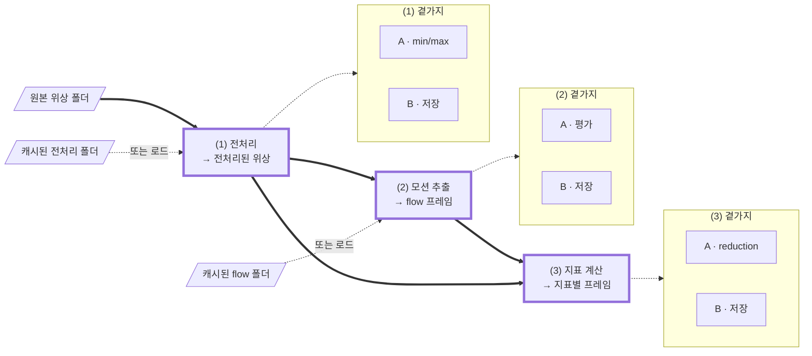

# TODO

문제 정의, 확정된 결정, 그리고 아직 코드나 테스트에 없는 것을 한곳에 모은다.
항목이 구현되면 CHANGELOG 항목으로 승격한다.

> **⚠️ 코드가 우선이다.** 불일치 시 우선순위는
> 실제 코드 > `pyproject.toml`/`uv.lock`/git 이력 > 이 문서.
> 여기 적힌 심볼·수치·경계는 **채택 전 코드로 재검증**할 것.

---

# 문제 정의

원본 위상 영상 시퀀스에서 **박동 프로파일** — 지표별 `(T′,)` 시그널 — 을 얻는다.

## 세 단계

각 단계는 **한 스텝 관점의 스트림**이다. 괄호 안 입력은 캐시로 대체할 수 있다.

| | 입력 | 출력 |
| --- | --- | --- |
| **(1) 전처리** | (위상 프레임) | 전처리된 위상 프레임 |
| **(2) 모션 추출** | (위상 프레임) | optical flow 프레임 |
| **(3) 지표 계산** | (위상 프레임, flow 프레임) | `{지표: (인덱스, 프레임)}` |



**굵은 실선이 메인 스트림**이고 테두리가 굵은 셋이 단계다. 점선은 근원 대체와 곁가지이고,
곁가지는 상자로 묶어 스트림과 갈랐다 — 무엇을 하는지는 아래 표에 있다.
(1)B가 쓰는 폴더가 다음 실행의 "캐시된 전처리 폴더"이고, (2)B와 flow 폴더도 같은 관계다.

**근원 선택은 단계마다 독립**이다. 전처리된 위상과 flow 각각 계산이거나 캐시라 네 조합이
모두 유효하고, 온라인 합성은 전이적이라 원본만 주고 지표까지 갈 수 있다. 섞었을 때
설정이 어긋나면 — 캐시된 flow가 다른 필터 설정의 산물이라면 — **사용자 책임**이며
검사하지 않는다.

## 곁가지 — A와 B, 서로 독립으로 켜고 끈다

| | **A · 누적** | **B · 저장** |
| --- | --- | --- |
| (1) | 프레임 min/max → 시퀀스 → **데이터셋** | 원본과 같은 레이아웃, 다른 루트 |
| (2) | 프레임 평가 → 시퀀스 → **데이터셋** | 〃 (최종 폴더·파일 이름은 다름) |
| (3) | 지표 프레임 → reduction → **시그널** | 〃 |

(1)A와 (2)A는 데이터셋까지 누적하지만 **(3)A는 시퀀스에서 멈춘다.**

## 지표


**3D와 Lagrangian 워핑은 나중이다.** 3D에서는 `Displacement`가 `xy`(`flow × pixel_size`)와
`z`(height의 시간차분)로 갈리고 `Height`가 위상에서 나온다. Lagrangian 차분은 `Acceleration`과
`Displacement z`에 `flow`를 하나 더 먹여 물질 점을 따라가게 한다. 둘 다 지금 결정할 것이
아니라 그림에서 뺐다.

**요청한 지표 수와 만들어지는 계산기 수는 다르다.** Force 하나를 요청해도 그 안에
DryMass와 Acceleration이, Acceleration 안에 Speed가, Speed 안에 Displacement가 있다 —
계산기 5개, 시그널 1개. 무엇을 뽑을지는 설정으로 받는다.

| 지표 | reduction | arity |
| --- | --- | --- |
| displacement · speed | norm의 평균 | `T−1` |
| acceleration · force | norm의 평균 | `T−2` |
| OPD variance | 평균 | `T−1` |
| dry mass | 합 | `T` |

**OPD variance**: `OPDvar(i) = var[OPD(i+1) − OPD(i)]`. 계산기는 픽셀별 **편차 제곱**을
반환하고, reduction의 평균이 그것을 분산으로 만든다.

### 인덱스는 지표마다 어긋난다

위상 프레임 `5`가 들어온 순간에 나오는 것:

```
dry_mass       5     프레임 하나면 됨
opd_variance   4     4, 5로 계산
force          4     3, 4, 5 → acceleration 4
```

**구간량**은 시작 프레임으로(`flow(i)`, `OPDvar(i)`는 `[i, i+1]`),
**순간량**은 중심으로(`acceleration`은 speed `i`·`i+1`의 차이라 `i+1`) 라벨링된다.
아직 만들 수 없는 지표는 **빈 값**이다.

## 한 스텝의 값은 한 번만 계산된다

계산된 값은 그것을 쓰는 **모든 소비자에게 전달**되고, 필요한 만큼만 보관되다 버려진다.

- **소비자가 여럿** — 필터된 프레임 `i`가 추정기와 dry mass와 OPD variance로. flow를
  온라인으로 계산할 때 이 셋이 **같은 프레임**을 받아야 하며, 두 번 필터링하면 안 된다
  (필터된 읽기를 두 번 하면 **+94%**, median `(2,2,2)` 기준).
- **소비자가 나중에** — Speed `i`가 Acceleration `i+1`이 만들어질 때까지. 계산기 포함
  구조와 내부 캐시가 이것이다.

## 실행

시퀀스 하나의 (1)→(2)→(3)이 통째로 독립이므로, 기본은 **순차**이고 프로세스나 GPU가
여럿이면 **시퀀스 단위 병렬**이다.

## 산출물

시그널은 지표마다 `.npy` 하나, `(T′,)` `float32`, 한 폴더에 모은다. **인덱스는 파일 밖의
규약**이므로 위 arity 표가 곧 계약이다. 중간 필드도 저장할 수 있다((1)B·(2)B·(3)B).

## 미룬 것

**ROI 마스크.** 지금은 항상 프레임 전체. 붙으면 지표 `N`개 × 마스크 `M`개의 시그널이 된다.

마스크가 들어올 때 **OPD variance의 형태를 다시 봐야 한다.** 계산기가
`(X − E[X])²`를 만들려면 `E[X]`를 먼저 알아야 하는데, 그 평균이 전체 프레임의 것이면
마스크 안 평균과 어긋나 `Var_R(X) + (μ_R − μ_full)²`가 된다 — 분산이 아니고, 값은
그럴듯하다. `E(X²) − E(X)²` 형태로 두 장을 내보내고 reduction이 접으면 계산기가 ROI를
몰라도 정확하다.

---

# 공통

어느 단계에나 걸리는 결정.

## 아키텍처 (가급적 재론 금지)

- **umbrella 패키지 + 연구별 서브패키지**: `iivs_cardio/<research>/`, 공용 코드는
  `iivs_cardio/common/` (공유 `Device`가 여기 사는 근거).
- **얇은 `scripts/`**: 인자 파싱·설정 로드·IO·device/시퀀스 배선만. **모든 실제 로직은
  `iivs_cardio/`** 에 둔다 (단일 수학 출처 원칙 보호).
- **모듈은 문제의 세 단계를 따른다**: `data/`(+`transforms/`) · `optical_flow/` ·
  `beating_profile/`(미생성). `scripts/`도 같은 삼분할.
- **editable install은 개발 편의용**: `import iivs_cardio` 안정화 목적. PyPI 배포 아님,
  `py.typed` 없음.
- **console entry point 기각**: CLI 코드를 패키지 안으로 끌어들여 `scripts/` 분리와 충돌.

## 멀티 GPU

- **데이터 병렬**: 시퀀스 샤딩, GPU마다 독립 파이프라인 인스턴스, 통신 0. 시퀀스가 온전히
  한 워커에 가므로 샤드 경계도 overlap도 stitch 시 dedupe도 없다.
- 구현은 `mpire`(GPU당 1 프로세스, spawn). 스케일은 선형이 아니었다: **7-GPU가 3.59배**로,
  디스크가 상한이었다.
- **모델 병렬 비권장**(교차 GPU 전송·복잡도; 한 프레임이 한 GPU에 안 들어갈 때만).
- 공유 `Device`(cuda:N): `cv2.cuda`는 전역 `setDevice`, torch는 per-op — 프로세스당 GPU
  1개 고정 모델과 잘 맞는다.

## 장치는 실행 단위로 고른다

`FilteredSequence`가 `Tensor`를 내놓고 `tensor_to_gpumat`이 그것을 OpenCV CUDA 추정기에
**복사 없이** 넘긴다(`tests/common/test_cuda_utils.py:28`이 포인터 동일성을 확인). 필터와
flow가 같은 장치면 프레임이 장치를 떠나지 않는다. 나누면 프레임당 3.24 MB와 — 더 나쁘게 —
그 전송이 강제하는 동기화를 문다. 워커 수의 최적값도 장치마다 다르므로(GPU당 하나 대
코어당 하나) 하나의 풀이 둘을 만족할 수 없다.

단계가 그 장치를 못 쓰면(DeepFlow는 CPU 전용) **캐시 경계에서 실행을 나누고**, 조용히
폴백하지 말고 **거부**할 것. 조용한 폴백은 몇 달 뒤 "왜 느리지"가 된다.

## CUDA 할당자

`MedianKernel.apply`가 343 오프셋 900×900에서 `(S,H,W)` 1.11 GB와 `(S//2+1,H,W)` 557 MB를
동시에 든다. torch의 캐싱 할당자는 해제된 블록을 세그먼트별로 쥐고 있어서, 가벼운 커널이
먼저 지나가면 총량은 충분한데 **연속된 큰 블록이 없는** 상태가 된다. 그러면
`release_cached_blocks`가 `cudaFree`로 장치를 세우고 재시도한다 — 프레임마다.

- 진단: `torch.cuda.memory_stats()["num_alloc_retries"]`. 한 번 찍어볼 것. 안 그러면 커널의
  실제 비용을 크게 잘못 읽는다.
- 싼 대책: `PYTORCH_CUDA_ALLOC_CONF=expandable_segments:True` (torch 2.12에 있음).
  세그먼트가 제자리에서 자라 새 연속 `cudaMalloc`이 필요 없어진다.
- **OpenCV는 별개로 할당한다.** `cv2.cuda`는 torch의 캐시를 모르므로, torch가 쥔 메모리를
  추정기가 못 얻을 수 있다. `empty_cache()`는 **시퀀스 경계**에 — 프레임 경계에 두면 비싼
  해제를 손으로 매 프레임 하는 셈이다.

## 파이프라인·컨테이너는 처음부터 다시 설계 중

트리에 있는 `Slot`·`Node`·`Steps`·`FieldWriter`·range collector들은 수렴하지 못한 대화에서
나온 것이다. 코드는 남아 있고 통과하지만, **확장할 것이 아니라 새로 판단할 대상**이다.
`scripts/data/scan_phase.py`가 유일한 드라이버이므로 그것만 계속 돌아가면 된다.

아직 정해진 것 없음: 데이터셋 수준 컨테이너가 무엇을 소유하는지, 그것이 실행을 분배하는
객체와 같은지, 시퀀스별 결과가 워커에서 어떻게 돌아오는지, 관심사마다 컨테이너 하나인지,
시간 윈도우를 누가 드는지.

# (1) 전처리

## 구현됨

`filtering/kernel/`에 `FilterKernel` 기반과 `MedianKernel`·`GaussianKernel`·`IdentityKernel`.
둘 다 per-axis 이웃을 읽고 범위 밖 이웃을 **패딩하지 않고 버린다**.

**median**은 레거시 의미를 유지하며 `scipy`로 검증했다 — ellipsoid는
`(dx/rx)² + (dy/ry)² + (dz/rz)² ≤ 1`(반지름 2에서 33개, cuboid는 125개), 유효 표본이
짝수면 **중앙 두 값을 평균**하므로 하위값을 반환하는 `torch.median`은 쓸 수 없다.
**gaussian**은 per-axis `sigma`+`truncate`(반지름 = `int(truncate*sigma+0.5)`, scipy 규칙)
이고 분리가능하며, 실제로 걸린 가중치로 나눠 전체 3D 정규화 결과와 정확히 일치한다.

`MedianParams`/`GaussianParams`가 있어 설정이나 캐시 사이드카가 살아 있는 객체 없이 설정을
나른다.

## 열린 것

- **장치 간 일치를 테스트로 만들 것.** `tests/`에 커널을 장치 간 비교하는 것이 없다.
  `tests/common/test_cuda_utils.py`의 `requires_cuda` 마커를 가져다 쓸 것.

  흥미로운 경계는 `sort` 대 `topk`다. `MedianKernel`이 오프셋 수로 고르는데 median 설정들이
  7~343개를 만들고 커밋된 임계는 `range(33, 64)`라, `ellipsoid (1,1,1)`(7개)과
  `ellipsoid (2,2,2)`(33개)가 **양쪽으로 갈린다**. 테두리 화소는 NaN 패딩과 짝수 유효
  개수를 가지므로 NaN 정렬과 중앙 두 값 평균 경로도 함께 지나간다. `torch.equal`로 전체
  텐서를 비교할 것.

- **시간 반지름은 프레임률을 따라야 한다.** 손상은 창이 덮는 **시간**을 따르지 프레임 수를
  따르지 않으므로, 레거시의 고정 `(2,2,2)`는 20 Hz 값이고 10 Hz 데이터를 과하게 뭉갠다 —
  10 Hz에서 박동 프로파일의 상대 진폭 **~30%**를 잃는 반면 `rz=1`은 잃지 않는다.
  **결과물이 곧 박동 프로파일**이므로 이것은 denoising이 아니라 신호 손실이다. 상수로
  고정하지 말고 데이터셋의 박동 주기에서 유도할 것. 실제 간격은 각 샘플의
  `timestamps.txt`에서 읽을 것 — 픽스처 이름은 "~10 Hz"라고만 주장한다.

- **범위 문서의 device sync를 일괄화.** `finite_range`가 프레임마다 `low.isfinite()`를
  읽어 값을 호스트로 끌어오고, 그동안 CPU가 다음 프레임을 못 읽는다. `aminmax`를 전부
  먼저 던지고 한 번에 전송하면 정지가 사라진다 — 스칼라가 프레임당 8 B라 1200프레임이
  9.6 KB고, CUDA 실행 큐는 무한히 자라지 않고 스스로 조절한다. 비유한 값 폴백은 없애려는
  그 동기화 없이 프레임마다 분기할 수 없으므로, **경계가 비유한으로 돌아온 프레임만**
  두 번째 패스로 다시 본다(실제로는 없다).

  **(1)B와 상충한다.** 프레임을 쓰려면 호스트로 내려야 하고 그것이 같은 동기화라,
  저장하는 실행에서는 정지가 어차피 돌아온다. 범위만 구하는 실행에서만 값을 한다.

- **범위 문서의 `indent=2`를 뺄 것.** 한 글자에 파일 크기의 큰 몫이고 시간 비용은 없다.

- **범위가 필터를 변별할 수 있는지는 다시 열려 있다.** 전체 데이터셋 답을 냈던 스윕이
  은퇴하면서 그 결론도 같이 은퇴했다. 다음 실행에 물어야 할 두 가지: 범위가 설정들을
  가르기는 하는가, 그리고 한 시퀀스의 핫픽셀 하나가 데이터셋 경계를 얼마나 움직이는가 —
  정규화 정책이 견뎌야 하는 것이 후자다. 모든 문서가 시퀀스별 범위를 들고 있으므로 둘 다
  두 번째 패스 없이 답할 수 있다.

- **소스 탐색은 `iivs-lib`으로 간다.** 결정됐고 일정만 미정. `search_phase_bin_folders`는
  이미 거기 있고, 따라갈 것은 `search_sources`가 그 위에 두른 층이다 — `include`/`exclude`
  선택, 단위 오버라이드, 그리고 구분해서 알리는 두 실패. 두 번째 스크립트가 자기 사본을
  기르기 전에 옮길 것.

- **필터 캐시를 둘지는 조건부다.** CUDA에서 1000프레임당 ~3초로 재생성되므로, GPU가 귀하거나
  없는 곳(CPU 전용 기계, 매 epoch 재필터링이 모델과 장치를 다투는 학습 루프)에서 캐시가
  이긴다. 전처리 파라미터를 탐색하는 동안은 재생성이 이긴다 — 설정이 바뀔 때마다 캐시가
  무효화되므로. 원본 위상을 지우고 필터 결과만 남기는 것은 파라미터가 확정된 뒤의 별개
  결정이다.

- **캐시 형식**: iivs-lib의 `save_phase_bin`/`save_phase_folder`를 통해 Koala `.bin`으로.
  그러면 `PhaseBinFolder`가 되읽고 `pixel_size`/`height_scale` 보정이 **파일 안**에 실려
  사이드카가 어긋날 일이 없다. `.bin`도 iivs-lib의 `.npy`도 float32이므로 float16은 생태계를
  떠나는 일이다 — 디스크가 실제로 막을 때만 재검토하고, 물리량에 대한 정밀도 손실을 먼저
  측정할 것.

---

# (2) 모션 추출

## 구현됨

`optical_flow/estimators/`에 OpenCV 기반 Farneback·DualTVL1·DeepFlow, `common/warp.py`,
`optical_flow/evaluation.py`, `optical_flow/data/folder.py`(flow `.npy` 폴더).

`data/transforms/normalization.py`는 세 모드를 쌍 모양 API로 제공하고 uint8을 낸다.
**`pairwise`는 단일 정규화 프레임 목록을 만들 수 없다** — 한 프레임이 속한 쌍의 결합 범위로
스케일되므로 두 번 등장하며 인코딩이 둘이다. API가 쌍(또는 창) 기반이어야 그 모드가 존재할
수 있다. `perframe`은 위험한 모드다: 프레임마다 자기 극값으로 다시 스케일하면 모든 추정기가
전제하는 밝기 항상성이 깨진다. `injected`는 밖에서 측정한 범위를 받으므로 시퀀스 범위와
데이터셋 범위가 같은 코드가 되고 호출자의 선택이 된다.

레거시가 **버림**하던 것을 **반올림**한다 — 256단계 중 한 단계만큼 화소 절반이 움직인다.
계통적 하향 편향을 없애는 것이지 잡음을 더하는 것이 아니지만, 전환 이전의 품질 수치와는
소수점 다섯째 자리에서 비교 불가다.

**`pairwise`는 추정기의 streaming 경로를 막는다.** `push`가 **정규화된** 이전 프레임을
붙들고 있는데 `pairwise`에서는 다음 프레임이 올 때 그 인코딩이 낡는다 — 비교되는 두
프레임이 서로 다른 스케일에 놓이며, 이것이 `perframe`을 기각한 바로 그 밝기 항상성 파괴다.
그래서 `pairwise`는 `calc`를 함의하고, `injected`만 안전하면서 `push`와 양립한다. 다만
그 거래의 값은 작다 — CUDA에서 `push`가 `calc` 대비 1.05배였다.

## 열린 것

- **어느 추정기인지 아직 모른다. Dual TV-L1이 이긴다고 가정하지 말 것.** 둘 다
  coarse-to-fine이라 그것이 차이가 아니고, 각 레벨 **안의** 추정기가 차이다. TV-L1의 L1
  데이터 항은 가림과 조명 변화에 대한 강건성을 사는데 — 투명 위상 영상에는 **둘 다 없다** —
  대략 가우시안인 위상 잡음 아래서 효율을 잃는다. TV 정규화는 조직이 매끄러운 연속체로
  변형하는 곳에서 조각별 상수장을 선호한다. 서브픽셀 운동에서는 피라미드가 둘 다 무력하다
  (Farneback의 `num_levels` 1/3/5가 bit-identical). 속도는 **캐시를 한 번 만드는 비용**으로
  판단할 것 — 그러면 DeepFlow의 CPU 전용 경로가 처음 보이는 것보다 훨씬 덜 결격이다.

- **한 축이 아니라 세 축으로 점수를 매길 것.** warp consistency는 flow가 프레임을 얼마나 잘
  재구성하는지만 재고, 탐색은 그 대리 지표를 기꺼이 악용한다.

  - *bias* — 아래 ground-truth 벤치마크에 대한 endpoint error, 아니면 평균 `|flow|`의 충실도
  - *consistency* — forward-backward error. 잡음을 맞춰 광도 점수를 버는 flow를 잡는다
  - *박동 진폭* — 쌍별 평균 `|flow|`의 std/mean. 레거시 시간 반지름이 신호를 ~30% 압축한
    것을 잡아낸 것이 이 축이다

  광도 수치 하나는 목적함수가 어긋난 것이다 — 결과물은 박동 프로파일과 힘이지 재구성된
  프레임이 아니다.

- **프레임 쌍마다 고르지 말 것. 시퀀스별 선택도 믿기 전에 검증할 것.** 측정된 공변량에서
  파라미터를 유도하는 것(프레임 간격에서 시간 반지름)은 원칙적이고 외삽되지만, 점수가 가장
  높은 설정을 고르는 것은 선택 편향이다. 쌍별 선택이 최악이다 — 이 지표들이 취약한 바로 그
  잡음 맞추기를 극대화하며, 추정기 간 bias가 ~2.2배 차이 나므로 시퀀스 중간에 바꾸면
  **분석이 검출하려는 약물 효과보다 큰 계단**이 박동 프로파일에 들어간다.

  시퀀스별 가설은 **split-half 검사**로 시험할 것: 한 시퀀스 쌍들의 절반에서 이긴 설정이
  나머지 절반에서도 이기는가? 아니면 그 변동은 잡음이다. 재현되면 시퀀스별 승자를
  공변량(프레임률, 평균 `|flow|`, SNR, 박동 주기)에 회귀시킬 것 — 설명되는 차이는 규칙이
  되고, 설명 안 되는 차이는 전역 설정 하나로 남는다. 추정기를 바꾸기보다 공변량으로
  파라미터화하는 쪽을 택할 것: 자유도가 시퀀스당 하나가 아니라 한둘이고, 불연속이 없다.

- **가장 덜 편향된 flow를 캐시하고, 평활은 소비자에서.** bias와 variance는 대칭이 아니다.
  잡음 많은 flow는 나중에 평활할 수 있지만, 정규화가 깎아낸 운동은 복구 불가다 — 모든 표본이
  똑같이 옮겨졌기 때문이다. 측정: Dual TV-L1이 Farneback의 평균 `|flow|`의 **~0.46배**를
  낸다 — 운동의 절반 이상이 사라진다.

  소비자들이 서로 다른 것을 원하기에 이것이 중요하다. 운동학과 힘은 낮은 분산을 원한다 —
  가속도는 2차 차분이라 독립 잡음을 `√6`배로 키우면서 10 Hz로 샘플된 매끄러운 1 Hz 신호는
  ~0.40배로 줄이므로, 이중 차분마다 SNR에서 약 6배를 문다. 프레임 보간과 지도학습 flow는
  낮은 bias를 원한다 — 절반 크기의 flow는 보간 내용을 절반 못 미치게 놓고, 그것으로 학습한
  망은 그 축소를 영구히 물려받는다. 더 선명한 flow를 캐시하면 둘 다 산다 — 힘 경로는
  소비 시점에 정규화할 수 있으므로.

  캐시는 **단일 설정**으로 할 것. 균일한 bias는 특성화·보정 가능하지만(상수 배율은 상대
  비교를 보존한다) 프레임 쌍마다 다른 bias는 둘 다 불가능하다.

  저장: flow는 `(2, H, W)` float32로 프레임당 6.48 MB — **위상의 두 배** — 이고 CUDA에서
  1000프레임당 ~4초에 재생성된다. 필터 캐시와 같은 조건부 규칙이다.

- **`evaluation.py`에 identity baseline과 forward-backward error를 올릴 것.** 둘 다
  `benchmark_opencv.py`에 프로토타입만 있고, 그 파일은 아래 재작성으로 은퇴한다 — 사라지기
  전에 옮길 것. 서브픽셀 운동에서는 **zero flow가 이미 SSIM ~0.94**를 받으므로 SSIM 이득만
  보면 잡음을 맞추는 flow에 상을 준다. 어느 쪽도 혼자서는 안전하지 않다 — zero flow는
  이득이 없지만 자기 일관성은 완벽하다 — 그러니 API가 **둘을 함께 보고하는 것을 쉬운 길**로
  만들어야 한다. FB error는 역방향 flow가 필요하므로 `warp_consistency`의 단일 flow
  시그니처를 재사용할 수 없다.

- **실제 프레임에서 ground-truth flow 벤치마크를 만들 것.** 실제 DHM 프레임을 알려진 매끄러운
  서브픽셀 변위장(~0.3 px, 측정된 규모)으로 워핑하고 endpoint error로 추정기를 채점한다.
  실제 영상 통계를 유지하면서 ground truth를 되찾는 것이다 — 옛 합성 장면은 ground truth는
  있었지만 운동 영역이 8~14 px로 틀렸다.

  요점은 **어느 대리 지표를 믿을지 정하는 것**이다. SSIM 이득과 FB error가 일상적으로
  엇갈리는데(TV-L1의 `lambda_`를 올리면 이득은 두 배, FB error는 14배 악화) ground truth가
  없으면 어느 쪽이 옳은지 말할 방법이 없다. EPE가 직접 결정한다.

  설계에서 감안할 것: 한 프레임을 워핑하면 그 잡음이 그대로 실려 가므로 밝기 항상성이 정확히
  성립하고 과제가 비현실적으로 쉬워진다. 워핑된 프레임에 독립적인 잡음을 더하거나, 수치를
  달성 가능한 정확도가 아니라 **추정기 순위**로 취급할 것.

  같은 구성이 학습된 flow 모델의 **지도학습 데이터 생성기**로도 쓰인다 — 실제 영상 통계에
  정확한 레이블. 고전적 pseudo-label로 학습하면 모델이 교사를 넘지 못한다.

- **`benchmark_opencv.py`를 `run_estimator.py`로 재작성할 것.** 지금 것은 샘플 하나를
  CPU-대-CUDA 판정으로 채점한다. 대체본은 루트 아래 모든 시퀀스를 훑고 시퀀스별로 집계하는데,
  그것이 파라미터 탐색이 필요로 하는 모양이다.

  워커 API를 규정하는 제약들(전부 확인됨):

  - **어떤 추정기도 프로세스 경계를 넘지 못한다.** 전부 자기 `cv2` 객체에서 pickle에
    실패한다. 워커는 **레시피**(params·device·경로)를 받아 자기 것을 만들어야 한다.
    `FarnebackParams`·`MedianKernel`·`FrameNormalizer`는 pickle되지만, 정규화기는 가변
    상태를 들고 `FilteredSequence`는 따뜻한 버퍼를 들고 있으므로 둘 다 보내지 말 것.
  - **풀 `initializer`가 워커를 싸게 만든다** — 시퀀스마다가 아니라 워커마다 추정기 하나.
  - **긴 것부터 정렬하고 동적으로 분배할 것.** 길이 균형 정적 분할과 긴 것부터의
    `imap_unordered`가 동일하게 측정됐다(둘 다 완벽한 분할의 1.07배). 정렬은 한 줄이고
    분할은 bin-packing 함수이며, 동적 분배는 추정 오차도 흡수한다. 정렬 안 함은 1.10배,
    짧은 것부터는 1.15배 — 정렬은 값을 하고 분할은 안 한다.
  - **워커 수는 추정기의 장치를 따른다**: CPU 추정기는 코어 수(이득이 거의 선형), CUDA
    추정기는 GPU 수만큼만(프로세스를 몇 개 세워도 장치에서 직렬화된다).
  - **`hydra.instantiate`가 whitelist 없이 경고한다(1.4).** 설정이 정하는 `_target_`은
    임의 코드이므로 `_target_whitelist_` 없는 사용은 deprecated다. 우리 설정은 우리 것이라
    위험은 낮지만, 드라이버의 `instantiate`는 만들려는 추정기/커널 클래스의 whitelist를
    넘겨야 한다.

  시간이 실제로 어디 가는가(프레임 쌍당): **flow가 전부를 지배한다.** CPU Dual TV-L1이
  median 필터의 ~150배, CPU Farneback의 ~15배. CUDA에서는 직관과 반대로 순서가 뒤집혀
  `warp_consistency`가 Farneback `calc`의 ~10배다. **전처리 최적화는 처리량이 있는 곳이
  아니다.**

  남은 최적화: 추정기의 입력 변환·`calc`·출력을 `cv2.cuda.Stream`으로 파이프라인화(지금은
  전부 기본 스트림 하나). 그리고 이제 자기가 채점하는 flow보다 무거워진 평가.

- **`run_estimator.py`에 실제 결함 넷이 남아 있다.** `ty`가 `scripts/`를 검사하기 시작하며
  드러났다: `:39`의 반환 타입 불일치, `:52`의 `FrameNormalizer.apply` 인자 둘 다 잘못
  (`iivs_cardio/data/transforms/normalization.py:142` 기준), `:76`의 `process_sequence` 인자
  잘못. `ruff`는 미사용 루프 변수 하나와 계산하고 버린 flow 둘을 더한다. **이것이 오늘
  `ruff check`·`ty check`가 보고하는 전부**이므로, 이 파일이 대체될 때까지 두 명령은 비교로만
  깨끗하다.

---

# (3) 지표 계산

**아직 아무것도 없다.** `iivs_cardio/beating_profile/`도 `scripts/beating_profile/`도 없다.

문제 정의의 지표 DAG·arity·reduction이 명세다. 그 위에 필요한 것:

- **kinematic 커널** — 채널-첫(CHW) 규약.
- **계산기 구성** — 상위가 하위를 포함하고 하위 결과를 캐시한다. Force ⊃ {Acceleration,
  DryMass}, Acceleration ⊃ Speed, Speed ⊃ Displacement.
- **reduction** — 지표마다 고정(벡터장은 norm의 평균, OPD variance는 평균, dry mass는 합).
  설정으로 고르는 값이 아니다.
- **시그널 저장** — 지표마다 `.npy`, `(T′,)` float32.
- **`iivs-lib`이 이미 가진 것부터 확인할 것.** `iivs-lib[torch]`는 이미 의존성이고
  (`>=0.3.1`), 이 단계가 쓸 것이 상당수 거기 있다 — `iivs.dhm.analysis.pytorch`에
  `OpticalPathDifference`·`DryMass`·`OpticalHeight`·`calc_drymass` 등이,
  `iivs.common.data.pytorch`에 `MaskedReduction`·`Mean`·`Sum`·`Norm`·`Variance`·
  `apply_mask`·`region_stack`이 있다. **마스크 지원 reduction은 곧 필드→시그널 요약
  그 자체**이고, `Variance`는 OPD variance와 겹친다.

  이름만 확인했고 시그니처와 의미는 안 봤다. 양마다 소유자를 하나만 정할 것 — 이 프로젝트가
  다시 쓰는 것은 거기 없는 것뿐이어야 한다.

---

# 실행 · 도구

## hydra

- **`hydra-core >= 1.4.0.dev6`, `scripts` 의존성 그룹.** 1.3.4는 Python 3.14에서 잡을
  시작조차 못 한다 — `hydra.main`이 non-string `help`로 `argparse` 파서를 만드는데 3.14가
  거부한다. dev 핀을 택한 이유: 인터프리터를 낮추거나 `--multirun`을 포기하는 것이 더 비싸다.
  `scripts/`만 hydra를 임포트하므로 런타임 의존성이 아니라 PEP 735 그룹에 산다
  (`uv sync --group scripts`). 1.4 stable이 나오면 재검토.

- **짧은 오버라이드 형태가 모든 그룹에 통하지 않는다.** `compute=cpu`는 그룹과 패키지가 둘 다
  `compute`라 되지만, 필터 그룹은 다른 패키지에 마운트되어
  `data/transforms/filtering@filter=<name>`이 필요하다 — 그냥 `filter=<name>`은 값으로 읽혀
  instantiation에서 실패한다. 잡의 정확한 호출은 그 잡의 `.hydra/overrides.yaml`에서 복구된다.

## 관측

- **아무것도 로그하지 않는다.** hydra가 잡 디렉터리마다 `scan_phase.log`를 여는데 매 실행
  0바이트다 — 스크립트가 아무것도 안 쓰고, `report_insights`는 `print`하는데 hydra가 그것을
  잡지 않는다. 그래서 스윕이 어느 시퀀스를 읽었는지, 각각 얼마나 걸렸는지, 왜 실패했는지
  기록을 남기지 않는다. 정할 것은 레벨 분리다: 시퀀스별 `INFO`, 프레임별 `DEBUG`(시퀀스당
  1200프레임이면 파일을 뒤덮으므로), `report_insights`는 stdout 대신 그쪽으로. 워커는 자기
  프로세스에서 로그하므로 핸들러가 spawn된 프로세스가 상속하거나 재구성할 수 있는 것이어야
  한다.

- **`mpire` insights가 지금 소비자를 잃었다.** `scan_sequences`에서 `report_insights` 호출이
  빠졌는데 `enable_insights=compute_config.insights`는 남아 있어, 수집은 하고 아무도 보지
  않는다. 나중에 이어서 정리할 것.

- **워커별 진행표시줄.** 풀 수준 바는 이미 그려진다. `worker_init`이
  `tqdm(position=worker_id + 1, leave=False)`를 열고(풀의 바가 0번), 작업마다 시퀀스 길이로
  리셋하고 이름을 바꾸며, `worker_exit`이 닫는다. spawn 아래 7줄이 독립적으로 그려지는 것을
  확인했다. **무거운 커널에서만 값을 한다** — 몇 초마다 시퀀스가 끝나는 설정은 이미 시퀀스
  바가 움직이고, 무거운 것은 몇 분씩 멈춰 있어 멎은 것처럼 보인다.

  `tqdm`은 tty가 아니어도 **조용해지지 않는다** — 리디렉션된 바는 갱신마다 재그리기 줄을
  로그에 쓴다. `compute.progress_bar` 기본값을 참으로 두면 `--multirun` 잡마다 그 소음을
  문다.

## 실패

- **시퀀스 하나가 실행 전체를 죽이면 안 된다.** `scan_sequence`는 유한값이 없는 프레임에서,
  `save_phase_bin_folder`는 목적지가 있고 `overwrite`가 거짓일 때 예외를 던진다. 어느 쪽이든
  전부를 끝낸다 — `mpire`가 작업의 예외를 부모에서 다시 던지고 풀을 무너뜨리므로, 이미 끝난
  모든 시퀀스가 실패한 하나 때문에 사라진다. 전체 데이터셋에서는 몇 시간 뒤에.
  스캔은 실패를 **예외가 아니라 결과로** 나르고, 할 수 있는 것을 끝내고, 마지막에 어느
  시퀀스를 왜 건너뛰었는지 보고해야 한다.

  **부분 실행은 그렇다고 말해야 한다.** 부분집합에 대해 접은 범위는 데이터셋의 범위가
  아니며, 그것으로 정규화 정책을 정하는 소비자는 **구멍을 데이터로 읽게** 된다. 문서가 무엇을
  얻든 — 건너뛴 목록이든 찾은 개수 대비 카운트든 — 읽는 사람이 놓칠 수 없는 것이어야 한다.
