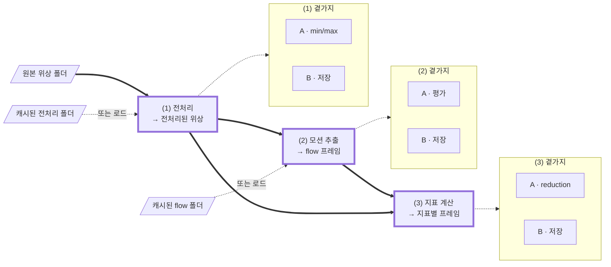
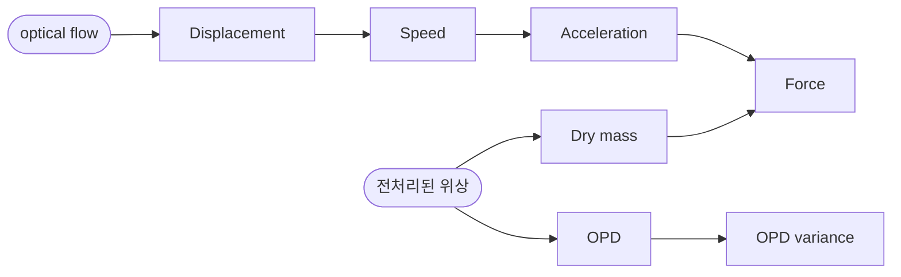

# TODO

문제 정의, 확정된 결정, 그리고 아직 코드나 테스트에 없는 것을 한곳에 모은다.
항목이 구현되면 CHANGELOG 항목으로 승격한다.

> **⚠️ 코드가 우선이다.** 불일치 시 우선순위는
> 실제 코드 > `pyproject.toml`/`uv.lock`/git 이력 > 이 문서.
> 여기 적힌 심볼·수치·경계는 **채택 전 코드로 재검증**할 것.

---

# 문제 정의

원본 위상 영상 시퀀스에서 **박동 프로파일** — 지표별 `(T′,)` 시그널 — 을 얻는다.

## 세 단계

각 단계는 **한 스텝 관점의 스트림**이다. 괄호 안 입력은 캐시로 대체할 수 있다.

| | 입력 | 출력 |
| --- | --- | --- |
| **(1) 전처리** | (위상 프레임) | 전처리된 위상 프레임 |
| **(2) 모션 추출** | (위상 프레임) | optical flow 프레임 |
| **(3) 지표 계산** | (위상 프레임, flow 프레임) | `{지표: (인덱스, 프레임)}` |



**굵은 실선이 메인 스트림**이고 테두리가 굵은 셋이 단계다. 점선은 근원 대체와 곁가지이고,
곁가지는 상자로 묶어 스트림과 갈랐다 — 무엇을 하는지는 아래 표에 있다.
(1)B가 쓰는 폴더가 다음 실행의 "캐시된 전처리 폴더"이고, (2)B와 flow 폴더도 같은 관계다.

**근원 선택은 단계마다 독립**이다. 전처리된 위상과 flow 각각 계산이거나 캐시라 네 조합이
모두 유효하고, 온라인 합성은 전이적이라 원본만 주고 지표까지 갈 수 있다. 섞었을 때
설정이 어긋나면 — 캐시된 flow가 다른 필터 설정의 산물이라면 — **사용자 책임**이며
검사하지 않는다.

## 곁가지 — A와 B, 서로 독립으로 켜고 끈다

| | **A · 누적** | **B · 저장** |
| --- | --- | --- |
| (1) | 프레임 min/max → 시퀀스 → **데이터셋** | 원본과 같은 레이아웃, 다른 루트 |
| (2) | 프레임 평가 → 시퀀스 → **데이터셋** | 〃 (최종 폴더·파일 이름은 다름) |
| (3) | 지표 프레임 → reduction → **시그널** | 〃 |

(1)A와 (2)A는 데이터셋까지 누적하지만 **(3)A는 시퀀스에서 멈춘다.**

## 지표



**요청한 지표 수와 만들어지는 계산기 수는 다르다.** Force 하나를 요청해도 그 안에
DryMass와 Acceleration이, Acceleration 안에 Speed가, Speed 안에 Displacement가 있다 —
계산기 5개, 시그널 1개. 무엇을 뽑을지는 설정으로 받는다.

| 지표 | reduction | arity |
| --- | --- | --- |
| displacement · speed | norm의 평균 | `T−1` |
| acceleration · force | norm의 평균 | `T−2` |
| OPD variance | 평균 | `T−1` |
| dry mass | 합 | `T` |

**OPD variance**: `OPDvar(i) = var[OPD(i+1) − OPD(i)]`. 계산기는 픽셀별 **편차 제곱**을
반환하고, reduction의 평균이 그것을 분산으로 만든다.

### 인덱스는 지표마다 어긋난다

위상 프레임 `5`가 들어온 순간에 나오는 것:

```
dry_mass       5     프레임 하나면 됨
opd_variance   4     4, 5로 계산
force          4     3, 4, 5 → acceleration 4
```

**구간량**은 시작 프레임으로(`flow(i)`, `OPDvar(i)`는 `[i, i+1]`),
**순간량**은 중심으로(`acceleration`은 speed `i`·`i+1`의 차이라 `i+1`) 라벨링된다.
아직 만들 수 없는 지표는 **빈 값**이다.

## 한 스텝의 값은 한 번만 계산된다

계산된 값은 그것을 쓰는 **모든 소비자에게 전달**되고, 필요한 만큼만 보관되다 버려진다.

- **소비자가 여럿** — 필터된 프레임 `i`가 추정기와 dry mass와 OPD variance로. flow를
  온라인으로 계산할 때 이 셋이 **같은 프레임**을 받아야 하며, 두 번 필터링하면 안 된다
  (필터된 읽기를 두 번 하면 **+94%**, median `(2,2,2)` 기준).
- **소비자가 나중에** — Speed `i`가 Acceleration `i+1`이 만들어질 때까지. 계산기 포함
  구조와 내부 캐시가 이것이다.

## 실행

시퀀스 하나의 (1)→(2)→(3)이 통째로 독립이므로, 기본은 **순차**이고 프로세스나 GPU가
여럿이면 **시퀀스 단위 병렬**이다.

## 산출물

시그널은 지표마다 `.npy` 하나, `(T′,)` `float32`, 한 폴더에 모은다. **인덱스는 파일 밖의
규약**이므로 위 arity 표가 곧 계약이다. 중간 필드도 저장할 수 있다((1)B·(2)B·(3)B).

## 미룬 것

**ROI 마스크.** 지금은 항상 프레임 전체. 붙으면 지표 `N`개 × 마스크 `M`개의 시그널이 된다.

마스크가 들어올 때 **OPD variance의 형태를 다시 봐야 한다.** 계산기가
`(X − E[X])²`를 만들려면 `E[X]`를 먼저 알아야 하는데, 그 평균이 전체 프레임의 것이면
마스크 안 평균과 어긋나 `Var_R(X) + (μ_R − μ_full)²`가 된다 — 분산이 아니고, 값은
그럴듯하다. `E(X²) − E(X)²` 형태로 두 장을 내보내고 reduction이 접으면 계산기가 ROI를
몰라도 정확하다.

---

# 공통

## 결정

- **멀티 GPU는 시퀀스 샤딩이다.** GPU마다 독립 파이프라인 인스턴스, 통신 0. 시퀀스가
  온전히 한 워커에 가므로 샤드 경계도 overlap도 stitch 시 dedupe도 없다. 구현은
  `mpire`(GPU당 1 프로세스, spawn). 스케일은 선형이 아니었다 — **7-GPU가 3.59배**로,
  디스크가 상한이었다. 모델 병렬은 비권장(교차 GPU 전송·복잡도; 한 프레임이 한 GPU에 안
  들어갈 때만). `cv2.cuda`는 전역 `setDevice`, torch는 per-op이라 **프로세스당 GPU 하나**
  고정 모델과 잘 맞는다.

- **장치는 실행 단위로 고른다.** 단계마다 따로 고르지 않는다. `FilteredSequence`가
  `Tensor`를 내놓고 `tensor_to_gpumat`이 그것을 OpenCV CUDA 추정기에 **복사 없이** 넘기므로
  (`tests/common/test_cuda_utils.py:28`이 포인터 동일성을 확인), 필터와 flow가 같은 장치면
  프레임이 장치를 떠나지 않는다. 나누면 프레임당 3.24 MB와 — 더 나쁘게 — 그 전송이 강제하는
  동기화를 문다. 워커 수의 최적값도 장치마다 다르므로(GPU당 하나 대 코어당 하나) **하나의
  풀이 둘을 만족할 수 없다**.

  단계가 그 장치를 못 쓰면(DeepFlow는 CPU 전용) **캐시 경계에서 실행을 나누고**, 조용히
  폴백하지 말고 **거부**할 것. 조용한 폴백은 몇 달 뒤 "왜 느리지"가 된다.

- **CUDA 할당자는 크기가 뒤섞일 때만 문제가 된다.** 900×900 343 오프셋에서 `MedianKernel`이
  한 번에 잡던 것이 **4.75 GB**였다 — `gathered` 1.11 GB, `sort`의 값 1.11 GB, `sort`의
  **인덱스** 2.22 GB(`int64`라 값의 두 배, `.values`가 곧바로 버린다), `isnan` 마스크
  0.28 GB. 지금은 프레임을 띠로 나눠 계산해 **0.17 GB**로 묶여 있고, 결과는 bit-identical에
  오히려 빠르다(§(1) 구현됨).

  그래도 위험이 사라진 것은 아니다. 크기가 제각각인 블록이 세그먼트에 흩어져 다음 큰 요청에
  연속 공간이 없으면 `release_cached_blocks`가 `cudaFree`로 장치를 세우고 재시도한다 —
  프레임마다. 커널 설정 11개를 한 프로세스에서 연달아 돌린 벤치마크에서 같은 코드가
  `cuboid (3,3,3)`에서 **8.46초 대 139 ms**로 읽혔다. **한 실행에서는 필터 설정이 하나라
  크기가 매 프레임 같으므로** 이 조건은 생산 경로에서 생기지 않는다.

  **진짜 위험은 온라인 모드다.** (1)(2)(3)이 한 프로세스에서 이어 돌면 필터 버퍼, 추정기
  작업공간, flow 텐서, 지표 중간값이 **서로 다른 모양으로** 같은 풀에 섞인다. 그리고
  `cv2.cuda`는 **torch의 캐시를 모르므로** torch가 쥔 메모리를 추정기가 못 얻을 수 있다 —
  `tensor_to_gpumat`이 프레임 복사는 없애도 추정기 내부 작업공간은 OpenCV 쪽 할당이다.

  진단은 `torch.cuda.memory_stats()["num_alloc_retries"]`(0이 아니면 일어난 것), 대책은
  `PYTORCH_CUDA_ALLOC_CONF=expandable_segments:True`(torch 2.12). `empty_cache()`는
  **시퀀스 경계**에 — 프레임 경계에 두면 그 비싼 해제를 손으로 매 프레임 하는 셈이다.

- **단계는 번호로 묻는 소스다.** `Stage`를 인덱스로 물으면 미스일 때만 계산하고 창 안에
  붙잡으므로, 한 프레임이 여러 소비자에게 **한 번의 계산으로** 간다 — 추정기와 dry mass가
  같은 위상 프레임을 볼 때 두 번 필터링하면 +94%다. 창 깊이는 소비자를 아는 빌더가 넣는다.
  곁가지는 훅이고 **인덱스마다 한 번** 불리며, `run()`이 그래프 전체의 훅을 한꺼번에 열고
  닫는다 — 공유 단계는 두 경로로 닿아도 한 번만 열리고, 중간에 죽으면 반쪽짜리 폴더가
  남지 않는다. `SequenceStage`가 `DataSequence`를 감싸므로 온라인 계산과 캐시 로드가
  같은 것이 된다.

  스테이지 팩토리가 훅을 붙여 넘기므로 **상위 단계는 하위의 곁가지를 보지 않는다.** 설정에서
  훅 팩토리를 만드는 것은 진입점의 일이고, 레벨마다 빌더 하나(`build_preprocess_stages`)를 지나
  드라이버가 둘이 되어도 그 조립은 한 군데다.

- **누적하는 곁가지는 파일로 집에 온다.** `shared_objects`는 한 방향이라 워커가 채운 복사본이
  돌아오지 않는다. 시퀀스별 미터가 끝날 때 `<문서>.parts/`에 자기 `SequenceRange`를 떨구고,
  부모의 `RangeDocument`가 실행이 끝나면 접는다. **드라이버를 지나는 값이 없다** — 예전
  `fresh`/`merge`가 풀려던 문제가 사라진다. 죽은 순회는 아무것도 안 쓰고(접두사는 데이터셋
  경계에 구멍을 낸다), 끝난 파트는 남으며, 진입 시 지운다(출력 디렉터리가 고정이라 이전
  실행의 파트가 섞일 수 있다).

  여섯 곁가지 중 **수명이 필요한 것은 둘뿐**이다 — (1)A와 (2)A. 나머지는 시퀀스에서 끝난다.
  구분은 A/B가 아니라 **누적이 어느 층에서 멈추느냐**이고, 그래서 `SideBranch`는 컨텍스트
  매니저를 **선택적 능력**으로 둔다.

  **별도 스크립트로 가르지 않는다.** 메인 스트림은 전처리이고 범위는 그 곁가지일 뿐이라,
  `preprocess` 하나가 둘 다 든다.

- **거부된 잡이 로그를 남기지 않는 것은 의도다.** `preprocess`가 스윕에서
  `target.save_frames`를 거부하면 잡 디렉터리에 0바이트 `preprocess.log`만 남는다. 설정을
  먼저 찍도록 가드를 뒤로 미루는 안을 재보고 **버렸다**.

  값이 거의 없다. hydra가 `main`을 부르기 전에 `.hydra/config.yaml`을 이미 쓰므로 거부된
  잡의 설정은 그대로 디스크에 있고, 거부 메시지도 무엇이 잘못인지 이름을 댄다. 로그 블록은
  이미 있는 것을 사람이 읽기 좋게 다시 그리는 것뿐이다.

  대가는 크다. `build_sequences`가 `PhaseFileFolder`를 만들며 프레임마다 헤더를 읽으므로
  비용이 시퀀스가 아니라 **파일 수**를 탄다 — 측정으로 약 **0.029 ms/file**이고(20 시퀀스에서
  500·2,000·8,000 파일이 24·69·245 ms), 121×1200이면 잡 하나당 **약 4.3초**다. 게다가 **스윕은
  첫 거부에서 멈추지 않는다** — 실측으로 잡 0이 거부된 뒤 잡 1이 자기 디렉터리를 만들며
  돌았다. 121개짜리 스윕이면 9분대를 통째로 버린다.

- **컨테이너는 스테이지 그래프를 따라 겹친다.** (2)가 오면 (2)의 컨테이너가 (1)의 것을 쥐고,
  맨 위 하나의 `running()`이 아래 전부의 곁가지를 연다. `Stage._all_hooks`와 같은 알고리즘이고
  **중복 방지가 필수**다 — 다이아몬드에서 (1)의 컨테이너가 두 경로로 닿으므로, 소스의
  `running()`을 중첩해서 부르면 `seen`이 갈려 `RangeDocument`가 두 번 저장한다. 지금은
  소스가 없어 평평한 루프다.

## 열린 것 — `scripts/_common/compute.py`

- **로그 안에 시간 형식이 둘 섞인다.** `log_insights`는 `mpire`가 준 `0:00:03.318`을 그대로
  쓰고, `run_all`과 `stage.py`는 `%.1f` + `s`로 `3.6s`를 쓴다. `insights`에는 포맷된 문자열만
  있고 원시 초 값이 없어 우리 형식으로 다시 그리려면 파싱해야 한다.

- **`unit` 하나가 진행표시줄과 산문 둘 다를 맡는다.** `tqdm`의 관례는 짧은 단수 축약이라
  (`12.12seq/s`, 기본값 `it`) 완전한 낱말이 들어갈 자리가 아닌데, 같은 문자열이 「running
  121 seq」와 「completed 3 seq」에도 쓰인다. 산문을 완전한 낱말로 하려면 막대의 단위와
  가르고(`unit` + `noun`) 복수형을 붙여야 한다.

- **복수형 처리가 한 곳 남았다.** `counted`는 `kaparoo.utils.quantify`가 되어 사라졌고,
  `RangeDocument`·`FrameTree`·`writer.py`·`stage.py`가 모두 그것을 쓴다. 남은 하나는
  `scripts/_common/compute.py`의 `f"{num_workers} worker{...}"`인데, 개수가 아니라 `in_process`로
  복수형을 정하므로 `quantify`로는 그대로 바뀌지 않는다.

- **레벨의 출처가 root가 아니라 스테이지 로거다.** `run_all`이
  `logging.getLogger(stages.name).getEffectiveLevel()`을 읽어 워커의 **root**에 건다. 보통은
  스테이지 로거에 레벨이 없어 root까지 올라가므로 같은 값이지만, 어긋나면 양쪽으로 샌다 —
  스테이지 로거만 DEBUG면 다른 라이브러리의 DEBUG까지 워커 파일에 들어오고, 스테이지 로거만
  WARNING이면 워커 파일이 경고만 든 껍데기가 된다(실측: INFO면 4줄, WARNING이면 1줄).
  특정 로거의 레벨을 전역 로거에 적용하는 것이 맞는지 정할 것.

  **전달 경로 자체는 닫혔다.** `test_the_level_the_parent_runs_at_reaches_the_worker_files`가
  `run_all` → `SharedContext` → 워커 → 파일 전체를 박고,
  `test_a_starting_worker_takes_the_level_the_parent_was_at`가 도착 쪽을 따로 박는다. 둘 다
  되돌리면 실패한다.


## 열린 것 — 재사용 구현 뒤에 남긴 판단

- **`RangeDocument`가 같은 파트를 두 번 읽는다.** `__enter__`의 판정(`_read_valid`)과
  `__exit__`의 접기가 같은 파일을 각각 읽고 파싱한다. 실측 121 시퀀스 × 2000 프레임
  (16.2 MB)에서 554 ms + 602 ms = **1.16 s**. 전부 재사용하는 실행에서는 그것이 실행 전체다.

  **고치지 않기로 했다.** 파싱한 `SequenceRange`를 들고 있으면 되지만 `RangeDocument`는
  워커로 pickle되므로 121 × 2000개 `FrameRange`가 워커마다 실려 간다. 막으려면
  `__getstate__`가 필요하고, 그것은 「워커가 나중에 그 필드를 쓰게 되면 조용히 깨지는」
  구조다. 지금 `_reused`는 이름 121개짜리 `frozenset`이라 pickle이 사실상 공짜다.
  1.16 s와 맞바꿀 만한 거래가 아니다.

- **`_window`가 창마다 버퍼 dict를 통째로 다시 짓는다.** O(창 크기). 창 1 → 512에서
  1.39 → 29.41 µs이고, 같은 프레임의 필터링이 ~3000 µs이므로 **0.05%**다. 창이 수백에
  이르는 설정이 실제로 쓰이면 다시 볼 것.


## 결정 — 설정은 셋으로 갈리고, 접두사는 타깃에만 붙는다

> **소스와 선택을 가르는 데까지 반영됐다.** `TreeConfig` + `SelectConfig`가
> `scripts/_common/dataset.py`에 있고 (1)의 YAML은 `source:` + `select:`다. 남은 것은 타깃 셋의
> 접두사(`PreprocessTargetConfig` 등)로, (2)의 타깃이 생길 때 같이 붙인다.

### 소스에서 선택을 뗀다

지금 `SourceConfig`는 「트리가 어디 있는가」와 「무엇을 얼마나 읽는가」를 **합쳐** 든다.
소스가 하나뿐인 (1)에서는 문제가 없었다.

(2)·(3)은 위상과 흐름을 **둘 다** 읽을 수 있다. 합쳐 두면 `include`·`exclude`·`frame_start`·
`frame_step`·`frame_count`·`if_frames_short`가 **두 벌**이 되고, 둘이 어긋나면 짝이 안 맞는
프레임을 짝지어 놓고 조용히 계산한다. 같은 실행이 두 소스에서 서로 다른 시퀀스를 고를 이유는
없으므로, **선택은 소스의 성질이 아니라 실행의 성질이다.**

```yaml
select:                  # 실행에 한 벌
  include: null
  exclude: null
  frame_start: 0
  frame_step: 1
  frame_count: null
  if_frames_short: take

source:                  # 소스마다 — 남는 것은 root + subpath 뿐이다
  root: ???

flow:                    # (2)가 더하는 두 번째 소스
  root: null
  subpath: null
```

**소스에 남는 것이 `TreeConfig` 그 자체가 된다.** 「두 벌이 일치해야 한다」는 검사가 아예
필요 없어지고, 표현할 수 없는 것이 된다. `_validate_output`이나 `FrameTree.__post_init__`이
계속 해온 방향이다.

### 모달리티는 클래스가 아니라 키가 말한다

`SourceConfig`에서 위상에 묶인 것은 `DEFAULT_SUBPATH: ClassVar[str] = PHASE_FLOAT_BIN`
한 줄뿐이다. 나머지 필드는 전부 모달리티와 무관하고 `TargetConfig`도 같다.

그러니 `PhaseSourceConfig` 같은 이름은 두지 않는다. **키도 마찬가지다** — `phase:`로 바꾸면
스키마 대신 config 파일에 모달리티를 박는 것이라 같은 실수를 자리만 옮겨 되풀이한다. 주 소스는
`source:`로 남고, (2)가 더하는 두 번째 소스만 그것이 무엇인지 말하는 이름(`flow:`)을 갖는다.

`DEFAULT_SUBPATH`는 당분간 `TreeConfig`에 둔다. 위상만 읽는 동안은 「기본 레이아웃」이 곧
Koala의 것이고, 두 번째 모달리티가 오면 그것을 아는 쪽 — 리더 — 으로 내려간다. 홀로그램 탐색은
`subpath`를 아예 받지 않으므로, 레이아웃은 트리가 아니라 리더가 알 일이다. 그때 모달리티는
`reader:` 같은 config 그룹이 고르고, `TreeConfig`는 `root` + `subpath`만 남는다.

### 접두사는 타깃 셋에만

타깃의 모양은 단계가 정한다 — `save_frames`/`save_ranges`와 `save_flows`/`save_evals`는 그
단계가 무엇을 내는지 그 자체다. 소스와 `select`는 세 단계가 글자 하나 다르지 않으므로 접두사가
붙을 자리가 없다.

```
TreeConfig                   root + subpath           소스는 전부 이것
SelectConfig                 include/exclude/frame_*  실행에 하나
PreprocessTargetConfig
OpticalFlowTargetConfig
BeatingProfileTargetConfig
```

`Preprocessing`이 아니라 **`Preprocess`**다. 저장소가 이미 그 철자를 쓴다 —
`scripts/data/preprocess.py`, `STAGE: Final = "preprocess"`, `configs/data/preprocess/`.
셋을 명사구로 맞추고 싶어지지만 애초에 같은 종류의 명사가 아니다(뒤 둘은 만들어내는 것의
이름이고 (1)은 활동의 이름이다). 어느 쪽으로도 완전히 나란해지지 않으므로 코드에 있는 철자를
따른다.

`OutputConfig` 같은 중간 층은 두지 않는다. 두 타깃이 `if_sources_gone` 하나를 공유하는데,
필드 하나로 층을 만들 값은 없다.

### 어느 소스가 필요한지는 소비자가 선언한다

(3)은 프로파일 종류에 따라 필요한 소스가 다르다.

```
opd variance · drymass                 {phase}
displacement · speed · acceleration    {flow}
force · kinetic energy                 {phase, flow}
```

프로파일 설정이 `READS: ClassVar[frozenset[Modality]]`를 들고, 실행은 **고른 것들의 합집합**을
갖춰야 한다. 빠지면 누가 요구했는지 대고 거절한다 — `force needs a flow source: set
flow.root`. 반대로 `flow.root`를 줬는데 아무도 흐름을 안 읽으면 읽지 않을 트리를 가리키는
것이므로 로그로 말한다.

`SUPPORTED_DEVICES`가 알고리즘에 붙고 `LEVELS`가 폴더에 붙는 것과 같은 자리다. **요구사항을
산문이 아니라 데이터로 둔다.**

(2)는 더 단순하다. `flow.root`가 계산을 **대체**하므로 합집합이 아니라 둘 중 하나이고,
선언 없이 유무만으로 갈린다.

### 왜 (4) 뒤였는가

`source.include` → `select.include`, `source.frame_count` → `select.frame_count`로 키가
움직였다. **서버에서 돌던 (4) 스윕이 그 이름을 쓰고 있었다.**

```bash
source.root="$DATA" source.include="$chunk"
```

스윕이 끝나기 전에 옮기면 남은 청크가 죽는다. 스윕이 끝났으므로 옮겼고, `temp/`의
`sweep.zsh`·`ranges.py`도 `source.include` → `select.include` 한 줄만 고치면 된다
(`source.root`는 그대로다).

## 열린 것 — `TreeConfig`를 (2)·(3)이 쓰게 하려면

**모양과 이름은 §「설정은 셋으로 갈리고, 접두사는 타깃에만 붙는다」에서 정했고, 소스와 선택을
가르는 데까지 반영됐다.** `TreeConfig`·`SelectConfig`·`search_sources`·`build_sequences`·
`LAST_SEARCH`가 `scripts/_common/dataset.py`와 `scripts/_common/phase.py`에 나뉘어 있다 — 모달리티에
의존하지 않는 것이 앞, 위상 탐색이 뒤다. (2)가 위상을 읽는 방식이 (1)과 완전히 같으므로 그대로
쓴다.

여기 남는 것은 둘이다.

- **타깃 셋의 접두사를 언제 붙일 것인가.** `TargetConfig` → `PreprocessTargetConfig`는
  YAML 키를 건드리지 않는 순수 개명이라 언제든 되지만, 혼자 하면 접두사가 구분하는 대상이
  아직 하나뿐이다. (2)의 `OpticalFlowTargetConfig`가 생길 때 같이 붙인다.

- **(3)의 target은 프레임 트리가 아닐 수 있다.** 출력이 `{지표: (인덱스, 프레임)}`과
  문서라, `save_frames`도 폴더 통째 교체도 (3)에는 없을 수 있다. 그래서 겹침 검사는
  `TreeConfig`에 넣지 않았다 — 그것이 붙는 자리는 「`StagedDirectory`가 시퀀스당 폴더를
  통째로 갈아끼우는 곳」이지 config 일반이 아니다. 다만 판정 자체는
  `(source_root, source_subpath)` 대 `(write_root, target_subpath)` 넷이면 끝나 단계에
  독립이므로, `_validate_output`의 그 절반은 **클래스 계층과 무관하게 함수로 먼저 올라갈**
  수 있다.

# 재사용 — 구현됨

브랜치마다 `if_present`(`error | overwrite | reuse`)와 `if_unsourced`(`keep | delete`)가
붙었고, `RangeDocument`와 `FrameTree`가 각자 판정한다. 실행 요약은
`N of M ready ... (a computed, b unchanged)`이고, `Coverage`가 `covered`·`reused`·
`skipped`·`unselected`를 갈라 센다. 무엇이 어떻게 바뀌었는지는 CHANGELOG에 있다.

계획과 달라진 것 둘:

- 세 번째 모드의 키 이름은 `on_existing`이 아니라 **`if_present`**다. 조건을 이름에 담고
  `if_unsourced`와 짝이 된다.
- 실행 요약의 어휘는 `reused`가 아니라 **`unchanged`**다. 로그가 세는 것은 「이번 실행이
  계산하지 않은 것」이고, 그것이 재사용인지 애초에 할 일이 없었는지는 브랜치만 안다.
  문서 쪽 `reused`는 계획대로다.

`error`가 파트를 지우던 것도 함께 고쳤다. 실행이 끝까지 가면 무슨 일이 있어도 문서를 쓰므로,
**문서 없이 파트만 있는 상태는 강제 종료된 실행의 것**이다. 그것을 지우고 처음부터 도는 대신
거부하고 `reuse`/`overwrite` 중에 고르게 한다.

## 청크로 나눠 돌린 뒤의 병합 — 스크립트가 필요 없다

파트를 한 폴더로 모으고, `select` 없이 같은 필터로 `if_present=reuse`를 한 번 더 돌리면
**프레임을 한 장도 읽지 않고** 데이터셋 전체 문서가 나온다. `_still_describes`의 설정 대조가
곧 병합의 검증이므로 문서를 손으로 접는 것보다 안전하다 — 필터가 다른 청크가 섞이면 조용히
합쳐지는 대신 그 파트만 다시 측정된다.

선택(`select.include`)이 `settings`에 기록되지 않는 것이 이것을 가능하게 한다. 기록하면
스스로를 좁힌 실행이 재사용을 거부당한다.

## 아직 열린 것

- **지워진 시퀀스의 캐시 폴더.** 파트는 `if_unsourced=delete`로 지울 수 있지만 프레임 폴더
  삭제는 파괴적이라 기본이 `keep`이고, 이름만 실행 전에 알린다.
- **이름이 바뀐 시퀀스**는 삭제+추가로 보인다(전체 재계산). 그대로 둘지.

## 순서에 대한 경고

**시간 반지름 결정이 이 캐시를 통째로 무효화한다.** §(1)의 「시간 반지름은 프레임률을 따라야
한다」가 답해지면 필터 설정이 바뀌고, 설정 대조 규칙에 의해 재사용이 전면 금지된다 — 그 전에
쌓은 캐시는 버린다. **캐시를 채우는 실행은 그 결정 뒤로 미룰 것.**

---

# (1) 전처리

## 구현됨

`filtering/kernel/`에 `FilterKernel` 기반과 `MedianKernel`·`GaussianKernel`·`IdentityKernel`.
둘 다 per-axis 이웃을 읽고 범위 밖 이웃을 **패딩하지 않고 버린다**.

**median**은 레거시 의미를 유지하며 `scipy`로 검증했다 — ellipsoid는
`(dx/rx)² + (dy/ry)² + (dz/rz)² ≤ 1`(반지름 2에서 33개, cuboid는 125개), 유효 표본이
짝수면 **중앙 두 값을 평균**하므로 하위값을 반환하는 `torch.median`은 쓸 수 없다.
**gaussian**은 per-axis `sigma`+`truncate`(반지름 = `int(truncate*sigma+0.5)`, scipy 규칙)
이고 분리가능하며, 실제로 걸린 가중치로 나눠 전체 3D 정규화 결과와 정확히 일치한다.

`MedianConfig`/`GaussianConfig`가 있어 설정이나 캐시 사이드카가 살아 있는 객체 없이 설정을
나른다.

**median은 프레임을 띠로 나눠 계산한다.** 한 픽셀의 중앙값은 자기 이웃만 읽으므로 띠 단위로
답해도 같은 값이고, 띠가 모든 임시 버퍼를 묶는다 — 정렬의 값과 버려지는 인덱스까지 합쳐
쌓인 이웃의 약 4배다. 900×900에서 열 개 설정 전부 측정했고 결과는 bit-identical, peak는
0.11~4.75 GB에서 **0.17 GB로 균일**, 시간은 1.00~1.44배 **빨라졌다**(합계 1.21배). 거대
할당 자체가 정렬보다 비쌌던 것이다. 띠가 너무 잘면 뒤집힌다 — 900행을 64조각으로 자르면
장치가 논다.

  **`_TILE_BYTES`가 그 0.17 GB를 가리키도록 고쳤다(F9).** 이전에는 쌓인 이웃만 세어 32 MiB로
  적혀 있었고 실제 정점은 그 4.4~5.1배였다 — 워커 수를 그 상수에서 정하면 4배 이상 틀린다.
  이제 `_band_bytes`가 정렬이 되돌려주는 값·int64 인덱스·유효성 bool 마스크까지 세고 예산은
  136 MiB다. **출하 중인 열 개 설정의 띠 크기는 한 행도 바뀌지 않았고**(2x2x2가 282행,
  3x3x3이 27행) 속도·정점도 그대로다. 예산만 32로 두고 세는 것을 고치면 3x3x3이 27행에서
  6행으로 잘려 **4.4배 느려진다** — 위의 「64조각」 경고가 그것이다.

**`sort`와 `topk`의 갈림은 계단 두 개로 설명된다.** CUDA에서 둘 다 32에서, 다시 128에서
더 빠른 공유메모리 경로를 벗어난다. `sort`는 표본 전부를, `topk`는 `samples//2+1`만
정렬하므로, **둘이 서로 다른 층에 있을 때만** `topk`가 이긴다 — 33~63과 129~255다.
16~343 사이 16개 지점에서 전부 맞았다. 이전의 `range(33, 64)`는 첫 구간만 담아
`cuboid (3,3,1)`(147 오프셋)을 놓치고 있었고, 고치니 74 → 56 ms로 **1.32배**가 됐다.

**프레임당 연산 예산 (900×900 float32 = 3.09 MiB, RTX 4060 Laptop).** 호스트 읽기·캐스트·
유한성 검사 0.136 ms, 업로드 0.350 ms, `finite_range` 0.238 ms, median `2x2x1` 5.69 ms /
`2x2x2` 23.9 ms / cuboid `2x2x2` 52.8 ms. **필터가 전부다.** 뒤집으면 워커 하나가 요구하는
대역폭이 `2x2x1`에서 482 MB/s, `2x2x2`에서 126 MB/s이고, SATA SSD(~550 MB/s)에서는
`2x2x1`이 워커 하나로도 I/O 바운드다. 서버 GPU에서는 필터가 줄어드는 만큼 요구가 커진다.

## 열린 것

- ~~**장치 간 일치를 테스트로 만들 것.**~~ `test_median.py`의
  `test_the_two_devices_reduce_a_window_to_the_same_bits`가 네 설정을 `torch.equal`로
  비교한다. `sort` 대 `topk`의 양쪽(7·27개는 `sort`, 33·75개는 `topk`)과, NaN 패딩과 짝수
  유효 개수가 나오는 테두리 화소를 함께 지난다. RTX 2080 Ti에서 네 건 모두 bit-identical.

- **시간 반지름은 프레임률을 따라야 한다.** 손상은 창이 덮는 **시간**을 따르지 프레임 수를
  따르지 않으므로, 레거시의 고정 `(2,2,2)`는 20 Hz 값이고 10 Hz 데이터를 과하게 뭉갠다 —
  10 Hz에서 박동 프로파일의 상대 진폭 **~30%**를 잃는 반면 `rz=1`은 잃지 않는다.
  **결과물이 곧 박동 프로파일**이므로 이것은 denoising이 아니라 신호 손실이다. 상수로
  고정하지 말고 데이터셋의 박동 주기에서 유도할 것. 실제 간격은 각 샘플의
  `timestamps.txt`에서 읽을 것 — 픽스처 이름은 "~10 Hz"라고만 주장한다.

- ~~**범위 문서의 device sync를 일괄화.**~~ **재봤고, 값을 하지 않는다.** `finite_range`의
  동기화는 프레임당 **0.238 ms**인데 median `2x2x2`가 **23.9 ms**, `2x2x1`이 **5.69 ms**다.
  완전히 없애도 각각 1%와 4%다. 아끼는 것이 `min(호스트 시간, GPU 시간)`으로 묶이는데 필터가
  그만큼 지배적이다. 이 항목은 median 비용이 측정되기 전에 적힌 것이므로 닫는다. 「범위만
  구하는 실행에서만 값을 한다」는 조건 자체는 여전히 맞지만, 그 실행에서도 값을 하지 않는다.

- **범위가 필터를 변별할 수 있는지는 다시 열려 있다.** 전체 데이터셋 답을 냈던 스윕이
  은퇴하면서 그 결론도 같이 은퇴했다. 다음 실행에 물어야 할 두 가지: 범위가 설정들을
  가르기는 하는가, 그리고 한 시퀀스의 핫픽셀 하나가 데이터셋 경계를 얼마나 움직이는가 —
  정규화 정책이 견뎌야 하는 것이 후자다. 모든 문서가 시퀀스별 범위를 들고 있으므로 둘 다
  두 번째 패스 없이 답할 수 있다.

- **소스 탐색은 `iivs-lib`으로 간다.** 결정됐고 일정만 미정. `search_phase_bin_folders`는
  이미 거기 있고, 따라갈 것은 `search_sources`가 그 위에 두른 층이다 — `include`/`exclude`
  선택, 단위 오버라이드, 그리고 구분해서 알리는 두 실패. 두 번째 스크립트가 자기 사본을
  기르기 전에 옮길 것.

  **(3)까지는 미룬다.** 모달리티를 DHM 위상 하나로 두기로 했고, 소비자가 하나인 동안 그
  층이 `iivs-lib`에 있어서 얻는 것이 없다. 값이 생기는 것은 강도나 홀로그램이 같은 60줄을
  두 번째로 쓰려 할 때다. 그때 따라갈 것은 위 셋 중 **선택과 두 실패**뿐이다 — 단위
  오버라이드는 위상 전용이고, `open_folder`가 실패한 폴더 이름을 대게 되면 `target_unit`에
  흡수된다(§HANDOFF의 후속 요청).

  **`scripts/_common/phase.py`가 그 대기 자리다.** 위상에 묶인 두 줄(탐색 함수와 `with_unit`)과
  일반적인 나머지를 한 덩어리로 모아두면, 올릴 때 잘라내기가 기계적이 된다.

- **필터 캐시를 둘지는 조건부다.** CUDA에서 1000프레임당 ~3초로 재생성되므로, GPU가 귀하거나
  없는 곳(CPU 전용 기계, 매 epoch 재필터링이 모델과 장치를 다투는 학습 루프)에서 캐시가
  이긴다. 전처리 파라미터를 탐색하는 동안은 재생성이 이긴다 — 설정이 바뀔 때마다 캐시가
  무효화되므로. 원본 위상을 지우고 필터 결과만 남기는 것은 파라미터가 확정된 뒤의 별개
  결정이다.

- **캐시 형식은 정해졌고 구현됐다** — `phase_frame_writer`가 iivs-lib의 `save_phase_bin`으로 Koala `.bin`을 쓴다.
  그러면 `PhaseBinFolder`가 되읽고 `pixel_size`/`height_scale` 보정이 **파일 안**에 실려
  사이드카가 어긋날 일이 없다. `.bin`도 iivs-lib의 `.npy`도 float32이므로 float16은 생태계를
  떠나는 일이다 — 디스크가 실제로 막을 때만 재검토하고, 물리량에 대한 정밀도 손실을 먼저
  측정할 것.

---

# (2) 모션 추출


## 구현됨

`optical_flow/estimators/`에 OpenCV 기반 Farneback·DualTVL1·DeepFlow, `common/warp.py`,
`optical_flow/evaluation.py`, `optical_flow/data/folder.py`(flow `.npy` 폴더).

**추정기는 세 층이다.** `EstimatorConfig`(파라미터를 든 값) → `Backend`(cv2 알고리즘과
`Device`를 들고 실제 호출을 하는 것) → `OpticalFlowEstimator`(시퀀스 인터페이스). 알고리즘마다
estimator 자식을 두던 상속은 사라졌고 `OpenCVEstimator` 하나가 전부를 맡는다. `Backend`는
`CPUBackend`·`CUDABackend`로 갈라 장치 분기를 그 층에 가뒀다 — estimator에는 `is_cuda` 분기가
하나도 없고 `cast`도 없다. `SUPPORTED_DEVICES`는 알고리즘의 성질이므로 config에 있다. hydra
설정의 `_target_: ...FarnebackConfig`는 한 글자도 바뀌지 않았다.

`push_chunk`·`calc_batch`는 배치를 한 번 잡고 flow를 행에 써 넣는다. 모아서 `torch.stack`하면
리스트와 결과가 동시에 살아 청크를 두 번 드는데, 900×900 120프레임에서 피크 1471 MiB가
736 MiB가 됐다(시간은 685 ms → 637 ms). `Backend.push`·`calc`의 `out` 인자와 `Backend.retained`가
그 대가다.

`data/transforms/normalization.py`는 세 모드를 쌍 모양 API로 제공하고 uint8을 낸다.
**`pairwise`는 단일 정규화 프레임 목록을 만들 수 없다** — 한 프레임이 속한 쌍의 결합 범위로
스케일되므로 두 번 등장하며 인코딩이 둘이다. API가 쌍(또는 창) 기반이어야 그 모드가 존재할
수 있다. `perframe`은 위험한 모드다: 프레임마다 자기 극값으로 다시 스케일하면 모든 추정기가
전제하는 밝기 항상성이 깨진다. `injected`는 밖에서 측정한 범위를 받으므로 시퀀스 범위와
데이터셋 범위가 같은 코드가 되고 호출자의 선택이 된다.

레거시가 **버림**하던 것을 **반올림**한다 — 256단계 중 한 단계만큼 화소 절반이 움직인다.
계통적 하향 편향을 없애는 것이지 잡음을 더하는 것이 아니지만, 전환 이전의 품질 수치와는
소수점 다섯째 자리에서 비교 불가다.

**`pairwise`는 추정기의 streaming 경로를 막는다.** `push`가 **정규화된** 이전 프레임을
붙들고 있는데 `pairwise`에서는 다음 프레임이 올 때 그 인코딩이 낡는다 — 비교되는 두
프레임이 서로 다른 스케일에 놓이며, 이것이 `perframe`을 기각한 바로 그 밝기 항상성 파괴다.
그래서 `pairwise`는 `calc`를 함의하고, `injected`만 안전하면서 `push`와 양립한다. 다만
**그 거래에는 값이 없다.** 예전 기록의 「`push`가 1.05배」는 순차 측정의 산물이었다. 900×900
프레임으로 번갈아 재면 `calc` 5.085 ms/pair, `push` 5.118 ms/pair로 **차이가 노이즈 안**이다
(회차 편차 8%). `calc`가 더 하는 일은 업로드 한 번 0.047 ms뿐이고, 알고리즘이 4.672 ms로
**91%**를 쓴다. 그러므로 정규화 방식을 `injected`로 바꾸어도 `push`로 갈 이유가 생기지 않는다.

## 정규화

프레임이 추정기에 닿기까지. 무엇으로 스케일하고, 그 범위를 누가 재는가.

### 결정 — 정규화는 필터링 **이후**다


#### 순서는 결과를 바꾸지 않는다. 그래서 대수적 논증은 결정력이 없다


min-max 정규화 `(x-m)/(M-m)`는 단조 증가 아핀 사상이고, 이 프로젝트의 두 커널은 그것과
교환된다. **median은 순위 통계**라 단조 증가 변환에 등변이고(짝수 표본에서 중앙 두 값을
평균하는 규칙도 아핀이라 보존된다), **gaussian은 가중치 합이 1인 볼록 결합**이다. 실측으로
최대차 1.9e-09 / 1.5e-08, NaN이 섞여도 median은 교환된다.

그러므로 질문은 「연산 순서」가 아니라 **「척도 상수 `(m, M)`을 어느 분포에서 뽑는가」**라는
통계적 추정 문제다. 아핀 사상은 가역이라 정보를 더하지도 빼지도 않으므로 정보량 논증으로도
순서를 고를 수 없다.

#### 그 상수는 존재하는 통계량 중 가장 강건하지 않다


`m`, `M`은 0·100번째 백분위수, 즉 극단 순위 통계이고 **파괴점이 0**이다 — 오염된 표본
하나가 추정치를 무한히 끌고 간다. 오염 비율이 0보다 크면 표본 최댓값은 신호가 아니라
**오염 분포의 상계**로 수렴한다.

DHM 위상에는 알려진 오염원이 있다. 언래핑 오류의 `2π` 점프, 먼지·데드 픽셀, 시야
가장자리의 복원 아티팩트. 따라서 **원본의 min/max는 신호의 지지집합이 아니라 오염의
지지집합을 추정한다.**

#### 필터링이 곧 그 추정량의 강건화다


median 필터는 이 오염에 대한 정확한 대응이고, 창 안 절반 미만이 오염되면 중앙값이
불변이므로 파괴점을 0에서 **창의 약 50%**로 올린다 — `ellipsoid (1,1,1)`은 7개 창에서 3개,
`(2,2,2)`는 33개 창에서 16개까지 견딘다. 즉 `min F(x)`, `max F(x)`는 `min x`, `max x`의
**강건 버전**이고, 「필터 후 정규화」를 고르는 것은 곧 **척도 상수의 강건 추정량을 고르는
것**이다.

#### 강건하지 않은 추정량은 재현성을 깬다 — 실용적으로 가장 무겁다


데이터셋 범위의 목적은 시퀀스 간·실행 간 비교 가능성이다. 상수가 한 시퀀스의 핫 픽셀
하나로 정해지면 **그 시퀀스를 넣고 빼는 것만으로 다른 모든 시퀀스의 정규화가 달라진다.**
데이터셋이 자라는 이 프로젝트에서 그것은 상수가 표본에 대해 일관추정량이 아니라는 뜻이고,
1순위의 범위 문서 재사용이 서 있는 전제가 무너진다. 필터 후에 재면 상수가 **신호의 성질**이
되어 표본 재추출에 안정적이다.

§「범위가 필터를 변별할 수 있는지는 다시 열려 있다」의 두 번째 질문(핫 픽셀 하나가
데이터셋 경계를 얼마나 움직이는가)에 대한 구조적 답이 이것이다.

#### 표현 손실은 정량적이다


교환성 때문에 정보는 같지만 **표현**은 다르다. 핫 픽셀 하나를 넣은 실측에서 필터 결과가
`[0,1]`의 **2.23%**만 차지했다 — 이미 제거된 이상치가 상수를 잡아먹기 때문이다. `uint8`로
양자화하면 256단계 중 5.7단계, **5.5비트 손실**이며 `FrameNormalizer`가 `dtype`과 정수
`target_range`를 지원하므로 이 경로는 가정이 아니다. 변위가 ~0.3px이라 프레임 간 밝기 변화가
원래도 작은데 거기서 5.5비트를 더 버리면 추정기가 잡을 신호가 그만큼 준다.

#### 그리고 이미 만들고 있는 문서가 필터 이후 범위다


훅은 `PhaseFilteredSequence`를 감싼 스테이지에 붙으므로 `SequenceRangeMeter`가 재는 값은
필터를 통과한 프레임이다. 「먼저」를 고르면 지금까지의 범위 문서가 전부 정규화에 쓸 수 없어
지고 원본 범위를 재는 별도 경로를 새로 만들어야 한다.

#### 이 선택이 무는 대가


**상수가 필터 설정에 의존한다.** 커널이 다르면 범위도 달라지므로 서로 다른 필터 설정의
정규화 출력은 직접 비교되지 않는다. 지금 최우선 실험이 필터 스윕이라 그냥 넘길 문제가
아니다. 다만 출하될 파이프라인은 필터와 정규화를 **함께** 적용하므로 합성된 것끼리 비교하는
것이 정직하고, 교차 비교가 필요해지면 `injected`로 **한 기준 설정의 상수를 모든 실행에
주입**하면 된다.

### 결정 — 범위는 측정 실행 하나가 내고, 소비 실행이 주입받는다


세 층(프레임·시퀀스·데이터셋)을 한 방식으로 통일한다. `PhaseStageFactory`를 먼저 한 번
돌리면 `RangeDocument.__exit__`가 파트를 접어 **세 층을 전부 담은 문서**를 내므로, 두 번째
실행은 원하는 층을 골라 `injected`에 넣기만 하면 된다.

**한 실행 안에서 2패스로 푸는 길도 있지만 반쪽이다.** 검토 결과는 이렇다.

- **같은 `SequenceStage`로 두 번 도는 것은 불가능하다.** `Stage._notify`가 `_notified`로
  인덱스마다 훅을 한 번만 부르므로 2회차에는 기존 훅이 안 울리고, **1회차 뒤에 등록한 훅은
  영원히 안 울린다.** 「먼저 재고 그다음 정규화 라이터를 붙인다」가 기계적으로 막혀 있다.
  프레임은 다시 계산되며 그때 `step N refilled` DEBUG가 남는다 — 재질의를 설계가 냄새로
  취급한다는 뜻이다.
- **새 `SequenceStage`를 만들면 된다.** `_notified`가 스테이지마다 따로라 훅이 정상
  발화한다. 소스는 공유하되 전부 다시 읽고 다시 필터링하며, 실측 **1.71배**다(256×256,
  40프레임, ellipsoid 2×2×2).
- **1회차의 `SequenceRange`는 살아남는다.** `SequenceRangeMeter`는 `__exit__`에서 파트를 쓴
  뒤 결과를 들고 있고, `run_stage`가 이미 `stage.run()` 뒤에 `report()`를 부르며 그렇게
  쓰고 있다.
- **그러나 데이터셋 범위는 안 된다.** 파트를 접는 것은 `stages.running()`의 `__exit__`, 즉
  모든 워커가 끝난 뒤다. 어떤 시퀀스도 정규화하기 전에 전부 재야 하므로 실행 전체에 장벽이
  생기고, 그건 사실상 실행 두 번이다.

측정 실행에서 `save_frames=true`로 캐시를 남기면 소비 실행은 **필터링을 다시 하지 않으므로**
1.71배가 사라진다. 대신 470 GB의 캐시 I/O가 드는데, 그 저울은 §「필터 캐시를 둘지는
조건부다」와 같다.

## 곁가지

(1)에서 물려받는 것과 (2)에서만 다른 것. 평가가 소비자가 아니라 조인이라는 사실 하나가
메인 스트림의 모양까지 정한다.

### 구현됨 — 문서 기계를 뽑았고, 곁가지 둘이 모두 섰다


- `DocumentBranch[S, P, D, M]`(`common/pipeline/document.py`)을 `RangeDocument`에서
  뽑았다. `Coverage`와 문서 라이터가 함께 왔고, `data`에 기대는 것이 하나도 없어
  `common`에 산다 — 라이터 때문에 `data`에 남은 `FrameBranch`와 갈리는 지점이다.
- 추상은 계획의 셋이 아니라 **넷**이다. `_expected(names)`가 늘었다. 파트가 몇 개의
  이름을 대야 하는가는 값이 아니라 **단이 정하는 것**이고, 프레임 곁가지가 답하는 것과
  같은 질문이다. §「재사용 판정이 1:1을 전제한다」가 여기로 접혔다.
- `PartMeter[P]`도 뽑았다. `SequenceRangeMeter`와 `SequenceEvaluator`는 파트를 어디에
  쓰는지, 오류로 닫으면 아무것도 안 쓴다는 것, 설정을 수치 위에 얹는 것, `revert`가
  파트를 되가져온다는 것까지 같았다. 자식은 「내가 접히는 것」 하나만 말한다.
- `EvaluationDocument`(`optical_flow/pipeline/document.py`)와 `FlowTree`로 (2)의
  곁가지 둘이 섰다. 남은 것은 정규화와 배선이다.
- `to_range`는 `to_dataset`이 되고 `save_range_document`는 `save_document`가 됐다.
  범위에 대한 이름이 아니게 됐다.

### 결정 — 곁가지 둘은 (1)의 것을 물려받는다. 이음매는 각각 하나다


(2)도 곁가지가 둘이다. **프레임을 쓰는 것**과 **문서를 쓰는 것**, (1)의 `FrameTree`·
`RangeDocument`와 같은 짝이다. 새로 짓지 않고 물려받는다.

#### 값으로 설정하고, 타입으로 특수화한다


바로 위에서 추정기의 자식 클래스를 버리기로 했는데 여기서는 자식을 두자는 것이 모순처럼
보인다. 규칙은 하나다.

**추정기의 변종은 사용자가 고르는 값**이다. hydra가 이름으로 Farneback과 DualTVL1을 고르고
각자 파라미터를 든다. 그래서 값으로 끼운다.

**곁가지의 변종은 자기가 어느 단계인가**다. 파라미터가 없고, 설정에 나타나지 않고, 브랜치를
만드는 코드가 정한다. 전처리 실행이 흐름을 쓸 일은 없다. 그래서 타입으로 가른다.

#### 프레임 곁가지 — 갈리는 것은 `get_hook` 하나뿐이다


`FrameTree`의 14개 중 위상에 묶인 것은 `get_hook`뿐이다. `list_sequences`·`_still_describes`·
`_count_frames`·`list_unsourced`·`drop_unsourced`·`clear_staging`·`report`·`__enter__`·
`__exit__`·`_written`·`_replacing`·`__post_init__`은 폴더와 기록만 다룬다.

`get_hook`을 세 줄로 줄이고 그 아래 하나만 추상으로 남긴다.

```python
def get_hook(self, source: S) -> KoalaFrameWriter[T] | None:
    if source.name in self._reused:
        return None

    record = None
    if self.settings is not None:
        record = {"settings": dict(self.settings), "source": source.name}

    dest = Path(self.root, source.name, self.subpath)

    return self._make_writer(dest, source, overwrite=self._replacing, record=record)
```

흐름 쪽 `_make_writer`는 위상 쪽보다 **짧다** — 헤더가 없다.

```python
KoalaFrameWriter(dest, save_flow_npy, stem="flow", ext="npy", overwrite=..., record=...)
```

`KoalaFrameWriter`는 이미 `T`와 저장 함수에 대해 일반적이고, `koala_frame_name`이
`00000_flow.npy`를 내므로 이름 규약도 그대로 이어진다.

#### 문서 곁가지 — 18개 중 13개가 이미 값에 무관하다


`RangeDocument`에서 값 타입을 언급하는 것은 `get_hook`·`_read_valid`·`to_range`·
`get_coverage`·`_still_describes` 다섯뿐이다. `list_parts`·`_list_staging`·`_read_part`·
`_source_of`·`save`·`report`·`__enter__`·`__exit__`·`found`·`_replacing`은 파트 파일과
스테이징만 다룬다. **`Coverage`는 이름만 세므로 그대로 쓴다.**

`DocumentBranch[S, P, D, M]`을 뽑고 넷만 추상으로 남긴다.

```
_make_meter(source) -> M   한 시퀀스를 재는 훅
_parse(document) -> P      파트 하나를 읽어 들이는 것
_fold(parts) -> D          전체로 접는 것
_expected(names)           그 시퀀스가 파트에 대야 하는 이름들
```

`RangeDocument`와 `EvaluationDocument`가 그 자식이 된다.

#### 값 타입은 공유하지 않는다 — 접는 방식이 다르다


`CompositeRange.__post_init__`은 **min/max로 접는다.** 결합적이고 가중치가 없다. 지표는
평균으로 접어야 하고 **평균은 그렇지 않다.**

**이 데이터셋에서 실제로 문제가 된다.** 600프레임 시퀀스와 1200프레임 시퀀스가 섞여 있으므로
시퀀스 평균들을 다시 평균내면 짧은 쪽이 두 배로 세어진다. `DatasetEvaluation`은 프레임 수를
들고 **가중 평균**을 내야 한다.

PSNR은 이미 결정돼 있다. `_metrics`의 주석이 「per sample로 재고 나서 평균낸다, 배치 전체의
오차 하나에 log를 씌우는 pooled 형태는 다른 양이다」라고 못박았으므로, 문서의 데이터셋 수치도
**프레임 수로 가중한 프레임 평균**이다.

그러니 `ValueRange` 계열을 억지로 일반화하지 않는다. `FrameEvaluation`·`SequenceEvaluation`·
`DatasetEvaluation`을 따로 두되 **모양은 같게** 한다(`Frame<X>` → `Sequence<X>` → `Dataset<X>`).
공유하는 것은 문서 기계이지 값이 아니다.

#### 두 곁가지가 함께 밟는 것 — 재사용 판정이 1:1을 전제한다


```python
frames = record.get("frames")
if tuple(frames) != tuple(self.contents[name]):
    return False
return self._count_frames(folder) == len(frames)
```

`record["frames"]`는 **쓴 프레임마다 하나씩** 쌓인다(`KoalaFrameWriter.write`가
`step.value is None`을 먼저 걸러낸 뒤에 append한다). (1)은 필터링이 1:1이라 이것과
`contents[name]`이 둘 다 N개다.

**(2)는 N개를 먹고 N-1개를 낸다.** 첫 비교가 `N-1 != N`으로 항상 실패하므로 **흐름 캐시도
평가 파트도 절대 재사용되지 않는다.** 틀린 답을 내는 것이 아니라 조용히 낭비하는 쪽이라 늦게
발견된다. 문서 쪽 `_still_describes`도 프레임 이름 목록을 같은 방식으로 비교하므로 같은 함정에
빠진다.

§「캐시 폴더는 자기가 어디서부터 시작하는지 말하지 않는다」와 **뿌리가 같다.** 한 번에 고칠
것: 판정이 「소스가 든 것」이 아니라 **「이 단계가 그 소스로부터 내야 하는 것」**과 비교해야
한다. 단이 그 수를 아는 유일한 곳이므로, 길이를 단에게 묻는 자리가 필요하다.

### 결정 — 평가 훅은 소비자가 아니라 조인이다. 프레임 스테이지를 들고 당긴다


**(1)의 곁가지 둘은 같은 값의 소비자였다.** 프레임 라이터와 범위 미터가 둘 다
`Step[Tensor, Path]`을 받아 `value`를 쓰고 `extra`로 이름을 붙인다. 그래서 `Hook` 타입 하나가
양쪽에 그대로 맞았다.

**(2)에서는 한쪽만 맞는다.** 저장은 `flow[i]` 하나면 되지만 워프 일관성은 `frame1`·`frame2`·
`flow` 셋을 요구한다. `Step`은 flow를 나르고 프레임은 안 나른다.

`extra`에 싣는 안은 **기각한다.** 임자가 이미 있다 — `KoalaFrameWriter.write`가
`Path(str(step.require_extra())).name`으로 기록을 남기므로 경로처럼 생겨야 한다. 프레임 두
장을 겸하는 타입을 만들면 한 타입이 무관한 두 소비자를 섬기고, 평가하지 않는 실행에서도 모든
스텝이 프레임을 달고 다닌다. 값 자체를 `(flow, prev, curr)`로 뭉치는 안도 마찬가지다 — 곁가지
하나 때문에 메인 스트림의 타입이 오염된다.

**곁가지가 프레임 스테이지를 들고 있고, 발화할 때 `frames[i]`와 `frames[i+1]`을 당긴다.**
`Hook` 타입은 그대로다(여전히 `Step` 하나를 받는 함수), 스테이지를 클로저로 들 뿐이다.

```python
class WarpConsistencyMeter:
    def __init__(self, frames: Stage[Tensor, Path], ...) -> None:
        self._frames = frames

    def __call__(self, step: Step[Tensor, Path]) -> None:
        prev = self._frames[step.index].require()
        curr = self._frames[step.index + 1].require()
        ... self._metric(prev, curr, step.value)
```

**같은 스테이지 객체여야 한다.** `_cache`와 `_notified`가 인스턴스마다 따로이므로, 새로 만들면
전부 다시 읽고 다시 계산하며(§「새 `SequenceStage`를 만들면 된다」의 실측 1.71배) 그 스테이지에
붙은 곁가지가 또 발화한다. 같은 객체이면 읽기가 캐시에 적중하고 `_notified`가 재발화를 막는다.

### 그 결정이 강제하는 것 — `FrameNormalizer`는 별도 스테이지다


점수는 **흐름을 계산한 그 uint8 프레임** 위에서 매긴다(그래야 `data_range`가 dtype에서 나오고,
채점 대상과 채점 재료가 같은 것이 된다). 정규화가 flow 스테이지의 `_compute` **안에서** 일어나면
그 프레임은 지역 변수라 곁가지가 닿을 수 없다. 그래서 메인 스트림은 두 단이다.

```
위상 소스 → Normalize (창 2) → Flow (창 1)
                  ↑                  곁가지: flow 저장, 평가(Normalize를 들고 있음)
```

**창 2의 근거가 여기 있다.** flow가 `normalize[i]`와 `[i+1]`을 읽은 직후 곁가지가 같은 둘을
읽으므로 창 2면 적중이다. 창 1이면 `_forget`이 `i`를 버려 다시 읽고 다시 정규화한다. 틀린 답이
나오지는 않고(`_notified`가 재발화를 막는다) `step %d refilled` DEBUG 한 줄만 남으므로 **조용히
느려진다.**

### FB error는 스테이지를 늘리지 않는다. 곁가지가 추정기를 들고 한 번 더 부른다


**backward flow는 이웃 인덱스의 forward flow가 아니다.** `flow[i-1]`은 다른 쌍이다. 필요한 것은
**같은 쌍의 반대 방향**이고, 알고리즘이 방향 있는 문제를 푸므로 `calc(curr, prev)`를 한 번 더
부르는 것 말고 방법이 없다. flow를 뒤집어 구하면 역flow 근사로 역flow를 검사하는 순환이 된다.

**역방향 스테이지를 두지 않는다.** `Stage`가 사주는 셋(인덱스별 캐싱, 곁가지 등록, 창)을 하나도
안 쓴다 — 소비자가 평가 곁가지 하나뿐이고, 인덱스 i에서 한 번 읽고 버린다. 게다가 그 스테이지는
forward의 `sources`에 없어 그래프 밖에 서게 된다.

**추정기는 flow 스테이지가 쓰는 그 객체다.** 순차 호출이라 안전하고(실측: 두 번째 `calc` 뒤에도
첫 flow가 그대로), cv2 알고리즘 할당이 하나면 되고, 무엇보다 **다른 추정기로 재면 다른 질문에
답하게 된다** — FB error가 묻는 것은 「이 추정기의 flow가 자기 일관적인가」다. TODO가 이미 정한
「워커마다 추정기 하나」와 같은 원칙이다.

**추정기를 선택 인자로 둔다.** `estimator: OpticalFlowEstimator | None = None`이고 `None`이면 FB
축이 문서에서 빠진다. 그러면 A/B에서 비용 때문에 끄는 것과 **C에서 낼 수 없는 것**이 한 가지로
표현된다. 비용은 쌍당 flow 2배(CUDA Farneback 6.2 ms → 12.4 ms, 448,800 프레임에 약 46분).

**C는 FB를 못 낸다.** 캐시에 순방향만 있고 역방향을 만들려면 추정기가 필요한데 C의 정의가
「추정기 안 씀」이다. 역방향까지 캐시하면 흐름이 위상의 **네 배**(448,800 프레임에 ~2.9 TB)라
값이 안 맞는다. **C는 gain과 identity baseline만 낸다.**

## 평가 문서

무엇을 재고, 프레임에서 시퀀스로 데이터셋으로 어떻게 접는가.

### 평가 곁가지가 한 번에 내는 것 — gain과 FB error

`warp_consistency` 하나만 보면 탐색이 대리 지표를 악용한다. 둘이 서로를 막는다.

**gain — identity baseline 위로 얼마나 올라갔는가.** `flow = 0`으로 같은 지표를 재는 것이
바닥이다. 실제 프레임 간 운동이 서브픽셀(~0.3-0.4 px)이라 **zero flow가 이미 SSIM ~0.95**를
받으므로 raw SSIM은 거의 아무 말도 안 한다. 계산은 워프가 필요 없다 — `backward_warp(f2, 0)`은
격자 그대로라 `f2` 자신이고, **두 프레임을 그냥 비교한 것과 소수점 다섯째 자리까지 같다**(실측).

**FB error — 갔다가 되돌아오면 제자리인가.** `|f_fwd(x) + f_bwd(x + f_fwd(x))|`, 단위는 px.
gain만 보면 자유도가 큰 flow가 **잡음을 맞춰서** 이긴다 — 기록된 실측으로 gain을 두 배로 만드는
파라미터가 FB 일관성을 **8-20배** 악화시킨다. 거꾸로 FB만 보면 **zero flow가 만점(0.0000)**이다.

**이 둘은 §「한 축이 아니라 세 축으로 점수를 매길 것」의 *consistency* 하나에 해당한다.**
gain은 축이 아니라 그 항목이 혼자 믿지 말라고 지목한 광도 대리 지표 자체다. 남은 두 축 중
*bias*(ground-truth EPE)는 합성 워프 벤치마크가 있어야 열리지만, ***박동 진폭*은 지금 바로
낼 수 있다** — 쌍별 평균 `|flow|`의 std/mean이라 flow 하나면 되고, 추정기를 더 부르지도
ground truth를 만들지도 않는다. 곁가지가 이미 `step.value`로 들고 있는 것이다.

### 결정 — 세는 것이 둘이다. `pairs`는 문맥이고, 가중치는 지표마다의 `scored`다

**`FrameEvaluation`은 `ValueRange`와 모양이 다르다.** 후자는 한 양의 두 끝이고, 전자는 이름 붙은
수 여럿이다(`ssim`·`psnr`·`mse`·`mae`에 gain과 FB가 붙는다). 값 타입을 공유하지 않는 결정이
여기서도 맞다.

**`frames`라고 부르지 않는다.** `warp_consistency`는 flow 하나마다 한 번 채점하므로 시퀀스당
채점은 N-1번인데, 필드를 `frames`로 두면 읽는 사람이 위상 프레임 수로 읽고 가중치를 하나씩 더
센다. §「재사용 판정이 1:1을 전제한다」와 **뿌리가 같다** — (2)가 N을 먹고 N-1을 내는 단이라는
사실이 문서 쪽에서 다시 나타난다.

**둘을 다 둔다.**

```
pairs   1199                        <- 이 시퀀스가 낸 flow 개수. 시퀀스의 사실
ssim    scored 1199,  mean 0.31
psnr    scored 1197,  mean 21.8     <- 2장이 완벽 재구성이라 빠졌다
```

`pairs`는 시퀀스가 몇 번 **시도했는가**이고, `scored`는 그 지표가 몇 번 **성사됐는가**다. 둘의
차가 곧 §「비유한 점수는 세어서 싣는다」가 세려던 그 수이므로 따로 필드를 두지 않는다 — 그리고
데이터셋 수준에서 그 차의 합이 **중복 프레임과 빈 시야의 개수**다. `Coverage`가 `skipped`를
명단과 디스크의 차로 구해 싣는 것과 같은 자리다.

**가중치는 `pairs`가 아니라 그 지표의 `scored`다.** 데이터셋 평균이 「유한한 점수 전체의 평균」과
같으려면 `Σₛ(scoredₛₘ·meanₛₘ) / Σₛ scoredₛₘ`이어야 한다. `pairs`로 가중하면 빠진 점수를 0으로
친 것과 같아진다. 그러므로 **가중치가 지표마다 다르고**, `pairs`는 가중치가 아니라 얼마가
버려졌는지 읽게 해주는 기준선이다.

**평균의 분모도 `scored`다.** `pairs`로 나누면 같은 실수를 시퀀스 수준에서 저지른다. 필드가 둘로
나뉘어 나란히 있는 것이 이 실수를 눈에 보이게 하는 장치다.

**가중치가 맞으면 접는 단을 몇 개 쌓아도 답이 같다.** `Σ(nₛ·meanₛ)/Σnₛ = ΣΣxₛᵢ/Σnₛ`이므로
두 단으로 접은 결과가 한 번에 평균낸 것과 **정확히 같다**(`n`은 그 지표의 `scored`). 청크별 문서를 다시 접는
것이 같은 연산이다. 가중치를 안 들면 이것이 전부 깨진다 — 600과 1200이 섞여 있어 짧은 쪽
프레임이 두 배로 세어진다.

### 결정 — 비유한 점수는 세어서 싣고, flow의 유한성은 스테이지가 지킨다


**위로 안 막힌 지표는 PSNR 하나다.** SSIM은 `[-1, 1]`, MAE는 `[0, 255]`, MSE는
`[0, data_range²]`로 유계라 접어도 발산하지 않는다. PSNR만 `10·log₁₀(MAX²/MSE)`라 MSE가 0이면
발산한다.

**MSE = 0이 나는 경로가 셋이고, 추정기마다 다르다.** 실측(동일한 두 프레임, 즉 중복 프레임):

| | flow가 정확히 0? | mse | psnr |
| --- | --- | --- | --- |
| Farneback | 아니오 (4.6e-02) | 9.5e-02 | 58.4 |
| DualTVL1 | **예** | 0.0 | **inf** |
| DeepFlow | **예** | 0.0 | **inf** |
| identity baseline (flow = 0) | 예 | 0.0 | **inf** |

그리고 완전히 균일한 프레임 쌍(빈 시야)도 같은 결과다. **Farneback만 벗어나므로 「실측상
안 난다」로 넘길 수 없다.**

**`inf`는 오염이 아니라 신호다.** 그 쌍의 두 프레임이 비트 단위로 같다는 뜻이고, 그것은
데이터셋의 사실이지 지표의 결함이 아니다. 그러므로 **세어서 문서에 싣고 PSNR 평균에서만
뺀다.** 잘라내거나(상한) 수식으로 흡수하는(pooled PSNR) 쪽은 그 사실을 숨긴다. 중복 프레임
탐지가 공짜로 딸려오는 것이 부수 이득이고, 오늘의 NaN 정책과 같은 성격이다 — 데이터 문제를
지표가 숨기지 않게 한다.

**「`inf`를 센다」가 아니라 「유한하지 않은 점수를 센다」로 정의할 것.** `torch.isfinite`로
걸러 `inf`와 `NaN`을 함께 잡는다. 나머지 지표는 그 프레임도 포함해 정상 집계한다.

**NaN은 `inf`보다 나쁘다.** `inf`는 순서가 있어 이기거나 지지만, NaN은 모든 비교가 거짓이라
이기지도 지지도 않고 앉아 있는다. 실측: `min(21.8, nan)`과 `max(21.8, nan)`이 **둘 다 21.8**
이라 인자 순서에 따라 답이 달라진다 — 최악 시퀀스를 고르는 로직이 그 때문에 틀린다.

**flow의 비유한 값은 지표를 통과해도 안 잡힌다.** 실측: flow에 `NaN`이나 `inf`가 한 픽셀
섞여도 네 지표가 전부 유한한 값을 낸다(`ssim -0.013, psnr 7.8, mse 1.08e4`). `grid_sample`이
그 좌표를 out-of-bounds로 처리하고 `padding_mode="border"`가 메꾸기 때문이다. **flow가
망가졌다는 사실이 「재구성이 좀 나빴다」로 둔갑한다.**

**그러므로 flow 스테이지가 거절한다.** 캐시 경로는 `OpticalFlowFolder`가
`on_nonfinite="raise"`로 이미 막지만 A/B의 메모리 위 flow는 아무도 안 본다. 위상이
`FilteredSequence._window`에서 거절되는 것과 **같은 자리** — 모든 flow가 정확히 한 번 지나고,
저장 곁가지도 함께 보호되며, 통과시킨 비유한 값이 나중 실행에서 출처를 잃는 것을 막는다.
`common/range.py`의 `all_finite`가 프레임당 `aminmax` 한 번이라 값이 싸다.

그러면 평가 곁가지의 비유한 카운트는 **오직 완벽 재구성만** 세게 되어 뜻이 하나로 좁혀진다.

| | 어떻게 하는가 |
| --- | --- |
| flow가 비유한 | **flow 스테이지가 거절** |
| PSNR이 `inf` | 세어서 문서에 싣고, PSNR 평균에서만 제외 |
| SSIM·MSE·MAE | 그 프레임도 정상 집계 (유계라 문제없음) |

### 결정 — 평균 옆에 시퀀스들의 최소·최대와 그것을 낸 이름을 싣는다


**평균 하나로는 「대부분 좋아지고 몇 개가 무너진」 경우가 안 보인다.** 시퀀스 5개로:

| | 1 | 2 | 3 | 4 | 5 | 평균 |
| --- | --- | --- | --- | --- | --- | --- |
| 필터 A | 0.30 | 0.30 | 0.30 | 0.30 | 0.30 | **0.30** |
| 필터 B | 0.45 | 0.45 | 0.45 | 0.45 | **-0.20** | **0.32** |

평균으로는 B가 이기는데 B는 5번을 망가뜨렸다(gain이 음수 = flow가 아무것도 안 한 것보다 나쁘다).

**이 데이터에서 일어날 조건이 갖춰져 있다.** `1x1x3`은 7프레임에 걸쳐 중앙값을 낸다. 천천히
뛰는 세포에서는 잡음만 지워 이득이고, **빠르게 뛰는 세포에서는 수축 자체를 뭉갠다.** 데이터셋이
10/20/40 Hz로 나뉘고 한 데이터셋 안에서도 웰마다 주기가 다르므로, 소수의 빠른 시퀀스만
무너뜨리면서 평균은 올리는 설정이 탐색에서 이길 수 있다.

**계산 가능성은 제약이 아니다.** §「청크로 나눠 돌린 뒤의 병합」이 정한 대로 병합은 문서끼리
합치는 것이 아니라 **파트를 모아 한 번에 다시 접는 것**이라, 접는 순간 모든 시퀀스 값이 한자리에
있다. 표준편차도 백분위도 구할 수 있다. (한때 「표준편차는 청크를 넘어 합쳐지지 않는다」고
적을 뻔했는데, 그것은 문서끼리 합치는 상황의 이야기이고 그런 상황은 없다. 프레임들에 대한
표준편차는 제곱합이 필요하지만, 여기서 필요한 것은 **시퀀스들에 대한** 것이라 시퀀스 평균
목록만으로 충분하다.)

**그러므로 질문은 「무엇을 구할 수 있는가」가 아니라 「다시 접지 않고 무엇이 보여야 하는가」다.**
문서는 필터 21개 × 데이터셋 3개를 나란히 놓고 볼 때 파트 440개를 열지 않아도 되게 하는
물건이다. `Coverage`가 「지나칠 수 없는 자리」에 실리는 것과 같은 목적이다.

**이름이 있어야 다음 행동이 정해진다.** 21개 문서를 나란히 놓았을 때, 최악 시퀀스가 필터마다
**다르면** 그 필터가 어떤 시퀀스를 망가뜨리는 것이고, 필터가 뭐든 **늘 같으면** 그 시퀀스 자체가
이상한 것이다. 표준편차로는 이 둘을 못 가린다. 표준편차를 함께 실어도 비용은 없지만 그것만
싣지는 말 것 — 고르지 않다는 것은 알려주면서 어디를 보라고는 안 한다.

**양 끝을 다 든다.** 「최악만」이면 지표마다 어느 쪽이 나쁜지(SSIM gain은 낮은 쪽, MSE와 FB
error는 높은 쪽)를 문서 코드가 알아야 하고 지표가 늘 때마다 그 표를 고쳐야 한다. 양 끝을 들면
그 지식이 읽는 쪽에 남는다. 범위 문서가 `min_index`/`max_index`로 하는 것과 같은 모양이다.

**평균과 같은 집합에서 낸다.** PSNR의 `inf`를 평균에서 뺐으므로 최대에도 넣지 않는다 — 넣으면
`max_psnr = inf`가 되어 아무 말도 안 하면서 짝이 어긋난다. **유한한 점수만**으로 평균과 양 끝을
함께 낸다. 그리고 최악을 고르는 로직은 비유한 값을 **명시적으로 걸러낸 뒤** 골라야 한다 —
`min(21.8, nan)`과 `max(21.8, nan)`이 둘 다 21.8이라 인자 순서에 답이 달린다(실측).

프레임 단위까지는 파트 파일에 이미 있다.

## 실행 모양

같은 스테이지 그래프가 세 가지로 배선된다. `flow.root`가 어느 것인지 정한다.

### 결정 — 실행이 세 모양이고, `flow.root`가 어느 것인지 정한다


| | 읽는 것 | 쓰는 것 | 추정기 |
| --- | --- | --- | --- |
| **A** 계산하고 남긴다 | 위상 | 흐름 + 평가 | 씀 |
| **B** 계산하되 안 남긴다 | 위상 | 평가만 | 씀 |
| **C** 캐시를 평가한다 | 위상 **+ 흐름** | 평가만 | **안 씀** |

A와 B는 `save_flows` 하나로 갈린다 — (1)의 `save_frames`/`save_ranges`와 같은 짝이다.
**C가 새로운 모양이고, 소스가 둘이다.** 워프 일관성이 `frame1`·`frame2`·`flow` 셋을 요구하므로
캐시를 읽어도 위상은 여전히 필요하다.

C가 필요한 이유는 비용이다. 448,800 프레임에 흐름을 다시 계산하는 것보다 읽는 쪽이 훨씬 싸다.

#### config


```yaml
source:                    # 위상. 셋 다 필요하다 — 평가가 프레임을 본다
  root: ???
  subpath: null            # Phase/Float/Bin

select:                    # 실행에 한 벌, 소스가 둘이어도 하나다
  include: null
  exclude: null
  frame_start: 0
  frame_step: 1
  frame_count: null
  if_frames_short: take

flow:                      # 흐름을 어디서 얻는가
  root: null               # null 이면 estimator 로 계산한다
  subpath: null            # Flow/Float/Npy, 읽을 때만

normalize:
  mode: injected           # pairwise | injected  (perframe 은 기각됨)
  range_file: ???          # 측정 실행이 남긴 value_range.json
  level: dataset           # dataset | sequence

target:
  root: ???
  subpath: null            # Flow/Float/Npy
  save_flows: false
  save_evals: true
  evals_file: flow_evaluation
  if_flows_exist: error    # error | overwrite | reuse
  if_evals_exist: error
  if_sources_gone: keep
```

`evals_file`의 기본값은 (1)의 `range_file: value_range`와 같은 모양이다 — 짧은 필드명에 풀어
쓴 파일명. `flow_` 접두어는 (3)이 자기 문서를 같은 루트에 쓸 때 값을 한다.

`subpath` 기본값은 **`Flow/Float/Npy`**로 둔다. Koala 관례가 `<종류>/<정밀도>/<형식>`이고,
파일 이름은 `OpticalFlowFolder.FILE_STEM`/`FILE_EXT`가 이미 `00000_flow.npy`로 정해두었다.

#### 소스 쪽은 새로 만들 것이 없다


(2)의 위상 소스는 (1)의 것과 같은 모양이다. 원본을 읽든 (1)의 캐시를 읽든 설정으로 갈린다.

```
source.root=/sdd/.../Off-axis   filter=median_cuboid_3x3x3     원본에서 필터링하며
source.root=$OUT/filtered       filter=identity                (1)이 남긴 캐시에서
```

`search_sources`·`build_sequences`도 그대로다. **여기서 §「`TreeConfig`를 (2)·(3)이 쓰게
하려면」의 첫 항목이 닫힌다** — 두 번째 쌍이 생겼으니 `TreeConfig`·`SourceConfig`·
`search_sources`·`build_sequences`를 `scripts.data` 위로 올린다. `TargetConfig`와
`build_branches`만 단계별로 남는다.

#### 「캐시에서 읽기」는 estimator 값이 아니다


(1)이 `filter=identity`로 「필터 없음」을 표현한 전례가 있으나 여기서는 안 된다.
`identity`는 진짜 커널이라 `apply(window, target)`을 구현한다. **캐시 리더는
`calc(prev, curr)`를 구현할 수 없다** — 두 프레임만으로는 어느 인덱스인지 모르고 답은 파일에
있다. 추상이 늘어나지 않으므로 흐름의 출처는 estimator 그룹이 아니라 자기 자리를 갖는다.

#### C가 먼저 확인해야 하는 것


**캐시된 흐름은 특정 필터와 특정 정규화를 거친 위상에서 나왔다.** 다른 설정으로 만든 프레임에
그 흐름을 대고 점수를 매기면 의미 없는 수치가 조용히 나온다.

검사할 재료는 이미 있다. 흐름 폴더의 `source.json`이 자기를 만든 `settings`를 든다.
**`_still_describes`가 쓰는 그 비교를 재사용 판정이 아니라 전제 조건으로 쓰면 된다.** 어긋나면
시퀀스 이름을 대고 거절한다. 새 기계가 필요 없다.

그리고 **C에서 `save_flows`는 거절한다.** 읽으면서 쓰면 복사이고, `_validate_output`이 (1)에서
「소스 위에 쓰는 것」을 거절한 자리와 같다.

#### `settings`가 담아야 하는 것 넷

재사용 판정이 `settings`를 비교하므로, **출력을 바꾸는 값이 거기 없으면 조용히 섞인다.**
그리고 `.npy`가 배열만 나르므로, **나중에 필요한데 파일에 없는 값**도 여기밖에 갈 데가 없다.

- **주입된 범위.** `level: dataset`이면 값이 하나이므로 `settings`에 그대로 넣는다.
  `level: sequence`면 시퀀스마다 다르므로 공유 `settings`가 아니라 **각 시퀀스의 record**에
  들어간다 — `KoalaFrameWriter`의 `_record`가 `get_hook`에서 시퀀스별로 만들어지므로 자리는
  있다. `range_file`의 **경로**만 넣는 것으로는 부족하다. 같은 경로의 문서가 다시 쓰였을 수
  있고, 그것은 `R15`와 같은 함정이다.
- **흐름이 계산된 것인지 읽힌 것인지.** 두 실행이 같은 이름의 평가 문서를 낸다.
- **픽셀 크기와 프레임 간격.** flow는 px/frame이고 (3)이 내려는 것은 속도와 힘이므로 µm/px와
  초/프레임이 있어야 한다. `save_flow_npy`의 docstring이 「the pixel size and frame interval a
  flow needs to become a physical velocity are **not carried here**」라고 못박아 두었고, 지금
  `FlowTree`는 그 둘을 아무 데도 넣지 않는다. **캐시를 읽으면 알 방법이 없다.**

  **`settings`에 넣는다. `_make_writer`가 소스에서 꺼내지 않는다.** 프레임 간격은 애초에
  시퀀스 헤더에 없다 — `source.frames.step`과 취득 주파수(10/20/40 Hz)에서 나오는 **실행의
  사실**이라 소스에서 꺼낼 수 있는 것이 아니다. 그래서 `FlowTree`의 `S`는 `Named`로 족하고,
  `_make_writer`가 `source`를 쓰지 않는 것이 맞다(`FrameTree`는 헤더가 나르는 pixel_size와
  height_scale을 꺼내야 해서 쓴다).

  픽셀 크기가 재사용 판정에 들어가는 것도 맞다. 바뀌었다면 실제로 다른 데이터다.

#### `frame_count`는 소스 프레임 수다


`source.frame_count=50`이면 위상 50장을 읽어 **흐름 49장**이 나온다. (1)과 일관되게 소스
기준으로 센다. 출력 기준으로 세면 `frame_indices`가 두 단계에서 다른 뜻이 된다.

#### 열어둔 것 — `flow`를 (3)과 나눠 쓸 것인가


**(3)도 흐름 폴더를 읽는다.** 그렇다면 `flow`는 (2)만의 항목이 아니라 (3)의 `source`다.
`TreeConfig`를 상속한 `FlowSourceConfig`로 만들어 (2)에서는 선택적 두 번째 소스,
(3)에서는 유일한 소스로 쓰는 편이 맞을 수 있다. **(3)의 입력을 정할 때 함께 정한다.**

### 세 실행 모양에서의 배선


곁가지 코드는 A·B·C에서 같다. 바뀌는 것은 배선뿐이다.

**A·B**: `normalize`가 `FlowStage`의 소스이면서 곁가지가 든 것이다. 저장 곁가지를 켜고 끄는 것이
A와 B의 차이 전부다.

**C**: flow가 캐시 폴더에서 읽으므로 `normalize`는 소스가 아니라 **옆에 나란히 선다.** 창 2는
여기서도 맞지만 이유가 다르다 — 곁가지의 읽기가 첫 읽기이고, 연속한 두 인덱스가 한 칸씩
겹치므로 각 프레임을 한 번만 읽는다.

C에서는 `normalize`가 `flow.sources`에 없으므로 **그래프 밖**이다. 지금은 거기 붙는 곁가지가
없어 깨지지 않지만, 드라이버가 그것을 살려두고 곁가지에 넘기는 일이 그래프에서 유도되지 않고
손으로 배선된다. **가짜 소스로 선언해 그래프를 하나로 만들지 말 것** — `sources`의 계약이 「이
스테이지가 그 위에 지어졌다」인데 C에서는 거짓이 된다.

**C는 둘에 막혀 있다.** §「캐시 폴더는 자기가 어디서부터 시작하는지 말하지 않는다」의 사이드카가
없으면 `flow[0]`이 위상 0·1번에서 나왔다는 것을 확인할 방법이 없어 **어긋난 짝을 조용히
채점한다.** 그리고 캐시된 flow를 채점하려면 그것을 만들 때와 같은 인코딩이 필요하므로 흐름
캐시의 record가 **주입된 범위를 들고 있어야** 하고, C는 현재 config가 아니라 그 record를 읽어야
한다.

## 추정기

### 결정 — 스테이지는 `calc`로 배선한다. 이유는 성능이 아니라 계약이다

`Stage._compute`가 「**a pure function of `index`**」이고, 창이 놓아준 인덱스는 다시 읽히되
곁가지는 다시 울지 않는다. `push`는 그 계약을 만족할 수 없다 — 답이 인덱스가 아니라 **그때까지
무엇을 밀어 넣었는가**에 달려 있기 때문이다. 실측: 순서대로 돈 뒤 인덱스 0을 다시 물으면
`f0→f1`이 아니라 `f2→f1`, 즉 **부호가 뒤집힌 flow**가 나온다. 그리고 재조회는 곁가지를 다시
부르지 않으므로 **디스크에 쓰인 것과 소비자가 든 것이 갈린다.** 조용히.

재조회는 이 파이프라인에서 일상이다. `step %d refilled` DEBUG가 그것을 위해 있고, 평가
곁가지가 하는 일이 정확히 「이미 지나간 인덱스를 다시 읽는 것」이다.

**라벨링은 결정적이지 않다.** 규약이 구간량을 **시작 프레임으로** 라벨링하므로
`flow[i] = calc(phase[i], phase[i+1])`이고 비는 것은 **마지막**인데, `push`는 `[i-1, i]`를
`phase[i]`를 받았을 때 돌려주는 **끝 라벨링**이라 한 칸 밀리고 비는 자리가 **처음**으로 간다.
다만 `_compute(i)`가 `push(frames[i+1])`을 부르면 이건 고쳐진다.

**데우기로도 우회할 수 있으나 사는 것이 없다.** 스테이지 생성 때 `push(frames[0])`으로 데우고
`_last`를 들어 순서가 어긋나면 `reset()` 후 다시 데우면 순수 함수가 된다. 그 대가로 스테이지에
상태가 생기고, 스테이지가 추정기의 스트리밍 상태를 **독점**해야 한다 — 그런데 평가 곁가지가
같은 추정기를 나눠 쓴다. 그리고 벌어들이는 시간이 0이다(§ 위의 실측).

**`push`가 죽는 것은 아니다.** `Stage` 바깥에서 프레임을 순서대로 흘려보내는 호출자에게는
맞는 API이고, `push` 사이에 `calc`를 껴도 붙들린 프레임은 무사하다(실측). 다만
`Stage._compute`를 뒷받침할 수 없다.

**선행 결측은 (2)가 아니라 (3)의 것이다.** 순간량은 중심 라벨링이라 `acceleration[k]`가
`phase[k-1..k+1]`을 쓰고 `k=0`과 `k=T-1`이 둘 다 빈다. `KoalaFrameWriter`가 앞의 결측을
통과시키게 고친 근거가 이쪽이다.

### torch(`nn.Module`) 추정기가 오면 무엇이 바뀌는가


설계의 모양은 살아남는다 — 곁가지가 들고 당기는 규칙, flow 스테이지 하나, 역방향은 곁가지가.
추정기를 `calc` 하나로만 쓰기 때문이다. 붙는 것이 셋이고, **셋 다 자기 층에서 해결된다.**

**배치 이음매가 없다(`Stage` 층).** `nn.Module`은 배치로 밀어야 GPU가 차는데 `_compute(index)`는
인덱스 하나에 값 하나다. 빠져나갈 길: `_compute(i)`가 내부적으로 `i..i+B`를 한 번에 추론해 사설
버퍼에 담고 `i`의 몫만 돌려준다 — 스테이지 캐시는 인덱스별로 두고 배치는 **읽기 선행**이 된다.
`_compute`는 여전히 인덱스의 순수 함수다. torch 추정기를 붙이는 시점에 함께 설계할 것.

**프레임 표현이 추정기에 종속된다(`FrameNormalizer` 층).** `OpticalFlowEstimator`가 「a subclass
pins the concrete dtype and shape」로 이미 열어둔 자리다. cv2는 uint8 `(H, W)`, torch 모델은 보통
float 3채널이다. 그러면 평가의 `data_range`가 dtype에서 안 나오고 **명시해야 한다** —
`_resolve_data_range`가 float에 대해 추측을 거부한다. 표현을 둘 두고 uint8 쪽에서 채점하면
「흐름을 계산한 그 프레임」이라는 전제가 깨지므로, **정규화 출력이 추정기를 따르고 평가가
`data_range`를 받는 쪽**이 맞다. `FrameNormalizer` 설계의 전제로 놓을 것.

**`no_grad`가 필요해진다(추정기 층).** `warp_consistency`의 gradient가 flow까지 닿는 것은 학습에
좋은 성질이지만 평가 실행에서는 시퀀스 내내 그래프가 남아 메모리가 터진다. cv2에는 없던 요구다.

## 열린 것

- **`DualTVL1Config`가 장치에 따라 조용히 무시되는 필드를 넷 든다.**
  `inner_iterations`·`outer_iterations`·`median_filtering`은 CUDA에서, `iterations`는 CPU에서
  읽히지 않는다. `iterations=1000`으로 스윕을 돌렸는데 CPU였다면 아무 일도 일어나지 않고
  로그도 말하지 않는다.

  **말하는 것은 config가 아니라 드라이버다.** 한 번 config가 직접 `logging.getLogger(__name__)`로
  경고하도록 짰다가 물렸다 — §관측이 정한 것은 로거 이름이 **스테이지**이고 그 이름을 잡이
  준다는 것이며, 얼어붙은 값 객체는 자기가 어느 실행에 속하는지 모른다. `_algorithm(device)`가
  아니라 `run_estimator.py`가 config를 instantiate하는 자리에 붙일 것. 파라미터 탐색을
  시작하기 전에 닫을 것.

- **캐시 폴더는 자기가 어디서부터 시작하는지 말하지 않는다.** `KoalaFrameWriter`는 도착한
  첫 프레임부터 0으로 번호를 매기므로, 시간 방향으로 줄어드는 단마다 원본과의 어긋남이 하나씩
  쌓인다. 6프레임 시퀀스를 실제로 세 단에 통과시킨 결과:

  ```
  phase  00000=p0       원본 0번
  flow   00000=f0->1    원본 0~1번 사이
  force  00000=F2       원본 2번
  ```

  **셋 다 `00000`으로 시작하는데 셋이 다른 것을 가리키고, 그 사실이 어느 폴더에도 없다.**
  (3)이 (2)의 캐시를 읽으면 자기 `00000`이 원본 1번이라는 것을 알 방법이 없고, 위상 캐시와
  흐름 캐시를 함께 읽는 지표는 `i`번끼리 짝지어 조용히 어긋난다. E8의 사이드카(캐시 인덱스별
  원본 프레임 이름)가 이 표다. **(1)에서는 편의였고 (2)·(3)에서는 체인의 전제**이므로, (2)
  착수 전에 구현할 것.

- **너무 짧아 만들 것이 없는 시퀀스와 만들다 실패한 시퀀스가 같은 예외로 나온다.** 힘에 2프레임
  시퀀스를 넣으면 `no frame was written: nothing to commit`이 나고 드라이버가 그 시퀀스를
  **실패**로 센다 — `IncompleteRunError`에 이름이 오르고 `coverage.skipped`에 들어간다.
  (1)에서는 필터링이 1:1이라 「한 장도 못 썼다 = 무언가 잘못됐다」가 참이었고, 시간 방향으로
  줄어드는 단에서 그 등식이 깨진다.

  셋 중 하나를 고를 것. **(가) 최소 길이를 앞에서 거부** — 단이 요구하는 길이를 `search_sources`가
  알고 걸러내면 실패 목록이 아니라 선택 목록에서 빠져 `found > selected`로 정직하게 드러난다.
  **(나) 빈 출력을 허용** — 빈 폴더가 남고, 그것은 P8·R5가 없애려던 모양이다. **(다) 커버리지가
  이유를 나눠 셈** — §1순위가 `reused`로 이미 같은 고민을 하고 있으니 거기 붙일 자리가 있다.
  **(가)를 권한다**: 만들 수 없는 것은 시도하지 않는 편이 시도해서 실패로 세는 것보다 정직하다.

- **(2)를 붙이는 순간 (1)의 창을 2로 올릴 것.** 지금은 1이다 — 묻는 곳이 `__iter__` 하나뿐이라
  맞다. (2)가 붙으면 한 스텝 안에서 위상 `i-1`(flow 경유)과 `i`(dry mass)가 같이 불리므로,
  1로 두면 **조용히 두 번 필터링한다.** 터지지 않고 느려질 뿐이라 `_compute`에 스파이를 건
  테스트로 잡을 것.

- **어느 추정기인지 아직 모른다. Dual TV-L1이 이긴다고 가정하지 말 것.** 둘 다
  coarse-to-fine이라 그것이 차이가 아니고, 각 레벨 **안의** 추정기가 차이다. TV-L1의 L1
  데이터 항은 가림과 조명 변화에 대한 강건성을 사는데 — 투명 위상 영상에는 **둘 다 없다** —
  대략 가우시안인 위상 잡음 아래서 효율을 잃는다. TV 정규화는 조직이 매끄러운 연속체로
  변형하는 곳에서 조각별 상수장을 선호한다. 서브픽셀 운동에서는 피라미드가 둘 다 무력하다
  (Farneback의 `num_levels` 1/3/5가 bit-identical). 속도는 **캐시를 한 번 만드는 비용**으로
  판단할 것 — 그러면 DeepFlow의 CPU 전용 경로가 처음 보이는 것보다 훨씬 덜 결격이다.

- **한 축이 아니라 세 축으로 점수를 매길 것.** warp consistency는 flow가 프레임을 얼마나 잘
  재구성하는지만 재고, 탐색은 그 대리 지표를 기꺼이 악용한다.

  - *bias* — 아래 ground-truth 벤치마크에 대한 endpoint error, 아니면 평균 `|flow|`의 충실도
  - *consistency* — forward-backward error. 잡음을 맞춰 광도 점수를 버는 flow를 잡는다
  - *박동 진폭* — 쌍별 평균 `|flow|`의 std/mean. 레거시 시간 반지름이 신호를 ~30% 압축한
    것을 잡아낸 것이 이 축이다

  광도 수치 하나는 목적함수가 어긋난 것이다 — 결과물은 박동 프로파일과 힘이지 재구성된
  프레임이 아니다.

  **셋 중 둘은 이미 닿는다.** *consistency*는 §「FB error는 스테이지를 늘리지 않는다」로
  설계가 끝났고, *박동 진폭*은 flow 하나로 계산되므로 곁가지가 들고 있는 것만으로 낼 수 있다.
  막힌 것은 *bias* 하나이고, 아래 ground-truth 벤치마크가 그 선행이다.

- **프레임 쌍마다 고르지 말 것. 시퀀스별 선택도 믿기 전에 검증할 것.** 측정된 공변량에서
  파라미터를 유도하는 것(프레임 간격에서 시간 반지름)은 원칙적이고 외삽되지만, 점수가 가장
  높은 설정을 고르는 것은 선택 편향이다. 쌍별 선택이 최악이다 — 이 지표들이 취약한 바로 그
  잡음 맞추기를 극대화하며, 추정기 간 bias가 ~2.2배 차이 나므로 시퀀스 중간에 바꾸면
  **분석이 검출하려는 약물 효과보다 큰 계단**이 박동 프로파일에 들어간다.

  시퀀스별 가설은 **split-half 검사**로 시험할 것: 한 시퀀스 쌍들의 절반에서 이긴 설정이
  나머지 절반에서도 이기는가? 아니면 그 변동은 잡음이다. 재현되면 시퀀스별 승자를
  공변량(프레임률, 평균 `|flow|`, SNR, 박동 주기)에 회귀시킬 것 — 설명되는 차이는 규칙이
  되고, 설명 안 되는 차이는 전역 설정 하나로 남는다. 추정기를 바꾸기보다 공변량으로
  파라미터화하는 쪽을 택할 것: 자유도가 시퀀스당 하나가 아니라 한둘이고, 불연속이 없다.

- **가장 덜 편향된 flow를 캐시하고, 평활은 소비자에서.** bias와 variance는 대칭이 아니다.
  잡음 많은 flow는 나중에 평활할 수 있지만, 정규화가 깎아낸 운동은 복구 불가다 — 모든 표본이
  똑같이 옮겨졌기 때문이다. 측정: Dual TV-L1이 Farneback의 평균 `|flow|`의 **~0.46배**를
  낸다 — 운동의 절반 이상이 사라진다.

  소비자들이 서로 다른 것을 원하기에 이것이 중요하다. 운동학과 힘은 낮은 분산을 원한다 —
  가속도는 2차 차분이라 독립 잡음을 `√6`배로 키우면서 10 Hz로 샘플된 매끄러운 1 Hz 신호는
  ~0.40배로 줄이므로, 이중 차분마다 SNR에서 약 6배를 문다. 프레임 보간과 지도학습 flow는
  낮은 bias를 원한다 — 절반 크기의 flow는 보간 내용을 절반 못 미치게 놓고, 그것으로 학습한
  망은 그 축소를 영구히 물려받는다. 더 선명한 flow를 캐시하면 둘 다 산다 — 힘 경로는
  소비 시점에 정규화할 수 있으므로.

  캐시는 **단일 설정**으로 할 것. 균일한 bias는 특성화·보정 가능하지만(상수 배율은 상대
  비교를 보존한다) 프레임 쌍마다 다른 bias는 둘 다 불가능하다.

  저장: flow는 `(2, H, W)` float32로 프레임당 6.48 MB — **위상의 두 배** — 이고 CUDA에서
  1000프레임당 ~4초에 재생성된다. 필터 캐시와 같은 조건부 규칙이다.

- **`evaluation.py`에 identity baseline과 forward-backward error를 올릴 것.** 설계는
  §곁가지·§평가 문서에서 끝났고 남은 것은 구현이다. 둘 다 `benchmark_opencv.py`에 프로토타입만
  있었는데 **그 파일은 이미 지워졌다**(`278bb80`, 「Drop the two optical flow scripts CI was
  failing on」). 옮기기 전에 사라졌으므로
  `git show 278bb80^:scripts/optical_flow/benchmark_opencv.py`에서 되살릴 것.

- **실제 프레임에서 ground-truth flow 벤치마크를 만들 것.** 실제 DHM 프레임을 알려진 매끄러운
  서브픽셀 변위장(~0.3 px, 측정된 규모)으로 워핑하고 endpoint error로 추정기를 채점한다.
  실제 영상 통계를 유지하면서 ground truth를 되찾는 것이다 — 옛 합성 장면은 ground truth는
  있었지만 운동 영역이 8~14 px로 틀렸다.

  요점은 **어느 대리 지표를 믿을지 정하는 것**이다. SSIM 이득과 FB error가 일상적으로
  엇갈리는데(TV-L1의 `lambda_`를 올리면 이득은 두 배, FB error는 14배 악화) ground truth가
  없으면 어느 쪽이 옳은지 말할 방법이 없다. EPE가 직접 결정한다.

  설계에서 감안할 것: 한 프레임을 워핑하면 그 잡음이 그대로 실려 가므로 밝기 항상성이 정확히
  성립하고 과제가 비현실적으로 쉬워진다. 워핑된 프레임에 독립적인 잡음을 더하거나, 수치를
  달성 가능한 정확도가 아니라 **추정기 순위**로 취급할 것.

  같은 구성이 학습된 flow 모델의 **지도학습 데이터 생성기**로도 쓰인다 — 실제 영상 통계에
  정확한 레이블. 고전적 pseudo-label로 학습하면 모델이 교사를 넘지 못한다.

- **`run_estimator.py`를 쓸 것.** 자리가 비어 있다: `scripts/optical_flow/`는 통째로
  지워졌고 `scripts/`에 남은 것은 `_common`·`data`·`env`뿐이다. 옛 `benchmark_opencv.py`는
  샘플 하나를 CPU-대-CUDA 판정으로 채점했고, 필요한 것은 루트 아래 모든 시퀀스를 훑어
  시퀀스별로 집계하는 모양이다 — 그것이 파라미터 탐색이 요구하는 것이다.

  워커 API를 규정하는 제약들(전부 확인됨):

  - **어떤 추정기도 프로세스 경계를 넘지 못한다.** 전부 자기 `cv2` 객체에서 pickle에
    실패한다. 워커는 **레시피**(params·device·경로)를 받아 자기 것을 만들어야 한다.
    `FarnebackConfig`·`MedianKernel`·`FrameNormalizer`는 pickle되지만, 정규화기는 가변
    상태를 들고 `FilteredSequence`는 따뜻한 버퍼를 들고 있으므로 둘 다 보내지 말 것.
  - **풀 `initializer`가 워커를 싸게 만든다** — 시퀀스마다가 아니라 워커마다 추정기 하나.
  - **긴 것부터 정렬하고 동적으로 분배할 것.** 길이 균형 정적 분할과 긴 것부터의
    `imap_unordered`가 동일하게 측정됐다(둘 다 완벽한 분할의 1.07배). 정렬은 한 줄이고
    분할은 bin-packing 함수이며, 동적 분배는 추정 오차도 흡수한다. 정렬 안 함은 1.10배,
    짧은 것부터는 1.15배 — 정렬은 값을 하고 분할은 안 한다.
  - **워커 수는 추정기의 장치를 따른다**: CPU 추정기는 코어 수(이득이 거의 선형), CUDA
    추정기는 GPU 수만큼만(프로세스를 몇 개 세워도 장치에서 직렬화된다).
  - **`hydra.instantiate`가 whitelist 없이 경고한다(1.4).** 설정이 정하는 `_target_`은
    임의 코드이므로 `_target_whitelist_` 없는 사용은 deprecated다. 우리 설정은 우리 것이라
    위험은 낮지만, 드라이버의 `instantiate`는 만들려는 추정기/커널 클래스의 whitelist를
    넘겨야 한다.

  시간이 실제로 어디 가는가(프레임 쌍당): **flow가 전부를 지배한다.** CPU Dual TV-L1이
  median 필터의 ~150배, CPU Farneback의 ~15배. CUDA에서도 순서는 뒤집히지 않는다 —
  `warp_consistency`가 Farneback `calc`의 **0.5배**(2.96 ms 대 6.21 ms)다. **전처리 최적화는
  처리량이 있는 곳이 아니다.**

  > 이전 판은 여기서 `warp_consistency`가 `calc`의 **~10배**라 적고 "자기가 채점하는 flow보다
  > 무거워진 평가"라는 결론을 달았다. 재측정에서 20배 틀렸고 결론도 뒤집힌다. 평가는 채점
  > 대상보다 가볍다.

  **기각된 최적화 — `cv2.cuda.Stream` 파이프라이닝.** 입력 변환·`calc`·출력을 겹치는 것은
  실측 ~1%다. `calc` 하나가 프레임당 5.10 ms 중 4.75 ms를 쓰고 interop 전체(`tensor_to_gpumat`
  0.030, `gpumat_to_cupy` 0.008, transpose 0.017, `activate` 0.001)가 1%라 겹칠 것이 없다.
  프레임당 device sync를 배칭하는 안도 같은 이유로 1%였다.

---

# (3) 지표 계산

**스케치가 하나 있다.** `iivs_cardio/beating_profile/estimation/`에 `base.py`(필드가 이웃을
얼마나 요구하는지 선언), `graph.py`(그 선언을 순서와 양끝 잘라내기로 접음), `fields.py`(지표
본체). **전면 재설계를 전제한 골격**이라 아무것도 re-export하지 않고 테스트도 없다.
`scripts/beating_profile/`은 없다.

재설계할 때 함께 볼 것: `KineticEnergy`가 `_scale`(½와 단위 변환)을 만들어놓고 `compute`가
읽지 않아 **계수가 빠진 값**을 낸다. `Force._scale`도 초기화만 되고 미사용이다. 단위 계약을
명시적으로 다시 세울 것.

문제 정의의 지표 DAG·arity·reduction이 명세다. 그 위에 필요한 것:

- **kinematic 커널** — 채널-첫(CHW) 규약.
- **계산기 구성** — 상위가 하위를 포함하고 하위 결과를 캐시한다. Force ⊃ {Acceleration,
  DryMass}, Acceleration ⊃ Speed, Speed ⊃ Displacement.
- **reduction** — 지표마다 고정(벡터장은 norm의 평균, OPD variance는 평균, dry mass는 합).
  설정으로 고르는 값이 아니다.
- **시그널 저장** — 지표마다 `.npy`, `(T′,)` float32.
- **`iivs-lib`이 이미 가진 것부터 확인할 것.** `iivs-lib[torch]`는 이미 의존성이고
  (`>=0.4.0`), 이 단계가 쓸 것이 상당수 거기 있다 — `iivs.dhm.analysis.pytorch`에
  `OpticalPathDifference`·`DryMass`·`OpticalHeight`·`calc_drymass` 등이,
  `iivs.common.data.pytorch`에 `MaskedReduction`·`Mean`·`Sum`·`Norm`·`Variance`·
  `apply_mask`·`region_stack`이 있다. **마스크 지원 reduction은 곧 필드→시그널 요약
  그 자체**이고, `Variance`는 OPD variance와 겹친다.

  이름만 확인했고 시그니처와 의미는 안 봤다. 양마다 소유자를 하나만 정할 것 — 이 프로젝트가
  다시 쓰는 것은 거기 없는 것뿐이어야 한다.

---

# 실행 · 도구

## hydra

- **`hydra-core >= 1.4.0.dev6`, `scripts` 의존성 그룹.** 1.3.4는 Python 3.14에서 잡을
  시작조차 못 한다 — `hydra.main`이 non-string `help`로 `argparse` 파서를 만드는데 3.14가
  거부한다. dev 핀을 택한 이유: 인터프리터를 낮추거나 `--multirun`을 포기하는 것이 더 비싸다.
  `scripts/`만 hydra를 임포트하므로 런타임 의존성이 아니라 PEP 735 그룹에 산다
  (`uv sync --group scripts`). 1.4 stable이 나오면 재검토.

- **`configs/experiment/`는 평평하게 두었다. 늘어나면 스크립트별로 한 단계 나눌 것.**
  실험 묶음은 채우는 키가 없는 `@package _global_` 오버레이라 위 규칙(폴더 이름 = 채우는 키)의
  바깥에 있다. 그래서 `configs/filter/sweep/`처럼 **가르는 그룹 아래에 두지 않았다** — 스윕은
  키 하나짜리가 아니고(`filter`와 `source.frames.step`을 함께 가르는 것을 실측 확인했다),
  (2)에서 추정기와 전처리 캐시를 함께 가르는 스윕이 나오면 넣을 폴더가 없어진다.

  대신 경계는 **어느 스크립트가 읽는가**다. `preprocess.py`용 실험을 flow 스크립트에 주면 없는
  키를 오버라이드하다 죽는다. 지금은 `filters.yaml` 하나뿐이라 이름으로 충분하지만, (2)·(3)의
  실험이 붙어 대여섯 개를 넘으면 `configs/experiment/preprocess/`·`.../optical_flow/`로 나눌
  것. 그러면 `+experiment/preprocess=filters`가 되어 명령줄이 길어지는 대신 소속이 경로에
  박힌다.

  **`configs/filter/sweep.yaml`(폴더가 아닌 파일)은 두지 말 것.** 실측: `filter` 그룹의 옵션
  목록에 끼어들고, `filter=sweep`이 **에러 없이 필터를 없앤 채** 실행된다.

- **결정 — 그룹 폴더 이름은 그것이 채우는 키와 같게 둔다.** 짧은 오버라이드(`filter=identity`)는
  **그룹 경로와 패키지가 같을 때만** 통한다. `compute=cpu`가 되는 이유가 그것이고, 필터가
  `configs/data/transforms/filtering/`에 있을 때 `filter=identity`가 값 오버라이드로 읽혀
  문자열이 들어간 이유도 그것이다 — 선언된 키였으므로 하이드라가 조용히 받아들였다.
  `configs/filter/`로 옮겨 해소했다.

  **축이 둘이고, 서로 다른 것을 정한다.**

  *키가 평평한가* — 오버라이드가 안전한지를 정한다. 키를 중첩시키면 **점 표기가 값
  오버라이드로 열려** 같은 함정이 되살아난다. `configs/data/filter/`로 두고 실측한 결과:

  ```
  data/filter=identity  -> IdentityConfig        슬래시는 그룹 선택
  data.filter=identity  -> 'identity'  (str)     점은 값 오버라이드
  data.filter=nope      -> 'nope'      (str)     오타조차 통과한다
  ```

  지금 형태(`filter=nope`)는 하이드라가 즉시 「선택지 없음」과 11개 나열로 거부한다.
  **슬래시와 점이 다른 뜻인데 사람 눈에는 같아 보이므로**, 그룹의 키는 평평하게 둔다.

  *누가 쓰는가* — 어디에 **둘 수 있는지**를 정한다. 모든 단계가 쓰면 `configs/<이름>/`
  최상위(지금 `compute`와 `filter`가 그렇다 — (2)도 `FilteredSequence`를 쓰고, 「정규화는
  필터링 이후」 결정이 그 순서다). 한 단계만 쓰면 **그 진입 설정 폴더 안**에 두고 그 폴더를
  `config_path`로 삼는다 — 그러면 키는 여전히 평평하고, 공용 그룹은
  `hydra.searchpath: [file://${oc.env:CONFIGS_ROOT}]`로 계속 보인다. 셋 다 실측 확인했다.

  두 축은 충돌하지 않는다. 진입 설정(`config.yaml`) 자체는 단계 경로 그대로 둔다 — 그것은
  `config_name`으로 지정하는 것이지 오버라이드하는 그룹이 아니다.

  **분류를 폴더로 반복하지 않는다.** `filter`는 분류상 `data`의 것이지만(`iivs_cardio/data/
  transforms/filtering/`), 설정 그룹 폴더는 분류표가 아니라 **CLI 이름공간**이다. 분류는 이미
  패키지 경로와 각 YAML의 `_target_`에 두 번 적혀 있고, 폴더로 세 번째를 적는 대가가 위의
  점 표기 함정이다.

  **평평하게 몰지 않는 이유.** 진입점이 하나인 학습 프로젝트는 `configs/model/`을 평평하게
  두지만 여기는 (1)·(2)·(3)에 학습까지 진입점이 여럿이라 `model`·`data`의 뜻이 서로 다르다.
  한 폴더에 몰면 관계없는 선택지가 섞이고, `model=beat_classifier`를 flow 학습이 **받아들인
  뒤** instantiate에서 죽는다 — 필터에서 방금 고친 것과 같은 함정이다. 단계 폴더 안에 두면
  그룹이 아예 없어 하이드라가 즉시 거부한다.

  **모서리 둘.** 범위 그룹에 공용 그룹과 같은 이름을 주지 말 것(어느 쪽이 잡히는지 모호해진다).
  두 단계가 공유하는 그룹은 복제하지 말고 최상위로 올릴 것(두 벌은 어긋난다).

- **`filter=null`은 이제 통하지 않는다.** 그룹 오버라이드에 `null`을 줄 수 없다
  (`Config group override must be a string or a list`). 대신 `filter=identity`(같은
  `IdentityConfig`를 만들고 스윕 목록에 넣을 수 있다) 또는 `~filter`(키가 사라지므로 읽는 쪽이
  `cfg.get("filter")`여야 한다)를 쓴다. 잡의 정확한 호출은 그 잡의 `.hydra/overrides.yaml`에서
  복구된다.

## 관측

### 구현됨

로거 이름이 **스테이지**다(`preprocess` / `optical_flow` / ...) — 모듈이 아니라. 셋이 한
프로세스에서 돌 때 `%(name)s` 열 하나로 갈리고, hydra의 잡 포맷을 그대로 쓰므로 포맷을 손대지
않는다. 이름은 **잡이 정해서** `StageFactory.name`으로 실린다: 같은 필터링 실행이 한
파이프라인에서는 전처리이고 홀로그램 복원 뒤에서는 후처리라, 기계가 스스로 이름을 주장하면
거짓말이 된다. 드라이버는 그 이름을 팩토리에게 물어 쓴다 — 부모와 워커가 한 실행을 두 이름으로
적을 길이 없다.

워커는 `worker_init`에서 `<잡 디렉터리>/worker<id>.log`를 자기 몫으로 연다. 여러 프로세스가
한 파일에 붙이면 섞이고 Windows에서는 찢어진다. 스테이지별이 아니라 **워커별**이라, 한 잡이
필터링하고 이어서 추정하면 시간 순으로 읽힌다. `mode="a"`인 것은 `compute.tasks_per_worker`가 워커를
은퇴시키고 같은 id로 새로 띄우기 때문이고, 지우는 책임은 잡마다 한 번 드라이버에 있다.

부모 파일에는 설정·판정·결산이, 워커 파일에는 시퀀스 블록이 남는다. `log_insights`도
그 로거로 간다.

- **프레임별 `DEBUG`는 (2)와 함께 짓기로 미뤘다.** 전처리에서 프레임마다 말할 수 있는 것은
  소요 시간뿐이고, 프레임별 min/max는 이미 범위 문서에 있다. optical flow는 반복 횟수와 수렴
  여부가 있어 다르다 — 그때 두 스테이지를 함께 보고 자리를 정할 것. `Stage`에는 넣지 않는다
  (`common/`이라 자기가 어느 스테이지인지 모른다). 지금 `Stage`가 남기는 프레임 줄은
  `step %d refilled` 하나뿐이고, 창이 좁아 두 번 계산했다는 뜻이라 정상 실행에서는 0번이다.

- **스테이지 깊이 들여쓰기도 (2)와 함께.** 오늘은 단계가 하나라 깊이가 항상 0이고, 깊이를
  아래로 내려주는 경로가 「컨테이너는 스테이지 그래프를 따라 겹친다」와 같이 정해질 문제다.

- **워커별 진행표시줄.** 풀 수준 바는 이미 그려진다. `worker_init`이
  `tqdm(position=worker_id + 1, leave=False)`를 열고(풀의 바가 0번), 작업마다 시퀀스 길이로
  리셋하고 이름을 바꾸며, `worker_exit`이 닫는다. spawn 아래 7줄이 독립적으로 그려지는 것을
  확인했다. **무거운 커널에서만 값을 한다** — 몇 초마다 시퀀스가 끝나는 설정은 이미 시퀀스
  바가 움직이고, 무거운 것은 몇 분씩 멈춰 있어 멎은 것처럼 보인다.

  `tqdm`은 tty가 아니어도 **조용해지지 않는다** — 리디렉션된 바는 갱신마다 재그리기 줄을
  로그에 쓴다. `compute.show_progress` 기본값을 참으로 두면 `--multirun` 잡마다 그 소음을
  문다.

## 실패

### 구현됨

워커는 실패를 **예외가 아니라 결과로** 돌려준다(`(index, 사유)` 문자열). `mpire`가 작업의
예외를 부모에서 다시 던지고 풀을 무너뜨리므로, 그대로 두면 이미 끝난 시퀀스가 전부 사라진다.
실행이 다 끝난 뒤 `IncompleteRunError`가 `failed`(무엇이, 왜)와 `total`을 통째로 들고
오른다 — 메시지 한 줄로 눌러 담으면 재시도할 인덱스를 잃는다.

**부분 실행은 문서가 스스로 말한다.** `coverage`가 `{total, covered, skipped}`로 `dataset`
바로 앞에 실린다 — 경계 숫자를 읽으러 온 사람이 지나칠 수 없는 자리다. 완전한 실행에서도
항상 쓰므로 키의 부재를 "완전함"으로 읽을 수 없고, 명단을 못 받은 문서는 아예 쓰지 않는다.
`skipped`는 전달받는 것이 아니라 **명단과 디스크의 차**로 구한다: 예외로 죽었든, 워커가
통째로 죽었든, 애초에 안 돌았든 파트가 없다는 사실은 하나다.

**곁가지가 닫히지 못해도 판정은 남는다.** 예전에는 `running()`의 `__exit__`에서 난 예외가
그 뒤의 「N of M done」과 `IncompleteRunError`를 통째로 덮어, 사용자가 보는 것이 파일 존재
오류 하나뿐이었다. 지금은 **모든 항목을 본 뒤에 난 예외만** 삼켜 `logger.exception`으로
남기고 판정을 계속 올린다 — 재시도에 필요한 것이 실패한 이름 목록이기 때문이다. 순회 도중
풀이 무너진 경우는 보고할 것이 없으므로 그대로 터지고, 실패가 하나도 없이 닫기만 실패하면
그 예외가 유일한 소식이라 그대로 오른다.

**비유한 값은 아예 들이지 않는다.** 전제는 **위상 프레임의 NaN이 마스킹이 아니라 파손**이라는
것이다(결정). 그래서 건너뛰기가 아니라 거절이고, 한 픽셀이 시퀀스 전체를 무르게 한다.
`FilteredSequence._window`가 소스 프레임을 읽는 그 자리 — 모든 프레임이 정확히 한 번 지나고,
GPU 업로드 전이라 호스트에서 검사할 수 있는 마지막 자리 — 에서 거절한다. 그래서 median 커널의 `valid == 0`(이웃이 전부 NaN → `gather` 인덱스
`-1`)은 도달 불가능해졌다. 쓰는 쪽도 `save_phase_bin(on_nonfinite="raise")`로 고정했다:
여기서 쓰는 것이 다음 단계가 읽을 캐시라, 통과시킨 NaN은 나중에 만나는 실행이 출처를 추적할
수 없다. iivs-lib은 비유한 값을 읽고 쓰는 것을 허용하므로 이 거절은 이 프로젝트의 몫이다.

- **`overwrite=false` 재실행은 재개가 아니라 깨진 상태다.** 이미 있는 시퀀스는 `get_stage`가
  `KoalaFrameWriter`를 만들 때 `FileExistsError`로 실패한다 — 필터링 전이라 계산이 낭비되지는
  않는다. 그런데 `RangeDocument.__enter__`가 파트를 이미 전부 지운 뒤이고, `save()`는
  `value_range.json`이 있어 또 실패하므로 **낡은 문서가 그대로 남아 디스크와 모순된다.**
  실측: 4개 중 3개가 이미 있는 상태에서 재실행하면, 문서는 방금 완성된 하나를 "빠진 것"으로
  지목한다. 위 §1순위가 이것을 함께 푼다.

- **`filtering N frames`를 일이 실패할 수 있기 전에 찍는다.** `run_stage`이 그 줄을 찍고 나서
  `get_stage`를 부르므로, 훅 생성이 실패하면 한 장도 거르지 않고 "거르는 중"이라고 남는다.
